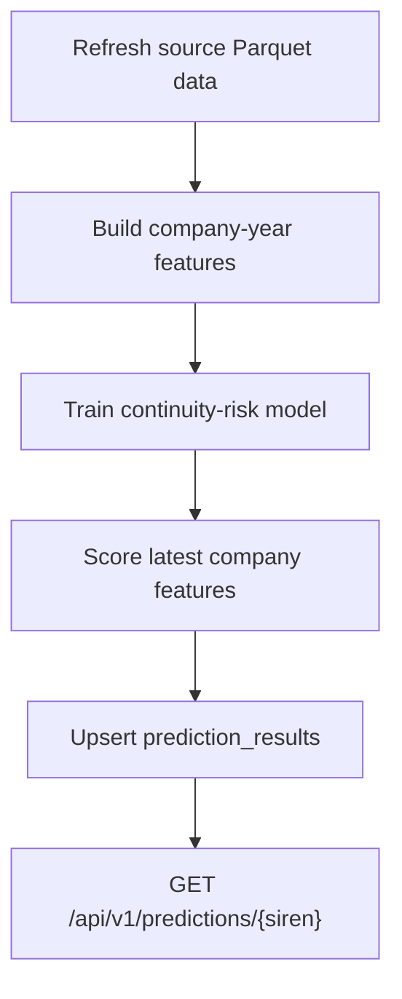

# Backend API And Operations Pipeline

## Purpose

This report explains how the backend exposes data ingestion, prediction lookup,
and operational monitoring. It complements the source-specific reports by
showing how the API, worker, scheduler, MongoDB collections, and data-lake tools
fit together.

The project uses a deliberate separation:

```text
API process = frontend-facing HTTP requests
Worker process = scheduled ingestion and long-running jobs
```

This keeps the user-facing API responsive while large public datasets are being
downloaded, parsed, or synchronized.

## Runtime Components

| Component | Implementation | Role |
|---|---|---|
| FastAPI app | `app.main` | Starts the HTTP API and mounts `/api/v1` routes |
| API router | `app.api.v1.router` | Groups health, prediction, INPI, INSEE bulk, BODACC, financial, and pipeline routes |
| Worker | `app.worker` | Starts the scheduler process |
| Scheduler | `app.scheduler.scheduler` | Registers recurring jobs with APScheduler |
| MongoDB | `app.db.mongodb` | Operational state, validation collections, and serving collections |
| ML registry | `app.ml.loader` | Loads model artifacts from `ML_ARTIFACTS_DIR` |
| CLI tools | `app.tools.*` | Build Parquet exports, features, models, and prediction publications |

## API Surface

All endpoints are mounted under:

```text
/api/v1
```

Swagger groups the routes by operational source so `/docs` is easier to scan:

```text
Health
Predictions
INSEE bulk
INPI
INSEE
BODACC
```

### Health

| Method | Path | Purpose |
|---|---|---|
| `GET` | `/health` | Basic API health check |
| `GET` | `/health/db` | MongoDB connectivity check |

### Predictions

| Method | Path | Purpose |
|---|---|---|
| `POST` | `/predictions` | Legacy or placeholder prediction request path |
| `GET` | `/predictions/{siren}` | Reads latest continuity-risk prediction for one company |

The implemented lookup reads MongoDB collection:

```text
prediction_results
```

It filters by:

```text
siren
target = continuity_risk_12m
horizon_months = 12
```

### Financial Data Source

Financial data is handled through data-lake endpoints. The old Mongo validation
path has been removed from the public API and worker schedule.

| Method | Path | Purpose |
|---|---|---|
| `GET` | `/ingestion/financial/resources` | List data.gouv.fr financial Parquet resources |
| `GET` | `/ingestion/financial/local-files` | List downloaded financial data-lake files |
| `POST` | `/ingestion/financial/export/run` | Download financial Parquet into `/data-lake/raw/financials` |
| `GET` | `/ingestion/financial/export/status` | Show financial data-lake download status |
| `POST` | `/ingestion/financial/export/cancel` | Request financial download cancellation |

Clean financial rows are built with:

```bash
python -m app.tools.build_clean_financials --overwrite
```

### INPI Ingestion

| Method | Path | Purpose |
|---|---|---|
| `GET` | `/ingestion/inpi/source-files` | List official remote INPI ZIP files without writing Mongo raw data |
| `POST` | `/ingestion/inpi/source-download/run` | Download official INPI ZIP files into `/source-archives/inpi` |
| `GET` | `/ingestion/inpi/source-download/status` | Show clean source-download status |
| `POST` | `/ingestion/inpi/source-download/cancel` | Request source-download cancellation |
| `GET` | `/ingestion/inpi/local-files` | List locally mounted INPI ZIP files and their export state |
| `POST` | `/ingestion/inpi/parquet-export/run` | Export local INPI ZIP files to raw Parquet in the data lake |
| `GET` | `/ingestion/inpi/parquet-export/status` | Show INPI Parquet export status |
| `POST` | `/ingestion/inpi/parquet-export/cancel` | Request INPI Parquet export cancellation |

The active ML initialization path is:

```text
INPI FTP/SFTP ZIP -> /source-archives/inpi -> /data-lake/raw/inpi -> /data-lake/clean -> features
```

Useful calls:

```bash
curl "http://localhost:8000/api/v1/ingestion/inpi/source-files?categories=formalites"
curl -X POST "http://localhost:8000/api/v1/ingestion/inpi/source-download/run?categories=formalites&max_files=1"
curl -X POST "http://localhost:8000/api/v1/ingestion/inpi/parquet-export/run?background=false&force_export=true&max_files=1&max_records_per_file=5000&categories=comptes_annuels&niveaux=standard"
```

It writes to:

```text
/data-lake/raw/inpi/<category>/<niveau>/<zip-name>/
```

The old INPI FTP/SFTP Mongo-validation endpoints are intentionally not exposed
in Swagger and the worker no longer schedules that path. Raw INPI records should
not be stored in MongoDB; MongoDB keeps only operational state and future compact
serving documents.

### INSEE Bulk Export

INSEE is bulk-first. The API-triggered background job downloads official Sirene
bulk Parquet files from data.gouv.fr into `/source-archives/insee/bulk`, then
exports them to `/data-lake/raw/insee/bulk`.

```bash
GET  /api/v1/ingestion/insee/bulk/resources
GET  /api/v1/ingestion/insee/bulk/local-files
POST /api/v1/ingestion/insee/bulk/run
GET  /api/v1/ingestion/insee/bulk/status
POST /api/v1/ingestion/insee/bulk/cancel
```

Useful smoke initialization call:

```bash
curl -X POST "http://localhost:8000/api/v1/ingestion/insee/bulk/run?background=true&max_files=1&download=true&export=true"
```

### BODACC Processing

BODACC current-year label archive initialization is exposed as an API-triggered
background job. It downloads missing or invalid `PCL` and `RCS-B` `.taz`
archives, validates that each archive can be read by `tarfile`, and exports the
announcements to the data lake through the Parquet exporter.

```bash
POST /api/v1/ingestion/bodacc/label-export/run
GET  /api/v1/ingestion/bodacc/label-export/status
POST /api/v1/ingestion/bodacc/label-export/cancel
```

Useful initialization call:

```bash
curl -X POST "http://localhost:8000/api/v1/ingestion/bodacc/label-export/run"
```

The older Mongo validation path is no longer exposed as the primary operational
path. If used for parser validation, it writes to:

```text
bodacc_annonces
bodacc_imports
bodacc_current_archive_files
bodacc_historical_archive_files
ingestion_jobs
```

## Scheduler Jobs

The worker registers recurring jobs at import time through
`app.scheduler.scheduler`.

| Job ID | Job Function | Purpose |
|---|---|---|
| `retrain_weekly` | `jobs.retrain_weekly` | Placeholder for future model retraining |

Default schedule controls are environment variables:

| Variable | Job |
|---|---|
| `SCHEDULER_TIMEZONE` | Scheduler timezone |

## Operational State Model

The backend uses state collections so long-running jobs can be monitored and
cancelled.

| State Pattern | Used By | Important Fields |
|---|---|---|
| Dataset state in `ingestion_jobs` | Financial, INPI, BODACC label export | `dataset_slug`, `status`, `run_id`, `cancel_requested`, progress fields, `last_error` |
| Source-file state | Legacy parser validation | Remote path, local path, status, attempts, size, dates |
| Prediction result state | ML publishing | `siren`, `target`, `horizon_months`, `model_version`, score fields |

The common operational states are:

```text
idle
starting
downloading
processing / ingesting / running
cancelling
cancelled
error
```

## Data And Volume Responsibilities

| Volume / Path | Role |
|---|---|
| `/source-archives` | Official downloaded provider archives and operational source files |
| `/source-archives/inpi` | Local INPI ZIP archive mirror |
| `/data-lake` | Durable raw, clean, and feature Parquet data |
| `/app/app/ml/artifacts` | Runtime model artifacts |
| MongoDB `/data/db` host volume | Persistent database state |

The report architecture treats `/data-lake` as the analytical source of truth
for large historical processing. MongoDB remains the serving and operational
state layer.

## ML Operational Flow

The implemented ML commands are manual CLI tools:

```bash
python -m app.tools.build_company_year_features
python -m app.tools.train_continuity_model
python -m app.tools.publish_prediction_results
```

Expected operational sequence:



The next production step is to move this sequence into worker jobs with model
validation gates before publishing.

## Frontend Usage

The frontend should use the API for:

| Frontend Need | API / Collection |
|---|---|
| Service health | `/api/v1/health`, `/api/v1/health/db` |
| Prediction display | `/api/v1/predictions/{siren}` backed by `prediction_results` |
| Ingestion monitoring | `/api/v1/ingestion/inpi/parquet-export/status`, `/api/v1/ingestion/bodacc/label-export/status` |
| Company search/profile prototype | `company_registry` until final `company_profiles` and `company_search` builders exist |

Raw INPI, BODACC, and financial validation collections should not become normal
frontend query targets.

## Limitations And Future Improvements

| Current Limitation | Future Improvement |
|---|---|
| `POST /api/v1/predictions` is still a placeholder for real feature extraction | Keep or remove it after frontend contract is finalized |
| ML feature build, training, and publishing are manual commands | Add scheduled worker jobs with validation checkpoints |
| Full clean financial build is currently smoke-capped in the checklist evidence | Run `build_clean_financials` without `--max-rows` after schema mappings are reviewed |
| Final serving collections are not fully implemented | Build `company_profiles`, `company_events_summary`, and `company_search` |
| State collection names and report names must stay synchronized | Add a documentation review checklist before defense/report freeze |

## Report Summary

The backend uses FastAPI for request handling and a separate worker process for
scheduled ingestion. MongoDB stores operational state, validation collections,
and serving collections such as `prediction_results`. Large historical data is
processed through Parquet tools and the data lake, while the API exposes compact
status and prediction endpoints to the frontend. This architecture keeps
long-running ingestion away from user-facing requests and gives the project a
clear path from raw public data to validated ML predictions.
