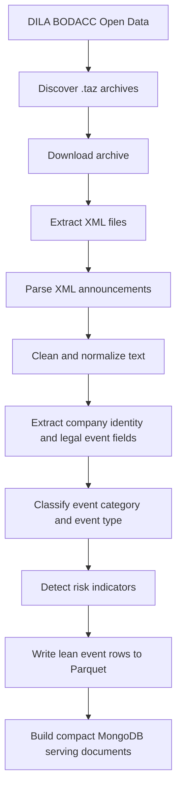
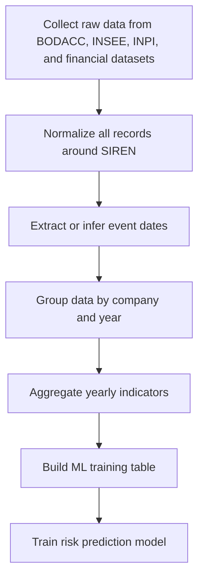
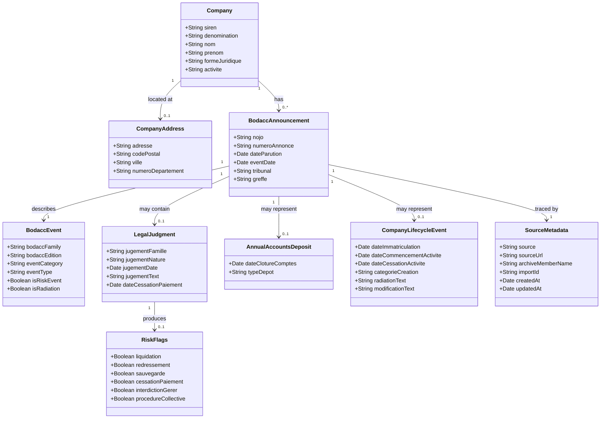
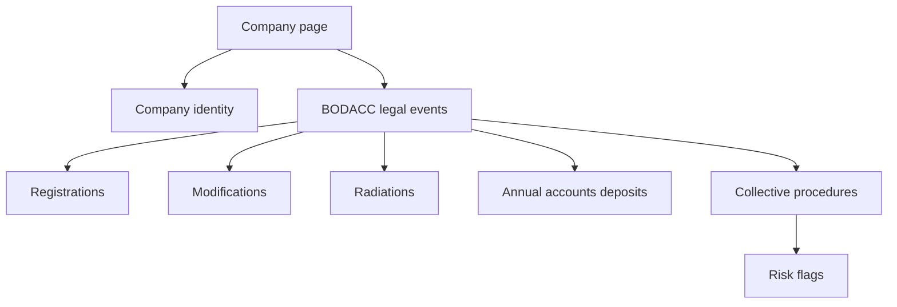

# BODACC Data Pipeline

## Purpose

The BODACC data pipeline collects official French legal announcements related to companies and transforms them into structured records that can be used by the backend, the future frontend, and the risk analysis part of the project.

BODACC is important for this project because it contains public legal events such as company registrations, modifications, radiations, annual accounts deposits, and collective procedures such as liquidation or redressement judiciaire.

## Data Source

The BODACC data is collected from the open data service provided by DILA:

```text
https://echanges.dila.gouv.fr/OPENDATA/BODACC/
```

The current-year data is downloaded from:

```text
https://echanges.dila.gouv.fr/OPENDATA/BODACC/FluxAnneeCourante/
```

The historical data is downloaded from:

```text
https://echanges.dila.gouv.fr/OPENDATA/BODACC/FluxHistorique/
```

The files are distributed as compressed `.taz` archives. Each archive contains XML files that represent BODACC publications.

## BODACC Families Used

The BODACC publication is divided into several families. Each family corresponds to a different type of legal or administrative company event. This distinction is important because the same company can appear in different BODACC families for different reasons during its lifetime.

The pipeline handles four main BODACC families:

| Family | Meaning | Example Use |
|---|---|---|
| `RCS_A` | RCS registrations | New company registrations and immatriculations |
| `RCS_B` | RCS modifications and radiations | Company changes, cessations, radiations |
| `PCL` | Procedures collectives | Liquidation, redressement, sauvegarde |
| `BILAN` | Annual accounts deposits | Published annual financial accounts deposits |

### RCS_A

`RCS_A` corresponds to announcements published in BODACC edition A and related to company registrations. These events usually describe new businesses, new establishments, or newly registered legal or physical persons.

In the project, this family helps identify when a company or establishment entered the official commercial register. It can be useful to reconstruct the starting point of a company's public administrative history.

### RCS_B

`RCS_B` corresponds to announcements published in BODACC edition B and related to company modifications or radiations. These events may include changes in activity, address, administration, legal form, or company cessation.

In the project, this family helps follow the evolution of a company after registration. It is useful for building a timeline of structural changes and detecting business exits or radiations.

### PCL

`PCL` stands for procedures collectives. This family contains announcements related to legal and financial distress procedures, such as liquidation judiciaire, redressement judiciaire, sauvegarde, and cessation of payments.

In the project, this is the most important BODACC family for risk analysis. These events can be transformed into risk indicators and used as target signals or explanatory features for the machine learning model.

### BILAN

`BILAN` corresponds to annual accounts deposit announcements. These events indicate that a company deposited its annual financial statements.

In the project, this family can help identify financial reporting activity and can be coupled with financial data from other sources. It may also indicate whether a company regularly publishes accounting information.

## BODACC Editions

BODACC is also organized by edition. The field `bodaccEdition` stores the edition associated with the announcement family.

| Edition | Related Family | Meaning |
|---|---|---|
| `A` | `RCS_A`, `PCL` | Registrations and collective procedures |
| `B` | `RCS_B` | Modifications and radiations |
| `C` | `BILAN` | Annual accounts deposits |

The edition is useful for traceability because it reflects the official BODACC structure. For analysis, the normalized field `bodaccFamily` is usually more explicit than the edition alone.

## Global Workflow



## Processing Steps

### 1. Archive Discovery

The backend scans the configured BODACC directory and detects files ending with:

```text
.tar
.tar.gz
.taz
```

Each discovered archive is stored in a file-tracking collection with its URL, year, status, attempts, local path, and processing metadata.

### 2. Download

Each archive is downloaded to the local BODACC data directory:

```text
/source-archives/bodacc/current
```

The download process tracks progress, downloaded bytes, errors, and current state. This makes the ingestion resumable and easier to monitor.

### 3. XML Extraction

The archive is opened as a tar file. Each XML member is extracted in memory and passed to the XML parser.

The importer stores import-level metadata in:

```text
bodacc_imports
```

This collection is useful for traceability because it links each parsed XML file to its archive and source URL.

### 4. XML Parsing

Each XML file contains multiple announcements. The parser extracts each announcement and creates a structured document.

The parser reads common BODACC fields such as:

```text
nojo
numeroAnnonce
numeroDepartement
tribunal
siren
denomination
nom
prenom
formeJuridique
activite
adresse
codePostal
ville
jugementNature
jugementText
eventDate
```

### 5. Text Cleaning

Some XML data can contain encoding artifacts. The parser repairs these values
before storage so that French labels and legal text remain readable in the API,
frontend, and report outputs.

Example repaired text:

```text
Société
procédure
d'ouverture
N°
```

This step is important for frontend display, search quality, and report readability.

### 6. Event Classification

The pipeline enriches each announcement with normalized event metadata:

| Field | Description |
|---|---|
| `bodaccFamily` | Source family: `RCS_A`, `RCS_B`, `PCL`, or `BILAN` |
| `bodaccEdition` | BODACC edition: `A`, `B`, or `C` |
| `eventCategory` | High-level event category |
| `eventType` | More precise event type |
| `isRiskEvent` | Boolean indicating whether the announcement represents a risk event |

Detailed meaning of these fields:

| Field | Detailed Explanation |
|---|---|
| `bodaccFamily` | Indicates the source family detected from the XML. It tells whether the announcement comes from registrations, modifications/radiations, collective procedures, or annual accounts deposits. |
| `bodaccEdition` | Indicates the official BODACC edition: A, B, or C. It is useful for source traceability and for explaining how the original BODACC publication is organized. |
| `eventCategory` | Groups events into a small number of business categories that are easier to use in dashboards, yearly aggregation, and machine learning. |
| `eventType` | Provides a more precise normalized event label, for example `liquidation_judiciaire`, `radiation_rcs`, or `depot_comptes`. |
| `isRiskEvent` | Indicates whether the event is considered a risk signal. This field can be used directly in the frontend as a warning badge or in ML feature engineering. |

Example event categories:

```text
rcs_immatriculation
rcs_modification
radiation
procedure_collective
comptes_annuels
```

Example event types:

```text
immatriculation
modification_rcs
radiation_rcs
liquidation_judiciaire
redressement_judiciaire
sauvegarde
depot_comptes
```

### 7. Risk Detection

The parser analyzes the legal judgment text to detect important risk indicators.

The following flags are extracted:

```text
flags.liquidation
flags.redressement
flags.sauvegarde
flags.cessationPaiement
flags.interdictionGerer
flags.procedureCollective
```

The global field `isRiskEvent` is set to true when the announcement contains a collective procedure, cessation of payment, or management prohibition signal.

This is one of the most useful outputs for the future frontend and for company risk analysis.

## Storage Strategy

BODACC was first ingested into MongoDB to validate parsing, field extraction,
deduplication, and risk classification. This is useful for development and API
experiments, but the full current and historical BODACC volume should use the
data lake path.

The recommended long-term storage split is:

```text
BODACC .taz archives
  -> /data-lake/raw/bodacc
  -> /data-lake/clean/legal_events
  -> /data-lake/features/company_event_features
  -> compact MongoDB serving collections
```

The raw Parquet event rows are written by:

```bash
python -m app.tools.bodacc_to_parquet \
  --input /source-archives/bodacc/current/OPENDATA/BODACC/FluxAnneeCourante/BILAN_BXC20260001.taz \
  --mode current \
  --year 2026 \
  --batch-size 100000
```

The Parquet rows preserve event-level information such as `siren`, `nojo`,
`eventDate`, `eventCategory`, `eventType`, risk flags, location fields, and
archive lineage.

## MongoDB Storage

MongoDB remains useful for ingestion state, validation, and frontend serving.
However, it should not be treated as the final raw historical storage for all
BODACC archives.

The main structured BODACC documents are stored in:

```text
bodacc_annonces
```

Import metadata is stored in:

```text
bodacc_imports
```

Archive processing state is stored in:

```text
bodacc_current_archive_files
bodacc_historical_archive_files
```

Global ingestion state is stored in:

```text
ingestion_jobs
```

## Main Stored Fields

| Field | Description | Usage |
|---|---|---|
| `nojo` | Unique BODACC announcement identifier. It identifies one official announcement and helps avoid duplicate insertion. | Deduplication and traceability |
| `numeroAnnonce` | Announcement number inside a BODACC publication. | Source traceability |
| `numeroDepartement` | French department number linked to the announcement. | Geographic filtering and analysis |
| `tribunal` | Court or registry that published or handled the announcement. | Legal context and frontend display |
| `identifiantClient` | Source-side client or announcement identifier when available. | Traceability |
| `personneType` | Indicates whether the announcement concerns a legal entity (`morale`) or a physical person (`physique`). | Filtering and entity interpretation |
| `siren` | Unique French company identifier. This is the main key used to connect BODACC data with INSEE, INPI, and financial datasets. | Data linking, ML grouping, frontend search |
| `rcsCode` | Registry code, usually `RCS`, meaning Registre du Commerce et des Sociétés. | Internal/source traceability only |
| `greffe` | Commercial registry office associated with the company registration. | Frontend display and regional analysis |
| `denomination` | Company name for legal entities. | Frontend display and search |
| `nom`, `prenom` | Name fields for physical persons. | Frontend display when no company denomination exists |
| `formeJuridique` | Legal form of the entity, such as SARL or SAS. | Company profile and ML feature engineering |
| `enseigne` | Commercial sign or trade name when available. | Frontend display and search |
| `activite` | Business activity described in the announcement. | Company profile, search, and text features |
| `adresse` | Street address or address text extracted from the XML. | Frontend display and geolocation enrichment |
| `codePostal` | Postal code. | Geographic filtering and aggregation |
| `ville` | City. | Geographic filtering and aggregation |
| `jugementFamille` | Broad family of the legal judgment when present. | Legal-event interpretation |
| `jugementNature` | Nature of the legal judgment, for example opening of liquidation or another court decision. | Risk analysis and frontend explanation |
| `jugementDate` | Date of the legal judgment. | Chronological analysis |
| `jugementText` | Full text complement of the legal judgment. | Risk extraction, supervisor traceability, frontend detail view |
| `flags` | Boolean risk indicators extracted from `jugementNature` and `jugementText`. | Risk badges and ML features |
| `dateCessationPaiement` | Date of cessation of payments when it can be extracted from the judgment text. | Risk chronology and ML target engineering |
| `eventDate` | Main date selected for the event. It is chosen from judgment date, cessation activity date, registration date, modification date, or publication date depending on available data. | Main chronological ordering field |
| `bodaccFamily` | Normalized BODACC family: `RCS_A`, `RCS_B`, `PCL`, or `BILAN`. | Filtering, event grouping, ML features |
| `bodaccEdition` | Official BODACC edition: `A`, `B`, or `C`. | Source explanation and traceability |
| `eventCategory` | High-level normalized event category. | Frontend timeline grouping and ML features |
| `eventType` | More precise normalized event type. | ML features and detailed frontend filters |
| `rawTypeAnnonce` | Original announcement type extracted from the XML when available. | Source traceability |
| `isRiskEvent` | Global indicator showing whether the event is considered risky. | Frontend warning badge and ML labels/features |
| `dateParution` | Official BODACC publication date. | Source chronology and fallback event date |
| `dateClotureComptes` | Closing date of annual accounts when the announcement is a BILAN deposit. | Yearly financial alignment |
| `typeDepot` | Type of annual accounts deposit when available. | Financial reporting analysis |
| `dateImmatriculation` | Company registration date when available. | Company lifecycle reconstruction |
| `dateCommencementActivite` | Activity start date when available. | Company lifecycle and yearly feature engineering |
| `categorieCreation` | Category or description of the creation event. | Context for registrations |
| `dateCessationActivite` | Date of activity cessation when available. | Company lifecycle and risk chronology |
| `radiationText` | Text extracted from radiation announcements. | Explanation of company exits |
| `modificationText` | Text extracted from modification announcements. | Explanation of company changes |
| `isRadiation` | Boolean indicating whether the announcement represents a radiation. | Risk/lifecycle feature |
| `source` | Source name, currently `BODACC`. | Multi-source traceability |
| `sourceUrl` | Original DILA archive URL. | Audit and reproducibility |
| `archiveMemberName` | XML file name inside the downloaded archive. | Audit and reproducibility |
| `importId` | Link to the import metadata document in `bodacc_imports`. | Internal traceability |
| `createdAt`, `updatedAt` | Technical timestamps indicating when the document was created or updated in MongoDB. | Operational tracking |

## Fields Not Intended For Frontend Display

Some fields are useful internally but should not be shown by default in the frontend.

For example:

```text
rcsCode
```

This field usually contains the value `RCS`, meaning Registre du Commerce et des Sociétés. Since it is almost always the same, it is not very informative for users. It can be kept in the database for source traceability, but it should not be displayed in normal company views.

## Chronological Use Of BODACC Data

One of the long-term goals of the project is not only to store isolated announcements, but to reconstruct a chronological history for each company.

The central linking key is:

```text
siren
```

For each company, all BODACC events can be ordered by:

```text
eventDate
```

When `eventDate` is not available, the publication date `dateParution` can be used as a fallback. This allows the system to build a timeline of events such as:

```text
registration -> modifications -> annual accounts deposits -> risk events -> radiation
```

This chronological structure is important because company risk is not static. A company can look healthy during one year, show warning signs in another year, and enter a collective procedure later.

## Yearly Company Dataset For Machine Learning

In the long run, the objective is to combine BODACC data with the other project data sources to build one consolidated dataset per company and per year.

The target structure can be represented as:

```text
(siren, year) -> company features for that year
```

For each company and each year, the system can aggregate:

| Source | Yearly Features |
|---|---|
| BODACC | Number of legal events, number of modifications, number of radiations, number of risk events, latest event type, existence of PCL event |
| Financial parquet data | Revenue, result, debt, equity, financial ratios, yearly accounts information |
| INSEE | Company identity, legal category, activity code, administrative status |
| INPI/RNE | Formalities, annual accounts metadata, registry-level company information |

Example yearly BODACC features:

```text
bodacc_events_count_year
bodacc_risk_events_count_year
has_liquidation_event_year
has_redressement_event_year
has_sauvegarde_event_year
has_radiation_event_year
last_bodacc_event_type_year
days_since_last_bodacc_event
```

The future ML dataset can therefore combine static company attributes with temporal signals. This makes it possible to train a model that learns from the evolution of companies over time instead of using only a single snapshot.

## Chronological Data Coupling Strategy

The planned coupling strategy is:



This approach allows the project to answer questions such as:

```text
What happened to this company during year N?
Did it publish accounts?
Did it change address, activity, or legal form?
Did it enter a collective procedure?
Were there warning signs before the risk event?
```

For the frontend, the same chronological data can be used to display a company timeline. For machine learning, it can be transformed into yearly features and labels.

## Conceptual Class Diagram For BODACC Data

The BODACC data can also be represented as a conceptual class model. In this view, the `Company` class is the central entity. Each company is identified by its `siren` and can be linked to multiple BODACC announcements over time.

This diagram is not meant to represent the exact Python classes in the backend. It represents the domain model used to explain the data structure in the report and in the future frontend.



The class relationships can be interpreted as follows:

| Relationship | Meaning |
|---|---|
| `Company -> BodaccAnnouncement` | One company can have many BODACC announcements across different years. |
| `Company -> CompanyAddress` | A company can have address information extracted from BODACC. |
| `BodaccAnnouncement -> BodaccEvent` | Each announcement is classified into a normalized event family, category, and type. |
| `BodaccAnnouncement -> LegalJudgment` | Some announcements, especially PCL events, contain legal judgment information. |
| `LegalJudgment -> RiskFlags` | Judgment text can produce risk indicators such as liquidation or redressement. |
| `BodaccAnnouncement -> AnnualAccountsDeposit` | BILAN announcements can contain annual accounts deposit information. |
| `BodaccAnnouncement -> CompanyLifecycleEvent` | RCS announcements can describe registration, modification, or radiation events. |
| `BodaccAnnouncement -> SourceMetadata` | Every stored announcement remains traceable to its original DILA source archive and XML file. |

This conceptual model helps explain how the raw XML fields become structured business objects. It also supports the future frontend, where a company page can display identity, address, legal events, risk indicators, annual accounts events, and source traceability.

## BODACC Fields Useful For Machine Learning

Not every stored BODACC field should be used directly by the ML model. Some fields are identifiers or traceability metadata, while others can be transformed into meaningful numerical, categorical, or temporal features.

The use of BODACC fields for ML must be controlled carefully to avoid data leakage. A field causes data leakage when it gives the model information that would not have been available at the prediction date. For example, if the objective is to predict whether a company will enter a collective procedure in year `N+1`, then a liquidation announcement published during year `N+1` must not be used as an input feature for year `N`.

The safest approach is to define a prediction cutoff date:

```text
prediction_date = end of year N
```

Then the model can only use BODACC events where:

```text
eventDate <= prediction_date
```

or, if `eventDate` is missing:

```text
dateParution <= prediction_date
```

The most useful BODACC fields for ML are:

| Field | ML Usage |
|---|---|
| `siren` | Main key used to join BODACC events with financial, INSEE, and INPI data. It should not be used as a predictive feature by itself. |
| `eventDate` | Used to place each event in time and aggregate events by year. |
| `dateParution` | Fallback chronological date when the event date is missing. |
| `bodaccFamily` | Categorical feature indicating whether the event comes from `RCS_A`, `RCS_B`, `PCL`, or `BILAN`. |
| `bodaccEdition` | Categorical source indicator, useful mainly for traceability or simplified grouping. |
| `eventCategory` | High-value categorical feature for event grouping. |
| `eventType` | More detailed categorical feature describing the event. |
| `isRiskEvent` | Strong binary feature or possible label depending on the prediction objective. |
| `flags.liquidation` | Binary feature indicating liquidation judiciaire. |
| `flags.redressement` | Binary feature indicating redressement judiciaire. |
| `flags.sauvegarde` | Binary feature indicating sauvegarde procedure. |
| `flags.cessationPaiement` | Binary feature indicating cessation of payments. |
| `flags.interdictionGerer` | Binary feature indicating management prohibition. |
| `flags.procedureCollective` | Binary feature indicating a collective procedure. |
| `dateCessationPaiement` | Temporal feature for measuring the timing of payment default. |
| `dateClotureComptes` | Can be used to align BILAN events with yearly financial periods. |
| `typeDepot` | Categorical feature describing annual account deposit type. |
| `dateImmatriculation` | Company age can be derived from this field. |
| `dateCommencementActivite` | Activity age can be derived from this field. |
| `dateCessationActivite` | Can indicate company closure or inactivity. |
| `isRadiation` | Binary lifecycle feature indicating company radiation. |
| `numeroDepartement` | Geographic categorical feature. |
| `codePostal` | Geographic feature, usually transformed into department or region. |
| `ville` | Geographic feature, mostly useful after normalization or aggregation. |
| `formeJuridique` | Categorical feature representing the legal form of the company. |
| `activite` | Text feature that can be transformed with NLP or mapped to activity categories. |
| `jugementNature` | Text/categorical legal-risk feature. |
| `jugementText` | Text feature for NLP-based extraction of risk signals. |
| `radiationText` | Text feature describing company exits or closure events. |
| `modificationText` | Text feature describing company modifications. |

## Data Leakage Control For BODACC Features

Some fields can be used safely as historical features, but become leakage if they occur after the prediction cutoff date or if they directly encode the target variable.

### Specific Methodological Note On PCL Events

PCL events require special attention because they are strongly related to company distress. Events such as liquidation judiciaire, redressement judiciaire, sauvegarde, or cessation of payments are highly correlated with the failure status that the model may try to predict.

This makes them powerful signals, but also dangerous if they are used incorrectly. A model that receives a future PCL announcement as an input feature would appear artificially accurate, but it would not be valid in real production conditions.

The fundamental rule is:

```text
PCL events can be used as historical features only if they occur before the prediction date.
PCL events can be used as labels when they occur inside the future prediction window.
```

For example, if the model uses data available up to the end of year `N`, then PCL events before or during year `N` can describe the company's history. PCL events occurring in year `N+1` must not be used as input features; they can only be used to define the target label.

Valid historical PCL features include:

```text
number of past PCL events
existence of a previous redressement judiciaire
existence of a previous sauvegarde procedure
time since the latest PCL event
```

Valid future labels include:

```text
entered liquidation judiciaire within the next 12 months
entered redressement judiciaire during year N+1
opened any collective procedure during the prediction horizon
```

Invalid usage examples:

```text
using a liquidation announcement from year N+1 to predict liquidation in year N+1
using future judgment text as an input feature
using future procedureCollective flags as explanatory variables
```

Therefore, the ML dataset must always separate:

| Role | Time Period | Example |
|---|---|---|
| Feature | Before or at the prediction cutoff | Past number of PCL events |
| Label | After the prediction cutoff, inside the prediction horizon | PCL event occurs during year `N+1` |

This temporal separation is necessary to avoid data leakage and to make sure the model learns from information that would actually be available at prediction time.

| Field | Leakage Risk | Recommended Use |
|---|---|---|
| `eventDate` | Low by itself, but dangerous if future events are included. | Use only to filter events before the prediction date and compute temporal features. |
| `dateParution` | Low by itself, but dangerous if future publications are included. | Use as fallback date only before the prediction date. |
| `isRiskEvent` | High if the target is risk/default/procedure collective. | Use only for past years, or use it to build the label for future years. |
| `flags.liquidation` | Very high if predicting liquidation. | Use as a target label or as a past-history feature only. |
| `flags.redressement` | Very high if predicting redressement. | Use as a target label or as a past-history feature only. |
| `flags.sauvegarde` | Very high if predicting sauvegarde/procedure collective. | Use as a target label or as a past-history feature only. |
| `flags.procedureCollective` | Very high if predicting collective procedure risk. | Usually better as the label for the future prediction window. |
| `jugementNature` | High when it contains explicit future risk terms. | Use only from past events; avoid using future-window judgment text as input. |
| `jugementText` | High when it contains explicit legal outcome text. | Use only from past events; for future events, use it only to create labels. |
| `eventType` | Medium to high if it directly says `liquidation_judiciaire` or `redressement_judiciaire`. | Use only from past events, or transform into historical counts. |
| `eventCategory` | Medium to high when category is `procedure_collective`. | Use only from past events, or transform into historical counts. |
| `dateCessationPaiement` | High if it belongs to the predicted risk period. | Use only if the date is before the prediction cutoff. |
| `dateCessationActivite` | High if predicting closure/radiation. | Use only from past events or as a future label. |
| `isRadiation` | High if predicting company closure/radiation. | Use only as a historical feature before the cutoff, or as a label. |
| `radiationText` | High if predicting radiation. | Use only from past events; avoid using future-window text. |

The recommended ML framing is:

```text
Features: information available up to the end of year N
Label: whether a target event happens during year N+1 or within the next K months
```

Example:

```text
For company SIREN X:
Input features = all BODACC, financial, INSEE, and INPI data available up to 2024-12-31
Label = did the company enter liquidation, redressement, sauvegarde, or another risk event during 2025?
```

In this framing, fields such as `flags.liquidation`, `flags.redressement`, `flags.procedureCollective`, `jugementNature`, and `jugementText` can be used in two different ways:

| Usage | Explanation |
|---|---|
| Historical feature | Safe only if the event happened before the prediction date. |
| Future label | Safe when used to define what the model is trying to predict. |

They should not be used as input features when they describe the same future period that the model is supposed to predict.

Recommended aggregated ML features by company and year:

| Feature | Meaning |
|---|---|
| `bodacc_events_count_year` | Total number of BODACC events for the company during the year. |
| `bodacc_pcl_events_count_year` | Number of collective procedure events during the year. |
| `bodacc_bilan_events_count_year` | Number of annual accounts deposit events during the year. |
| `bodacc_rcs_modification_count_year` | Number of RCS modification events during the year. |
| `bodacc_radiation_count_year` | Number of radiation events during the year. |
| `has_liquidation_event_year` | Whether a liquidation event happened during the year. |
| `has_redressement_event_year` | Whether a redressement event happened during the year. |
| `has_sauvegarde_event_year` | Whether a sauvegarde event happened during the year. |
| `has_cessation_paiement_year` | Whether cessation of payments was detected during the year. |
| `has_risk_event_year` | Whether any risk event happened during the year. |
| `last_bodacc_event_type_year` | Last known BODACC event type during the year. |
| `days_since_last_bodacc_event` | Recency of the latest BODACC event before the prediction date. |
| `company_age_years` | Difference between the prediction year and `dateImmatriculation` or `dateCommencementActivite`. |
| `has_recent_radiation` | Whether a radiation happened recently. |
| `has_recent_collective_procedure` | Whether a PCL event happened recently. |

Fields that should generally not be used as direct ML features:

| Field | Reason |
|---|---|
| `nojo` | Unique technical identifier, not predictive. |
| `numeroAnnonce` | Publication-order metadata, not a company characteristic. |
| `sourceUrl` | Traceability field, not predictive. |
| `archiveMemberName` | File traceability field, not predictive. |
| `importId` | Internal database link, not predictive. |
| `createdAt`, `updatedAt` | Technical ingestion timestamps, not business information. |
| `rcsCode` | Usually always `RCS`, so it adds almost no predictive value. |

## BODACC Fields Useful For Frontend Display

For the frontend, the objective is different from ML. The interface should display understandable company information, legal events, and risk signals. Technical fields should be hidden unless the user opens an advanced traceability view.

Recommended fields for the company identity section:

| Field | Display Purpose |
|---|---|
| `siren` | Main company identifier shown on the company profile. |
| `denomination` | Company name for legal entities. |
| `nom`, `prenom` | Person name when the record concerns a physical person. |
| `formeJuridique` | Legal form of the company. |
| `activite` | Business activity. |
| `adresse` | Address line. |
| `codePostal` | Postal code. |
| `ville` | City. |
| `greffe` | Registry office, useful for legal context. |
| `tribunal` | Court or registry associated with the announcement. |

Recommended fields for the legal events timeline:

| Field | Display Purpose |
|---|---|
| `eventDate` | Main date used to order events chronologically. |
| `dateParution` | Official BODACC publication date. |
| `eventCategory` | High-level event group shown as a timeline category. |
| `eventType` | Specific event type shown as the event label. |
| `bodaccFamily` | Source family, useful as a filter or badge. |
| `bodaccEdition` | Official BODACC edition, useful in details. |
| `rawTypeAnnonce` | Original announcement type, useful in a detailed view. |
| `dateImmatriculation` | Registration date when available. |
| `dateCommencementActivite` | Activity start date when available. |
| `dateCessationActivite` | Activity cessation date when available. |
| `dateClotureComptes` | Accounts closing date for annual accounts deposits. |
| `typeDepot` | Type of accounts deposit. |

Recommended fields for the risk and legal detail section:

| Field | Display Purpose |
|---|---|
| `isRiskEvent` | Can be displayed as a warning badge. |
| `flags.liquidation` | Indicates liquidation judiciaire. |
| `flags.redressement` | Indicates redressement judiciaire. |
| `flags.sauvegarde` | Indicates sauvegarde procedure. |
| `flags.cessationPaiement` | Indicates cessation of payments. |
| `flags.interdictionGerer` | Indicates management prohibition. |
| `flags.procedureCollective` | Indicates collective procedure. |
| `jugementFamille` | Broad family of judgment. |
| `jugementNature` | Short legal judgment label. |
| `jugementDate` | Judgment date. |
| `jugementText` | Detailed judgment text shown in an expandable detail panel. |
| `dateCessationPaiement` | Payment cessation date when detected. |
| `radiationText` | Details for radiation events. |
| `modificationText` | Details for modification events. |

Recommended fields for an advanced source/traceability panel:

| Field | Display Purpose |
|---|---|
| `source` | Confirms the data source is BODACC. |
| `sourceUrl` | Link or reference to the original DILA archive. |
| `archiveMemberName` | Original XML file name inside the archive. |
| `nojo` | Official announcement identifier. |
| `numeroAnnonce` | Announcement number in the publication. |
| `numeroDepartement` | Department number associated with the announcement. |
| `rcsCode` | Can be shown only in raw/source details, not in the main UI. |

## Suggested Frontend Presentation

The future frontend can use BODACC data to display a legal events timeline for each company.



Recommended frontend sections:

| Section | Fields |
|---|---|
| Company identity | `siren`, `denomination`, `formeJuridique`, `adresse`, `ville` |
| Legal events timeline | `eventDate`, `eventCategory`, `eventType`, `dateParution` |
| Risk indicators | `isRiskEvent`, `flags`, `jugementNature`, `jugementText` |
| Source traceability | `sourceUrl`, `archiveMemberName`, `bodaccFamily` |

## Report Summary

The BODACC pipeline transforms official legal announcement XML files into structured company event data. It downloads BODACC archives from DILA, extracts XML files, parses company and legal-event data, repairs encoding issues, classifies announcements by event type, and detects risk indicators. For large-scale processing, BODACC events are exported as compressed Parquet rows in the data lake. MongoDB is then used for compact frontend-serving documents, company event summaries, and API queries. This design preserves traceability while keeping the application layer fast.
