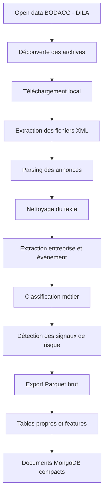

# Pipeline De Données BODACC

## Objectif

Le pipeline BODACC collecte les annonces légales officielles concernant les
entreprises françaises et les transforme en événements structurés. Ces données
servent à trois usages principaux :

| Usage | Description |
|---|---|
| Backend | Valider le téléchargement, le parsing XML et la déduplication |
| Frontend | Afficher une chronologie juridique compréhensible par entreprise |
| Machine learning | Construire des signaux historiques et des labels de risque |

Le BODACC est essentiel pour ce projet car il contient des événements publics
liés à la vie juridique des entreprises : immatriculations, modifications,
radiations, dépôts de comptes annuels et procédures collectives.

## Source Des Données

Les données proviennent du service open data de la DILA :

```text
https://echanges.dila.gouv.fr/OPENDATA/BODACC/
```

Deux familles de flux sont utilisées :

| Flux | URL | Rôle |
|---|---|---|
| Année courante | `FluxAnneeCourante` | Synchronisation régulière des annonces récentes |
| Historique | `FluxHistorique` | Constitution du stock historique |

Les fichiers sont distribués sous forme d'archives `.taz`, `.tar` ou
`.tar.gz`. Chaque archive contient des fichiers XML représentant des
publications BODACC.

## Familles BODACC Utilisées

| Famille | Signification | Utilisation Dans Le Projet |
|---|---|---|
| `RCS_A` | Immatriculations RCS | Début de l'historique public de l'entreprise |
| `RCS_B` | Modifications et radiations | Changements, cessations et sorties |
| `PCL` | Procédures collectives | Liquidation, redressement, sauvegarde |
| `BILAN` | Dépôts de comptes annuels | Activité déclarative et comptable |

La famille `PCL` est la plus importante pour l'analyse du risque, car elle
contient des événements directement liés aux difficultés juridiques et
financières.

## Éditions BODACC

| Édition | Familles Associées | Signification |
|---|---|---|
| `A` | `RCS_A`, `PCL` | Immatriculations et procédures collectives |
| `B` | `RCS_B` | Modifications et radiations |
| `C` | `BILAN` | Dépôts de comptes annuels |

Le champ `bodaccEdition` conserve la structure officielle du BODACC. Pour
l'analyse et le frontend, le champ normalisé `bodaccFamily` est généralement
plus explicite.

## Workflow Global



## Étapes De Traitement

### 1. Découverte Et Téléchargement

Le service détecte les archives disponibles dans le flux configuré. Chaque
archive est suivie dans une collection de fichiers avec son URL, son année, son
statut, son nombre de tentatives, son chemin local et ses métadonnées.

Les archives de l'année courante sont stockées sous :

```text
/source-archives/bodacc/current
```

Les archives historiques sont stockées sous :

```text
/source-archives/bodacc
```

### 2. Extraction XML

Chaque archive est ouverte comme un fichier tar. Les membres XML sont extraits
en mémoire et transmis au parseur. Les métadonnées d'import sont conservées dans
la collection :

```text
bodacc_imports
```

### 3. Parsing Des Annonces

Le parseur extrait les champs principaux :

```text
nojo
numeroAnnonce
numeroDepartement
tribunal
siren
denomination
nom
prenom
formeJuridique
activite
adresse
codePostal
ville
jugementNature
jugementText
eventDate
```

### 4. Nettoyage Du Texte

Certaines archives peuvent contenir des problèmes d'encodage. Le parseur répare
ces valeurs avant stockage afin d'obtenir un texte français lisible.

Exemples de texte réparé :

```text
Société
procédure
d'ouverture
N°
```

Cette étape améliore l'affichage frontend, la recherche textuelle et la qualité
des exports utilisés dans le rapport.

### 5. Classification Des Événements

Chaque annonce est enrichie avec des champs normalisés :

| Champ | Description |
|---|---|
| `bodaccFamily` | Famille BODACC : `RCS_A`, `RCS_B`, `PCL` ou `BILAN` |
| `bodaccEdition` | Édition officielle : `A`, `B` ou `C` |
| `eventCategory` | Catégorie métier de haut niveau |
| `eventType` | Type d'événement plus précis |
| `isRiskEvent` | Indicateur global de risque |

Exemples de catégories :

```text
rcs_immatriculation
rcs_modification
radiation
procedure_collective
comptes_annuels
```

Exemples de types :

```text
immatriculation
modification_rcs
radiation_rcs
liquidation_judiciaire
redressement_judiciaire
sauvegarde
depot_comptes
```

### 6. Détection Des Risques

Le texte du jugement est analysé pour extraire des indicateurs booléens :

```text
flags.liquidation
flags.redressement
flags.sauvegarde
flags.cessationPaiement
flags.interdictionGerer
flags.procedureCollective
```

Le champ `isRiskEvent` devient vrai lorsqu'une annonce contient une procédure
collective, une cessation des paiements ou une interdiction de gérer.

## Stratégie De Stockage

Le stockage recommandé sépare les archives sources, le traitement analytique et
la base de service :

```text
archives BODACC .taz
  -> /data-lake/raw/bodacc
  -> /data-lake/clean/legal_events
  -> /data-lake/features/company_event_features
  -> collections MongoDB compactes
```

MongoDB reste utile pour la validation, l'état des jobs et les documents servis
à l'API. Il ne doit pas être considéré comme le stockage brut principal pour
tout l'historique BODACC.

## Export Parquet Brut

L'exporteur Parquet est :

```text
app.tools.bodacc_to_parquet
```

Exemple :

```bash
python -m app.tools.bodacc_to_parquet \
  --input /source-archives/bodacc/current/OPENDATA/BODACC/FluxAnneeCourante/BILAN_BXC20260001.taz \
  --mode current \
  --year 2026 \
  --batch-size 100000
```

Sortie recommandée :

```text
/data-lake/raw/bodacc/<mode>/<year>/<archive-name>/
  part-00001.parquet
  _progress.json
  _manifest.json
```

## Collections MongoDB

| Collection | Rôle |
|---|---|
| `bodacc_annonces` | Collection de validation contenant les annonces structurées |
| `bodacc_imports` | Métadonnées d'import des fichiers XML |
| `bodacc_current_archive_files` | Suivi des archives de l'année courante |
| `bodacc_historical_archive_files` | Suivi des archives historiques |
| `ingestion_jobs` | État global des jobs |

## Champs Principaux

| Champ | Description | Utilisation |
|---|---|---|
| `nojo` | Identifiant officiel de l'annonce | Déduplication et traçabilité |
| `siren` | Identifiant de l'entreprise | Jointure, recherche, ML |
| `denomination` | Nom de l'entreprise | Affichage et recherche |
| `eventDate` | Date principale de l'événement | Chronologie |
| `dateParution` | Date officielle de publication | Chronologie de secours |
| `bodaccFamily` | Famille BODACC normalisée | Filtres et agrégations |
| `eventCategory` | Catégorie métier | Timeline et features |
| `eventType` | Type d'événement détaillé | Filtres et ML |
| `isRiskEvent` | Indicateur de risque | Badge frontend, feature ou label |
| `flags` | Détails des risques détectés | Features et explications |
| `isRadiation` | Indicateur de radiation | Label ou historique de sortie |
| `sourceUrl` | URL de l'archive source | Audit |
| `archiveMemberName` | XML dans l'archive | Traçabilité |

Les champs techniques comme `importId`, `createdAt`, `updatedAt` ou certains
identifiants internes doivent rester dans les détails techniques.

## Utilisation Frontend

Le frontend doit consommer des documents compacts plutôt que la collection brute
complète.

| Section | Champs Utiles |
|---|---|
| Identité | `siren`, `denomination`, `formeJuridique`, `activite`, `adresse`, `ville` |
| Timeline juridique | `eventDate`, `eventCategory`, `eventType`, `dateParution`, `bodaccFamily` |
| Risque | `isRiskEvent`, `flags`, `jugementNature`, `jugementText`, `dateCessationPaiement` |
| Traçabilité | `sourceUrl`, `archiveMemberName`, `nojo`, `numeroAnnonce` |

## Utilisation Machine Learning

Le grain recommandé est :

```text
(siren, prediction_year)
```

Exemples de features BODACC :

| Feature | Signification |
|---|---|
| `legal_events_count_all` | Nombre total d'événements avant la date de prédiction |
| `legal_events_count_12m` | Nombre d'événements dans les 12 derniers mois |
| `legal_risk_events_count_all` | Nombre d'événements de risque historiques |
| `legal_distress_events_count_all` | Nombre de procédures collectives historiques |
| `radiation_events_count_all` | Nombre de radiations historiques |
| `days_since_last_legal_event` | Récence du dernier événement légal |

Les événements futurs peuvent servir de labels, mais pas de variables d'entrée.

## Contrôle De La Fuite De Données

Règle fondamentale :

```text
Features : événements BODACC avec eventDate <= prediction_date
Labels : événements BODACC avec prediction_date < eventDate <= prediction_date + 12 mois
```

Exemples d'utilisation invalide :

| Usage Risqué | Problème |
|---|---|
| Utiliser une liquidation future comme feature | Le modèle voit l'événement à prédire |
| Utiliser un jugement futur comme texte explicatif | Le texte contient directement la cible |
| Utiliser une radiation future dans l'état courant | L'information n'était pas disponible à la date de prédiction |

## Relation Avec Les Autres Sources

| Source | Contribution |
|---|---|
| INSEE | Identité officielle, statut administratif, activité |
| INPI/RNE | Formalités et dépôts de comptes |
| Données financières | Valeurs comptables et ratios |
| BODACC | Événements juridiques, radiations, procédures collectives |

La clé de jointure commune est :

```text
siren
```

## Limites Et Améliorations Futures

| Limite Actuelle | Amélioration Prévue |
|---|---|
| L'ingestion MongoDB sert surtout à valider le parsing | Utiliser Parquet comme stockage historique principal |
| L'export Parquet fonctionne archive par archive | Ajouter un orchestrateur pour tous les flux courants et historiques |
| Les tables propres ne sont pas encore finalisées | Construire `/data-lake/clean/legal_events` |
| Les documents frontend compacts restent à produire | Construire `company_events_summary` et enrichir `company_profiles` |
| La qualité des dates dépend du contenu XML | Ajouter des règles de priorité et des contrôles de qualité par famille |

## Résumé Pour Le Rapport

Le pipeline BODACC transforme les annonces légales officielles en événements
structurés par entreprise. Il télécharge les archives de la DILA, extrait les
fichiers XML, parse les annonces, corrige les problèmes d'encodage, classe les
événements et détecte les signaux de risque. Pour le traitement à grande
échelle, les événements sont exportés en Parquet dans le data lake, puis
transformés en tables propres et en features. MongoDB est réservé à l'état
opérationnel, à la validation et aux documents compacts consommés par l'API et
le frontend.
