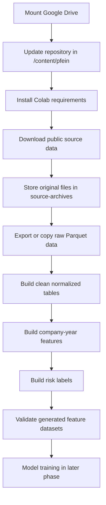

# Google Colab Data Preparation Pipeline Report

## Purpose

This document describes the Google Colab pipeline prepared for building the
machine-learning dataset of the project. The objective of this pipeline is to
download public company data, preserve source archives, transform the data into
Parquet-based data-lake layers, and generate feature and label tables that can
later be used for model development.

The Colab workflow was introduced because several data preparation operations
are heavy for a local development machine. Google Colab provides temporary
compute resources, while Google Drive provides persistent storage for downloaded
archives and generated Parquet datasets.

## Context And Work Completed

The work focused on making the data preparation pipeline reproducible in Google
Colab. The project repository already contains backend tools for downloading,
cleaning, feature generation, and baseline training. The Colab layer wraps these
tools into simpler notebook commands.

The following actions were performed or clarified:

| Area | Action |
|---|---|
| Repository update | The existing `/content/pfein` checkout is updated with `git pull` instead of cloning again |
| Dependency installation | Colab-specific dependencies are installed from `collabs/requirements-colab.txt` |
| Dependency conflict handling | Backend API packages such as `fastapi`, `starlette`, and `uvicorn` were removed from Colab after conflicts |
| Storage design | A Google Drive folder was selected as persistent storage for source archives and data-lake outputs |
| Pipeline execution | The full public-data pipeline command was prepared without INPI, without BODACC, and without model training for the first validation run |
| Training decision | The `--train` flag was intentionally deferred because the current priority is validating data preparation before model development |

## Why Colab Uses A Separate Requirements File

The backend project has a standard `requirements.txt` file for the local API and
Docker environment. That file includes packages such as `fastapi`, `starlette`,
and `uvicorn`, which are useful for running the backend server.

Google Colab already includes many Python packages, including packages used by
interactive tools. Installing the backend requirements directly in Colab caused
dependency conflicts with preinstalled packages such as `gradio`, `mcp`, and
`google-adk`.

For this reason, Colab uses:

```text
collabs/requirements-colab.txt
```

This file keeps only the dependencies needed for data processing:

| Package Family | Role In The Pipeline |
|---|---|
| `duckdb` | SQL queries and joins over Parquet files |
| `pyarrow` | Parquet reading and writing |
| `pandas`, `numpy` | Data manipulation |
| `scikit-learn`, `joblib` | Optional baseline model training |
| `httpx`, `python-dotenv` | HTTP access and environment configuration |
| `pydantic`, `pydantic-settings` | Compatibility with project configuration modules |
| `paramiko` | Optional SFTP access for INPI source downloads |

The important operational rule is:

```text
In Colab, install collabs/requirements-colab.txt, not requirements.txt.
```

## Repository Update Strategy In Colab

When the repository already exists in Colab, running `git clone` again produces:

```text
fatal: destination path '/content/pfein' already exists and is not an empty directory
```

This is expected. Colab still has the previous `/content/pfein` folder in the
current runtime. The correct command is therefore:

```bash
%cd /content/pfein
!git pull
```

If the runtime contains local changes that must be discarded, the reproducible
reset command is:

```bash
%cd /content/pfein
!git fetch origin
!git reset --hard origin/main
```

The branch name must be changed if the project uses another branch.

## Storage Architecture

The pipeline separates temporary Colab compute from persistent Google Drive
storage.

| Location | Role |
|---|---|
| `/content/pfein` | Temporary Colab checkout of the project source code |
| Google Drive `pfe_data` folder | Persistent storage for downloaded data and generated outputs |
| `source-archives` | Original downloaded files kept for traceability |
| `data-lake/raw` | Extracted source records with minimal transformation |
| `data-lake/clean` | Normalized tables with stable schemas |
| `data-lake/features` | ML-ready feature and label tables |
| `ml-artifacts` | Optional trained model files and metadata |

The current selected Drive root is:

```text
/content/drive/MyDrive/PFE ML Data/pfe_data
```

If the project later moves to a true Google Shared Drive, the same scripts can
be used by changing only `--drive-root`, for example:

```text
/content/drive/Shareddrives/PFE ML Data/pfe_data
```

## Global Workflow



## Source Systems Used In The First Pipeline Run

The first recommended run uses public data sources that do not require private
credentials.

| Source | Provider | Access Method | Current Role |
|---|---|---|---|
| INSEE Sirene | INSEE / data.gouv.fr | Public bulk Parquet files | Company identity and administrative status |
| Financial statements | data.gouv.fr | Public Parquet resource | Financial indicators and company-year accounting features |

The first run excludes INPI and BODACC:

| Source | Reason For Exclusion In First Run |
|---|---|
| INPI / RNE | Requires FTP or SFTP credentials and large archive handling |
| BODACC | Requires local `.taz` or `.tar` archive availability for the Colab script |

This staged strategy reduces operational risk. The public-data pipeline is
validated first, then private or heavier legal-event sources can be added.

## Main Colab Commands

### 1. Mount Google Drive

```python
from google.colab import drive
drive.mount("/content/drive")
```

### 2. Update Repository

```bash
%cd /content/pfein
!git pull
%cd /content/pfein/back_end
```

### 3. Install Colab Dependencies

```bash
!pip install -q -r collabs/requirements-colab.txt
```

If backend packages were previously installed in the same runtime, remove them:

```bash
!pip uninstall -y fastapi starlette uvicorn
!pip install -q -r collabs/requirements-colab.txt
```

After uninstalling conflicting packages, restarting the Colab runtime is
recommended.

### 4. Run The Full Public-Data Pipeline

The first complete data preparation run should not train the model yet:

```bash
!python collabs/full_pipeline.py \
  --drive-root "/content/drive/MyDrive/PFE ML Data/pfe_data" \
  --install-deps \
  --no-inpi \
  --no-bodacc \
  --start-year 2017 \
  --end-year 2025
```

This command runs the data preparation pipeline from source download to feature
and label table generation.

## Pipeline Components

The Colab folder contains small scripts that call the project backend tools in a
notebook-friendly way.

| Script | Purpose |
|---|---|
| `collabs/full_pipeline.py` | Runs the complete Colab preparation workflow |
| `collabs/download_insee.py` | Downloads INSEE bulk resources and exports raw data |
| `collabs/download_bilan.py` | Downloads financial/bilan Parquet data and copies it to raw storage |
| `collabs/download_inpi.py` | Optionally downloads INPI ZIP archives using credentials |
| `collabs/download_bodacc.py` | Optionally exports local BODACC archives to raw Parquet |
| `collabs/export_raw_sources.py` | Exports selected source archives into the data lake |
| `collabs/build_ml_data.py` | Builds clean tables, company-year features, and labels |
| `collabs/common.py` | Centralizes paths, dependency installation, commands, and Drive defaults |

## What The Full Pipeline Does

With `--no-inpi --no-bodacc`, the public-data pipeline performs the following
operations.

| Step | Operation | Output Layer |
|---|---|---|
| 1 | Download INSEE bulk resources | `source-archives/insee` |
| 2 | Export INSEE records to Parquet | `data-lake/raw/insee` |
| 3 | Download financial/bilan Parquet resource | `source-archives/financials` |
| 4 | Copy financial source into raw data lake | `data-lake/raw/financials` |
| 5 | Build clean company identity sources | `data-lake/clean/company_identity` |
| 6 | Build clean financial table | `data-lake/clean/financials` |
| 7 | Build company-year feature rows | `data-lake/features/company_year_features` |
| 8 | Build 12-month risk labels | `data-lake/features/risk_labels` |
| 9 | Build latest company feature table | `data-lake/features/company_features` |

## Data-Lake Output Structure

The expected output folder is:

```text
/content/drive/MyDrive/PFE ML Data/pfe_data
```

After a successful run, the main outputs are:

```text
/content/drive/MyDrive/PFE ML Data/pfe_data/source-archives
/content/drive/MyDrive/PFE ML Data/pfe_data/data-lake/raw
/content/drive/MyDrive/PFE ML Data/pfe_data/data-lake/clean
/content/drive/MyDrive/PFE ML Data/pfe_data/data-lake/features/company_year_features
/content/drive/MyDrive/PFE ML Data/pfe_data/data-lake/features/risk_labels
/content/drive/MyDrive/PFE ML Data/pfe_data/data-lake/features/company_features
/content/drive/MyDrive/PFE ML Data/pfe_data/ml-artifacts
```

The feature layer contains the datasets needed for ML experimentation:

| Dataset | Grain | Role |
|---|---|---|
| `company_year_features` | One row per `(siren, prediction_year)` | Historical feature matrix |
| `risk_labels` | One row per `(siren, prediction_year)` | Future outcome labels |
| `company_features` | One row per company | Latest available company feature snapshot |

## Why The Initial Year Range Is 2017-2025

The initial command uses:

```text
start-year = 2017
end-year = 2025
```

This is a practical validation range rather than a final scientific limitation.
The feature builder creates one row for each company and each prediction year.
Extending the period increases the output size considerably.

The 2017-2025 slice was selected for the first run because:

| Reason | Explanation |
|---|---|
| Recent data quality | Recent years usually have stronger financial and administrative coverage |
| Operational validation | A smaller time window is easier to run and debug in Colab |
| Label relevance | Recent years are more aligned with current business behavior |
| Runtime control | The output grows with `number of companies x number of years` |

After validating the pipeline, the range can be extended:

```bash
!python collabs/full_pipeline.py \
  --drive-root "/content/drive/MyDrive/PFE ML Data/pfe_data" \
  --install-deps \
  --no-inpi \
  --no-bodacc \
  --start-year 2010 \
  --end-year 2025
```

Older years may be useful, but their actual value depends on the completeness of
financial statements, legal events, and administrative history.

## Why Model Training Is Deferred

The pipeline includes a baseline training script:

```text
app/tools/train_continuity_model.py
```

This script trains a transparent logistic-regression model for:

```text
continuity_risk_12m_label
```

However, training was intentionally deferred in the current phase. The immediate
objective is to prepare and validate the data, not to claim final predictive
performance.

The correct order is:

1. Download and store source data.
2. Build raw and clean Parquet layers.
3. Generate features and labels.
4. Validate row counts, schemas, missing values, and temporal consistency.
5. Only then train and evaluate models.

Running `--train` too early may produce a model, but the model would not yet be
scientifically meaningful if the input sources are incomplete or unvalidated.

## Optional Training Command

After the dataset has been validated, training can be launched with:

```bash
!python collabs/build_ml_data.py \
  --drive-root "/content/drive/MyDrive/PFE ML Data/pfe_data" \
  --start-year 2017 \
  --end-year 2025 \
  --train
```

This writes:

```text
/content/drive/MyDrive/PFE ML Data/pfe_data/ml-artifacts/model.joblib
/content/drive/MyDrive/PFE ML Data/pfe_data/ml-artifacts/model_metadata.json
```

These artifacts should be interpreted as a baseline model, not as the final
modeling result.

## Validation Commands

After the public pipeline finishes, the following commands help verify that the
feature datasets exist:

```bash
!find "/content/drive/MyDrive/PFE ML Data/pfe_data/data-lake/features" -maxdepth 3 -type f | head -50
```

Useful manifest files can also be inspected:

```bash
!find "/content/drive/MyDrive/PFE ML Data/pfe_data/data-lake" -name "_manifest.json" | head -20
```

The purpose of this verification is to confirm that:

| Check | Reason |
|---|---|
| Feature folders exist | Confirms the pipeline reached the ML preparation stage |
| Parquet files exist | Confirms datasets were physically written |
| Manifests exist | Confirms traceability metadata was generated |
| Row counts are non-zero | Confirms sources were actually processed |

## Team Storage Strategy

A Google Drive folder named `PFE ML Data` was created with a nested `pfe_data`
folder. This can be shared with teammates so that the data does not need to be
downloaded separately by every user.

The current path is:

```text
/content/drive/MyDrive/PFE ML Data/pfe_data
```

This is a regular Drive folder, not necessarily a true Google Shared Drive. It
can still be shared, but each teammate must be able to see the same folder path
from Colab. If they cannot, they should add the shared folder as a shortcut to
their own MyDrive.

For a stronger team setup, the folder can later be moved to:

```text
/content/drive/Shareddrives/PFE ML Data/pfe_data
```

In that case, all team members run the same pipeline commands with the shared
drive path.

## Data Leakage Control

The feature builder follows a temporal prediction design:

```text
Features: information available at or before prediction_date
Labels: events occurring after prediction_date and within the next 12 months
```

This distinction is essential for academic validity. A model must not use future
closure, radiation, or legal distress events as input features when those same
events define the target label.

| Invalid Leakage Example | Why It Is Invalid |
|---|---|
| Using a future radiation event as a feature | The model sees the answer before predicting it |
| Using next-year financial weakness as an input feature | The information was not available at the prediction date |
| Using future INPI formalities to describe the current year | The event occurs after the cutoff date |

## Limitations And Future Improvements

| Current Limitation | Future Improvement |
|---|---|
| The first recommended run excludes INPI | Add INPI after credentials and archive downloads are confirmed |
| The first recommended run excludes BODACC | Add historical BODACC archives for stronger legal-event labels |
| The initial year range is limited to 2017-2025 | Extend to 2010-2025 after validating runtime and data completeness |
| Training is deferred | Train only after feature and label quality checks are complete |
| The current shared storage is a regular Drive folder | Move to a true Google Shared Drive for cleaner team collaboration |
| Colab runtime is temporary | Keep all important outputs under Drive, not `/content` |

## Reproducible First Run

The following block summarizes the recommended first reproducible run:

```python
from google.colab import drive
drive.mount("/content/drive")
```

```bash
%cd /content/pfein
!git pull
%cd /content/pfein/back_end
!pip install -q -r collabs/requirements-colab.txt
```

```bash
!python collabs/full_pipeline.py \
  --drive-root "/content/drive/MyDrive/PFE ML Data/pfe_data" \
  --install-deps \
  --no-inpi \
  --no-bodacc \
  --start-year 2017 \
  --end-year 2025
```

## Report Summary

The Google Colab data preparation pipeline provides a reproducible workflow for
building the project machine-learning dataset outside the local backend runtime.
It updates the repository in Colab, installs a reduced dependency set designed
for data processing, stores persistent files in Google Drive, downloads public
INSEE and financial sources, builds raw and clean Parquet layers, and generates
company-year feature and label tables. Model training is deliberately postponed
until the prepared datasets are validated. This staged approach improves
reproducibility, avoids dependency conflicts, reduces unnecessary downloads for
team members, and creates a clear foundation for later ML experimentation.
