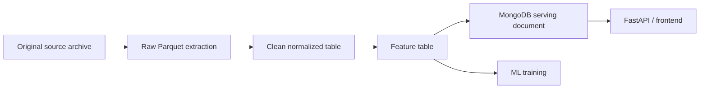

# Data Lake Pipeline

## Purpose

The data lake pipeline stores and processes the large historical datasets used
by the project. It exists because the raw public data volume is too large and
too analytical for MongoDB to be the only storage layer.

MongoDB remains the serving database for the API and frontend. The data lake is
the file-based processing layer used for raw extraction, normalization, joins,
and machine-learning feature construction.

Related report sections:

```text
docs/system_data_architecture.md
docs/inpi_report_section.md
docs/bodacc_report_section.md
docs/insee_report_section.md
docs/financial_report_section.md
docs/ml_continuity_risk_pipeline.md
docs/model_validation_report.md
docs/data_quality_report.md
docs/backend_api_operations_report.md
```

## Storage Location

Default container path:

```text
/data-lake
```

Default Windows host mount:

```text
D:/PFE_volumes/data-lake
```

Docker mount:

```text
D:/PFE_volumes/data-lake:/data-lake
```

Configuration variable:

```text
DATA_LAKE_DIR=/data-lake
```

## Storage Layers

The project uses clear folder names:

| Folder | Meaning | Example |
|---|---|---|
| `raw` | Extracted source records with minimal transformation | INPI filing rows, BODACC event rows |
| `clean` | Normalized tables with stable schemas and data types | `annual_accounts`, `legal_events` |
| `features` | Aggregated company or company-year features | `company_year_features` |

Recommended layout:

```text
/data-lake/
  raw/
    inpi/
    bodacc/
    insee/
    financials/
  clean/
    company_identity/
    establishments/
    annual_accounts/
    annual_account_lines/
    formalities_events/
    legal_events/
    financials/
  features/
    company_features/
    company_year_features/
    risk_labels/
```

## Processing Flow



## Current Operational State

As of 2026-05-04, the active data lake is `/data-lake`, mounted from
`D:/PFE_volumes/data-lake`. The older `/app/data/lake` shortcut was cleanup
leftover storage and is not part of the active path.

| Area | Current Evidence |
|---|---|
| Financials | Full source Parquet downloaded and 6,368,964 clean rows written to `/data-lake/clean/financials` |
| Features | Interim 2017-2025 feature and label tables exist with 17,078,580 rows each |
| INPI | Full source coverage is in progress; the missing `stock_RNE_formalites_NIVEAU1_20260304_1400.zip` is downloading and the full Parquet export is running for already available ZIPs |
| INSEE | Current evidence is still the 5,000-row API identity smoke export; full Sirene stock extraction is still required |
| BODACC | Current-year `PCL` and `RCS-B` exports exist, but historical `PCL` and `RCS-B` coverage is still required for final labels |

The current feature tables are useful integration evidence. They should be
rebuilt after full INPI, INSEE, and historical BODACC coverage is available.

## Why Parquet

Parquet is used because it is columnar, compressed, and efficient for analytical
queries.

| Requirement | Why Parquet Helps |
|---|---|
| Large source volume | Compression reduces storage compared with expanded JSON documents |
| Repeated feature engineering | DuckDB/Polars can rescan Parquet quickly |
| Joins by `siren` and year | Columnar reads avoid loading unused nested fields |
| Reproducibility | Partitioned files and manifests make outputs traceable |
| Separation from API workload | Heavy processing does not overload MongoDB serving collections |

## Source Archive Policy

Original source files are still important. They are the source of truth.

Examples:

```text
/source-archives/inpi/*.zip
/source-archives/bodacc/current/**/*.taz
/source-archives/bodacc/**/*.taz
INSEE Sirene bulk files
```

The data lake should not replace the source archive. It should contain extracted
and normalized Parquet datasets that can be regenerated from the source archive
when parsing logic changes.

## INPI Raw Export

API initialization endpoint:

```bash
curl "http://localhost:8000/api/v1/ingestion/inpi/source-files"
curl -X POST "http://localhost:8000/api/v1/ingestion/inpi/source-download/run?categories=formalites&niveaux=niveau1"
curl "http://localhost:8000/api/v1/ingestion/inpi/local-files"
curl -X POST "http://localhost:8000/api/v1/ingestion/inpi/parquet-export/run?background=true&force_export=true&include_raw_json=false"
curl "http://localhost:8000/api/v1/ingestion/inpi/parquet-export/status"
```

Exporter:

```text
app.tools.inpi_to_parquet
```

Example:

```bash
python -m app.tools.inpi_to_parquet \
  --input /source-archives/inpi/stock_RNE_comptes_annuels_20250926_1000_v2.zip \
  --batch-size 100000
```

Default output:

```text
/data-lake/raw/inpi/<category>/<niveau>/<zip-name>/
```

Example output:

```text
/data-lake/raw/inpi/comptes_annuels/standard/stock_RNE_comptes_annuels_20250926_1000_v2/
  part-00001.parquet
  part-00002.parquet
  _progress.json
  _manifest.json
```

Important behavior:

| Behavior | Reason |
|---|---|
| Chunked Parquet parts | Avoids one huge output file |
| `_progress.json` | Allows monitoring long exports |
| `_manifest.json` | Records final row count, parts, source file, and export metadata |
| `--include-raw-json` disabled by default | Avoids duplicating the original source ZIP |

Current source inventory:

| ZIP | Status |
|---|---|
| `stock_RNE_comptes_annuels_20250926_1000_v2.zip` | Present and exporting |
| `stock_RNE_comptes_annuels_NIVEAU1_20260320_1400.zip` | Present |
| `stock_RNE_formalites_20250523_0000.zip` | Present |
| `stock_RNE_formalites_NIVEAU1_20260304_1400.zip` | Downloading as `.zip.part` |

After the missing NIVEAU1 formalities ZIP finishes, rerun the full INPI Parquet
export so all four ZIP files are included in one complete data-lake refresh.

## BODACC Raw Export

API initialization endpoint:

```bash
curl -X POST "http://localhost:8000/api/v1/ingestion/bodacc/label-export/run"
curl "http://localhost:8000/api/v1/ingestion/bodacc/label-export/status"
```

The endpoint lists the DILA current-year feed, downloads missing or unreadable
`PCL` and `RCS-B` archives into `/source-archives/bodacc/current`, validates each tar
archive, and exports Parquet rows into `/data-lake/raw/bodacc/current/...`.

Current evidence is current-year oriented. Historical `PCL` and `RCS-B` archives
are still needed because they create most of the legal-distress and radiation
labels used for temporal model training.

Reusable exporter:

```text
app.tools.bodacc_to_parquet
```

Example:

```bash
python -m app.tools.bodacc_to_parquet \
  --input /source-archives/bodacc/current/OPENDATA/BODACC/FluxAnneeCourante/BILAN_BXC20260001.taz \
  --mode current \
  --year 2026 \
  --batch-size 100000
```

Default output:

```text
/data-lake/raw/bodacc/<mode>/<year>/<archive-name>/
```

Example output:

```text
/data-lake/raw/bodacc/current/2026/BILAN_BXC20260001/
  part-00001.parquet
  _progress.json
  _manifest.json
```

BODACC raw Parquet rows are event-oriented. They include `siren`, `nojo`,
`event_date`, `event_category`, `event_type`, BODACC family, risk flags,
location fields, and archive lineage.

## INSEE Raw Export

For full-history production, prefer INSEE Sirene stock files over API crawling.
The API exporter remains useful for smoke checks and targeted refreshes.

API initialization endpoint:

```bash
curl "http://localhost:8000/api/v1/ingestion/insee/bulk/resources"
curl -X POST "http://localhost:8000/api/v1/ingestion/insee/bulk/run?background=true&max_files=1&download=true&export=true"
curl "http://localhost:8000/api/v1/ingestion/insee/bulk/status"
```

Bulk exporter:

```text
app.tools.insee_bulk_to_parquet
```

Example:

```bash
python -m app.tools.insee_bulk_to_parquet \
  --input /source-archives/insee/bulk/stock_unite_legale/StockUniteLegale_utf8.parquet \
  --overwrite
```

Default bulk output:

```text
/data-lake/raw/insee/<stock-file-type>/<file-name>/
```

API exporter:

```text
app.tools.insee_bulk_to_parquet
```

Example:

```bash
python -m app.tools.insee_bulk_to_parquet \
  --max-pages 10 \
  --batch-size 100000
```

Default output:

```text
/data-lake/raw/insee/unites_legales/<run-name>/
```

Example output:

```text
/data-lake/raw/insee/unites_legales/api_full_20260502_120000/
  part-00001.parquet
  _progress.json
  _manifest.json
```

INSEE raw Parquet rows are identity-oriented. They include `siren`,
`denomination`, legal category, activity code, administrative status, creation
date, employee-size bracket, selected period fields, and API lineage.

## Financial Data Handling

The financial source is distributed as a Parquet resource through data.gouv.fr.
The backend exposes a data-lake path that downloads the source Parquet directly
under `/data-lake/raw/financials`, then normalizes selected accounting codes into
`/data-lake/clean/financials`.

API initialization endpoint:

```bash
curl "http://localhost:8000/api/v1/ingestion/financial/resources"
curl -X POST "http://localhost:8000/api/v1/ingestion/financial/export/run?background=true&overwrite=true&run_name=data_gouv_export_detail_bilan_20260210"
curl "http://localhost:8000/api/v1/ingestion/financial/export/status"
```

Clean builder:

```bash
python -m app.tools.build_clean_financials --overwrite
```

Pipeline endpoint:

```bash
curl -X POST "http://localhost:8000/api/v1/pipeline/financials/clean/run?background=true&overwrite=true"
curl "http://localhost:8000/api/v1/pipeline/status/clean_financials"
```

Recommended data-lake targets:

```text
/data-lake/raw/financials/<source-run>/
/data-lake/clean/financials/
```

The feature builder reads the first available financial dataset from:

```text
/data-lake/clean/financials
/data-lake/raw/financials
/data-lake/raw/financial
```

It accepts flexible source column names for:

```text
siren
financial_year / year / annee / exercice
closing_date / date_cloture
revenue / chiffre_affaires / ca
net_result / resultat_net / benefice
equity / capitaux_propres
debt / dettes / total_dettes
```

This flexibility is useful while the exact financial source schema is being
stabilized, but the final report schema should still normalize these fields in
`/data-lake/clean/financials`.

## Raw Layer Schemas

### INPI Raw Rows

| Field Group | Examples |
|---|---|
| Identity | `siren`, `denomination` |
| Source lineage | `record_key`, `source_file`, `inpi_id`, `category`, `niveau` |
| Filing dates | `date_depot`, `date_cloture`, `updated_at_source` |
| Filing context | `type_bilan`, `confidentiality`, `deleted` |

### BODACC Raw Rows

| Field Group | Examples |
|---|---|
| Identity | `siren`, `denomination`, `nom`, `prenom` |
| Event classification | `bodacc_family`, `event_category`, `event_type` |
| Event dates | `event_date`, `date_parution`, `jugement_date` |
| Risk signals | `flag_liquidation`, `flag_redressement`, `flag_procedure_collective` |
| Location | `numero_departement`, `tribunal`, `greffe`, `ville`, `code_postal` |
| Source lineage | `archive_name`, `archive_member_name`, `source_url` |

### INSEE Raw Rows

| Field Group | Examples |
|---|---|
| Identity | `siren`, `denomination`, `nom`, `prenom1` |
| Company classification | `categorie_juridique`, `activite_principale` |
| Administrative status | `etat_administratif`, `date_debut_periode` |
| Size and profile | `tranche_effectifs`, `annee_effectifs`, `caractere_employeur` |
| Lifecycle | `date_creation`, selected period fields |
| Source lineage | `record_key`, `source_page`, `source_cursor`, `exported_at` |

## Clean Layer Targets

The clean layer should have stable business schemas.

| Clean Dataset | Source | Grain | Purpose |
|---|---|---|---|
| `company_identity` | INSEE / INPI | One row per company | Company identity and administrative status |
| `establishments` | INSEE | One row per establishment | Establishment-level geography and activity |
| `annual_accounts` | INPI | One row per annual account filing | Filing and closing dates |
| `annual_account_lines` | INPI | One row per accounting code/value | Detailed accounting values |
| `formalities_events` | INPI | One row per formality | Registry lifecycle events |
| `legal_events` | BODACC | One row per legal announcement | Timeline and risk analysis |
| `financials` | data.gouv.fr | One row per company/year or source grain | Financial indicators |

## Feature Layer Targets

Feature datasets are designed for frontend summaries and ML.

| Feature Dataset | Grain | Examples |
|---|---|---|
| `company_features` | One row per company | Latest status, latest event, latest filing, global risk summary |
| `company_year_features` | One row per company/year | Yearly financial ratios, event counts, filing behavior |
| `risk_labels` | One row per company/year or prediction window | Future continuity, legal distress, radiation, financial weakness, and filing anomaly labels |

The first model target is:

```text
continuity_risk_12m
```

It predicts whether the company is likely to stop being active/open within the
next 12 months.

Feature and label builder:

```bash
python -m app.tools.build_company_year_features \
  --start-year 2017 \
  --end-year 2025 \
  --overwrite
```

Pipeline endpoint:

```bash
curl -X POST "http://localhost:8000/api/v1/pipeline/features/build/run?background=true&start_year=2017&end_year=2025&overwrite=true"
curl "http://localhost:8000/api/v1/pipeline/status/build_features"
```

Implemented feature sources are resolved in this order:

| Feature Source | Preferred Path | Fallback Path |
|---|---|---|
| Company identity | `/data-lake/clean/company_identity` | `/data-lake/raw/insee/unites_legales` |
| Legal events | `/data-lake/clean/legal_events` | `/data-lake/raw/bodacc` |
| INPI formalities | `/data-lake/clean/formalities_events` | `/data-lake/raw/inpi/formalites` |
| INPI annual accounts | `/data-lake/clean/annual_accounts` | `/data-lake/raw/inpi/comptes_annuels` |
| Financials | `/data-lake/clean/financials` | `/data-lake/raw/financials`, then `/data-lake/raw/financial` |

Training:

```bash
python -m app.tools.train_continuity_model
```

Pipeline endpoint:

```bash
curl -X POST "http://localhost:8000/api/v1/pipeline/model/train/run?background=true"
curl "http://localhost:8000/api/v1/pipeline/status/train_model"
```

Publishing predictions:

```bash
python -m app.tools.publish_prediction_results
```

Pipeline endpoint:

```bash
curl -X POST "http://localhost:8000/api/v1/pipeline/predictions/publish/run?background=true"
curl "http://localhost:8000/api/v1/pipeline/status/publish_predictions"
```

## Publishing To MongoDB

MongoDB should receive compact documents built from clean and feature datasets.

Recommended collections:

```text
company_profiles
company_events_summary
company_features
company_search
prediction_results
```

MongoDB should not receive all raw INPI and BODACC records as the final storage
strategy. Raw Mongo ingestion can be used for validation, but the long-term
pipeline should publish only compact documents.

## Monitoring And Validation

Each long export should be checked through its progress and manifest files.

Progress file:

```text
_progress.json
```

Typical fields:

```text
rows
parts
done
updated_at
input_path
```

Manifest file:

```text
_manifest.json
```

Validation checks:

| Check | Purpose |
|---|---|
| Row count is non-zero | Confirms records were extracted |
| `done` is true | Confirms the export completed |
| Number of parts matches expectation | Confirms chunked writing worked |
| Required columns exist | Confirms schema compatibility |
| Sample `siren` values are valid | Confirms join key quality |

## Operational Notes

When `docker-compose.yml` is changed to add a new mount, containers must be
recreated for the mount to become active. Code under `app/` is live-mounted in
development, but new Docker volumes require container recreation.

Deprecated development shortcut:

```text
/app/data/lake
```

Final intended path:

```text
/data-lake
```

Any temporary output under `/app/data/lake` can be deleted or regenerated into
`/data-lake`. Do not mix new analytical outputs between both paths.

## Report Summary

The data lake pipeline is the project’s large-scale processing layer. Original
source archives remain preserved, while extracted records are written as
compressed Parquet files under `/data-lake/raw`. These raw files are transformed
into clean normalized tables and then into company-level or company-year feature
datasets. MongoDB is used only after this processing stage to serve compact
frontend and API documents. This design makes the project scalable, traceable,
and suitable for machine-learning feature engineering.
