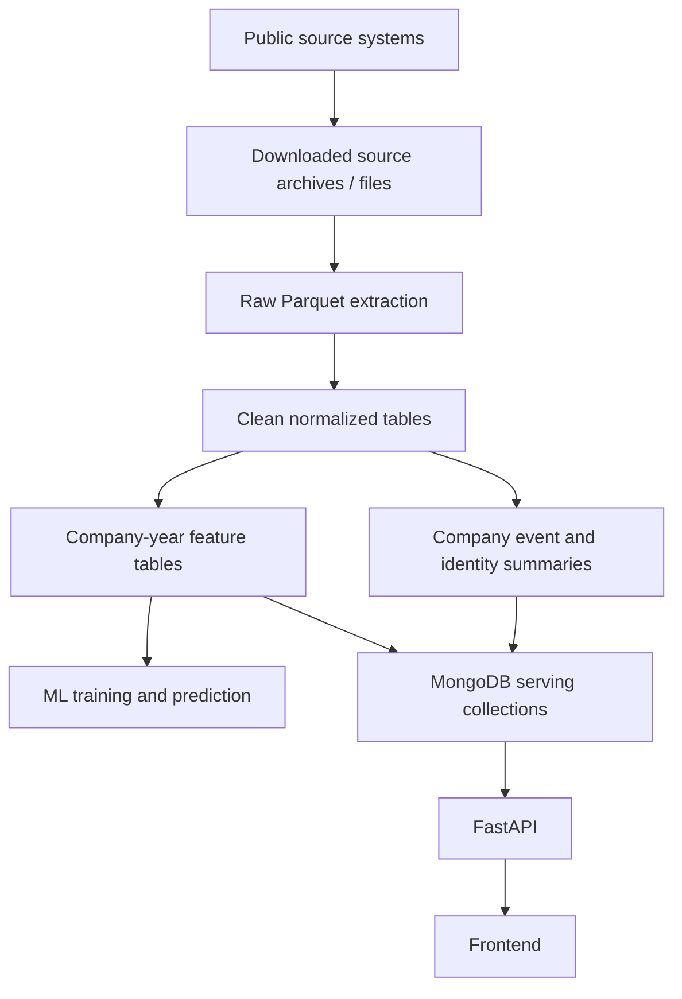

# Overall Data Architecture

## Purpose

The project combines several large French public datasets to build a company
intelligence and risk-analysis platform. The final system must support three
different needs:

| Need | Description |
|---|---|
| Data preservation | Keep source files and processing lineage so results can be reproduced |
| Analytical processing | Join and transform large historical datasets efficiently |
| Application serving | Expose fast, compact company profiles to the frontend and API |

The key architectural decision is to separate large-scale data processing from
frontend-serving storage. The source data can exceed 60 GB before expansion, so
using MongoDB as the only raw historical store would make ingestion, joins, and
feature engineering unnecessarily heavy.

## Source Systems

| Source | Provider | Main Content | Format | Main Use |
|---|---|---|---|---|
| INPI / RNE | INPI | Registry formalities and annual accounts filings | ZIP archives containing JSON | Registry activity and filing behavior |
| BODACC | DILA | Official legal announcements | `.taz` archives containing XML | Legal events, radiations, risk signals |
| INSEE / Sirene | INSEE | Company and establishment identity | API or bulk files | Identity, activity, legal category, administrative status |
| Financial dataset | data.gouv.fr | Financial indicators | Parquet | Financial ratios and model variables |

The shared linking key is:

```text
siren
```

The system also keeps source-specific identifiers such as BODACC `nojo`, INPI
record IDs, INSEE API cursors, archive member names, and source URLs for
auditability.

## Why MongoDB Alone Is Not Enough

MongoDB is useful for the backend and frontend, but it is not the best main raw
store for all historical public datasets.

| Problem With Raw Mongo-Only Storage | Impact |
|---|---|
| Large nested JSON/XML-derived documents | High disk usage and slower scans |
| Millions of individual inserts/upserts | Long ingestion time and index pressure |
| Heavy indexes on raw collections | More storage and slower writes |
| Analytical joins inside MongoDB | Slower feature engineering than columnar processing |
| Reprocessing raw data from database documents | Slow iteration when feature logic changes |
| Mixed source schemas in application database | Harder API and frontend contracts |

The chosen approach is therefore:

```text
source files -> Parquet data lake -> DuckDB/Polars processing -> compact MongoDB serving collections
```

## Global Architecture



## Layer Responsibilities

The project uses clear folder names rather than relying only on data-platform
jargon.

| Layer | Path / Storage | Responsibility | Example |
|---|---|---|---|
| Source files | `/source-archives/inpi`, `/source-archives/bodacc`, API or bulk source volumes | Preserve original archives and downloaded data | INPI ZIP, BODACC TAZ, INSEE API pages |
| Raw | `/data-lake/raw` | Extract source records into Parquet with minimal transformation | INPI annual account rows, BODACC event rows, INSEE identity rows |
| Clean | `/data-lake/clean` | Normalize schemas, dates, identifiers, and business entities | `company_identity`, `annual_accounts`, `legal_events` |
| Features | `/data-lake/features` | Aggregate company and company-year variables | `company_year_features` |
| Serving | MongoDB | Store compact API/frontend documents | `company_profiles`, `company_events_summary` |

## Data Lake Layout

Recommended layout:

```text
/data-lake/
  raw/
    inpi/
    bodacc/
    insee/
    financials/
  clean/
    company_identity/
    establishments/
    annual_accounts/
    formalities_events/
    legal_events/
    financials/
  features/
    company_features/
    company_year_features/
    risk_labels/
```

The host mount is:

```text
D:/PFE_volumes/data-lake:/data-lake
```

## Tooling Choices

| Tool | Role | Why It Is Used |
|---|---|---|
| PyArrow | Parquet writing and reading | Efficient columnar file generation |
| DuckDB | SQL analytics over Parquet | Fast joins and aggregations without a separate server |
| Polars | Python batch transformations | Fast dataframe operations and feature engineering |
| MongoDB | Serving database | Flexible compact documents for frontend/API queries |
| FastAPI | Backend API | Exposes company profiles, features, predictions, and monitoring |

Spark is not the first choice for this project because it adds operational
complexity. DuckDB and Polars are sufficient for a local or single-server
pipeline unless the data grows beyond what one machine can process comfortably.

## Source-Specific Roles

Detailed sections:

```text
docs/inpi_report_section.md
docs/bodacc_report_section.md
docs/insee_report_section.md
docs/financial_report_section.md
docs/data_lake_pipeline.md
docs/ml_continuity_risk_pipeline.md
docs/model_validation_report.md
docs/data_quality_report.md
docs/backend_api_operations_report.md
```

### INPI / RNE

INPI provides registry formalities and annual accounts filing information. It is
useful for filing behavior, registry activity, and company lifecycle signals.

Recommended path:

```text
INPI ZIP
  -> /data-lake/raw/inpi
  -> /data-lake/clean/annual_accounts
  -> /data-lake/clean/formalities_events
  -> company features and MongoDB summaries
```

### BODACC

BODACC provides official legal announcements. It is the main source for legal
events, radiations, and collective procedure risk signals.

Recommended path:

```text
BODACC TAZ
  -> /data-lake/raw/bodacc
  -> /data-lake/clean/legal_events
  -> event features and MongoDB timeline summaries
```

### INSEE / Sirene

INSEE is the identity backbone. It provides administrative status, activity
code, legal category, and establishment information.

Recommended path:

```text
INSEE source
  -> /data-lake/raw/insee
  -> /data-lake/clean/company_identity
  -> /data-lake/clean/establishments
  -> MongoDB company profile identity section
```

### Financial Dataset

The financial dataset is already Parquet-oriented. It provides company financial
values used in company-year features, such as revenue, net result, equity, and
debt when these columns are available in the source schema.

Recommended path:

```text
financial Parquet
  -> /data-lake/raw/financials
  -> /data-lake/clean/financials
  -> /data-lake/features/company_year_features
```

The backend now treats Parquet in the data lake as the preferred analytical
financial source. The raw source is downloaded under `/data-lake/raw/financials`
and normalized into `/data-lake/clean/financials`; raw financial Mongo storage
is not part of the active path.

### API, Worker, And Scheduler

The backend is split into an API process and a worker process. The API exposes
health checks, prediction lookup, ingestion controls, and synchronization
status. The worker owns scheduled jobs such as financial ingestion, INPI bulk
ingestion, BODACC current-year synchronization, and INSEE company registry sync.

This separation prevents long-running ingestion or model operations from
blocking frontend-facing API requests.

## Final Serving Model

The frontend should not query raw INPI or BODACC records directly. It should
query compact company documents designed for display and search.

Recommended MongoDB serving collections:

| Collection | Grain | Purpose |
|---|---|---|
| `company_profiles` | One document per company | Identity, status, latest known facts |
| `company_events_summary` | One document per company | Event counts, latest legal events, risk flags |
| `company_features` | One document per company or company-year | ML-ready features and prediction inputs |
| `company_search` | One document per searchable company | Fast search/autocomplete |
| `prediction_results` | One document per prediction run or company | Model outputs and explanation summaries |

Example company serving document:

```json
{
  "siren": "301899522",
  "identity": {
    "denomination": "Example Company",
    "activity_code": "6420Z",
    "legal_form": "SAS",
    "administrative_status": "active"
  },
  "latest_financials": {},
  "inpi_summary": {
    "accounts_count": 5,
    "latest_account_closing_date": "2024-12-31"
  },
  "bodacc_summary": {
    "risk_events_count": 0,
    "latest_event_type": "depot_comptes"
  },
  "risk_features": {},
  "updated_at": "2026-05-02T00:00:00Z"
}
```

## Machine Learning Dataset

The recommended ML structure is company-year based:

```text
(siren, year) -> information available at the end of that year
```

The first ML priority is company continuity risk:

```text
Will this company still be active/open in the next 12 months?
```

The primary target is:

```text
continuity_risk_12m
```

The label should represent a future event after the prediction cutoff. Example:

```text
features available up to 2024-12-31
label = did the company become inactive, close, get radiated, or enter serious legal distress during 2025?
```

This prevents data leakage from future events.

Feature families:

| Feature Family | Source |
|---|---|
| Identity and administrative status | INSEE |
| Financial ratios and accounting indicators | Financial parquet data |
| Legal event history and risk flags | BODACC |
| Registry activity and annual accounts filing behavior | INPI |

Secondary ML targets are also prepared:

| Target | Meaning |
|---|---|
| `legal_distress_risk_12m` | Future liquidation, redressement, sauvegarde, or collective procedure |
| `radiation_risk_12m` | Future radiation or cessation event |
| `financial_weakness_risk_12m` | Future weak financial condition when financial fields are available |
| `filing_anomaly_risk_12m` | Missing, late, or abnormal annual-account filing behavior |

## Data Leakage Control

The system must distinguish between historical features and future labels.

| Data Type | Feature Use | Label Use |
|---|---|---|
| BODACC PCL event before cutoff | Valid historical risk signal | Not a future label |
| BODACC PCL event after cutoff | Invalid as input | Valid target label |
| INPI formality before cutoff | Valid registry activity feature | Usually not a label |
| INPI formality after cutoff | Invalid as input | Possible future event label depending on objective |
| INSEE status before cutoff | Valid identity/status feature | Usually not a label |
| INSEE closure/status after cutoff | Invalid as input | Possible label only if closure is the target |
| Financial statement after cutoff | Invalid as input | Not usually a target label |

Rule:

```text
Only use data whose event/source date is <= prediction_date as input.
Use data after prediction_date only to define labels.
```

## Operational Strategy

The pipeline is designed to be resumable and inspectable.

| Mechanism | Purpose |
|---|---|
| Source archive retention | Allows reprocessing without re-downloading |
| `_progress.json` files | Allows long Parquet exports to be monitored |
| `_manifest.json` files | Records row counts, parts, source file, and export metadata |
| Mongo ingestion state collections | Tracks operational jobs and validation runs |
| Partitioned Parquet output | Makes partial processing and analytical scans easier |
| Separate API and worker containers | Keeps long-running scheduled work away from request handling |

## Advantages Of The Architecture

| Advantage | Explanation |
|---|---|
| Scalability | Parquet stores large extracted datasets more efficiently than raw Mongo documents |
| Reproducibility | Original archives and manifests preserve source lineage |
| Faster analytics | DuckDB and Polars can scan and join Parquet efficiently |
| Better API performance | MongoDB stores only compact documents designed for the frontend |
| Safer ML construction | Company-year feature tables make cutoff dates explicit |
| Easier schema evolution | Clean and feature layers can be regenerated when parsing logic improves |

## Limitations And Future Improvements

| Current Limitation | Planned Improvement |
|---|---|
| INPI clean tables are not fully implemented yet | Build annual accounts and formalities normalizers |
| BODACC Parquet export exists but bulk current/historical export still needs orchestration | Add batch runner over all downloaded archives |
| INSEE bulk exporter exists, but clean period-aware identity snapshots are not implemented yet | Build cutoff-safe `company_identity` and `establishments` clean tables |
| Financial clean data exists, but derived ratios are still minimal | Add margins, leverage, liquidity, and trend features |
| `prediction_results` publishing exists, but final company profile serving collections are still conceptual | Implement `company_profiles`, `company_events_summary`, and `company_search` builders |
| Feature generation and model training exist as CLI tools and API-triggered jobs, but are not scheduled end-to-end | Add worker schedules for feature build, training, validation, and publishing |

## Report Summary

The project uses a hybrid data architecture to handle large public company data.
Original INPI, BODACC, INSEE, and financial files are preserved as source data.
Extracted records are stored as compressed Parquet files in a data lake, then
transformed into clean tables and company-level features with DuckDB or Polars.
MongoDB is used as the serving database for compact company profiles, event
summaries, and prediction-ready documents exposed through FastAPI. This
separation allows the system to handle 60 GB+ of source data while keeping the
frontend responsive and the machine-learning dataset reproducible.
