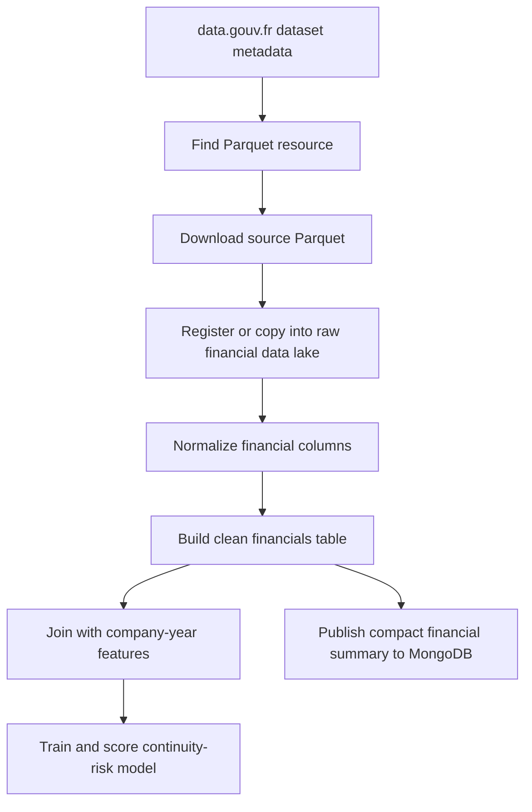

# Financial Parquet Data Pipeline

## Purpose

The financial data pipeline adds accounting and financial indicators to the
company intelligence platform. It complements INSEE identity data, BODACC legal
events, and INPI registry activity with variables that describe the economic
condition of a company.

Financial data is especially useful for the machine-learning objective because
legal distress is often preceded by weak profitability, negative equity,
increasing debt, or irregular account filing behavior.

## Data Source

The configured source is the data.gouv.fr dataset:

```text
donnees-financieres-detaillees-des-entreprises-format-parquet
```

The backend discovers the dataset through:

```text
DATAGOUV_API_BASE=https://www.data.gouv.fr/api/1
DATAGOUV_DATASET_SLUG=donnees-financieres-detaillees-des-entreprises-format-parquet
```

The expected source format is Parquet. A reference downloader also exists:

```text
references/download_financial_parquet.py
```

That script downloads one Parquet resource with retry and resume behavior, then
checks the Parquet `PAR1` header and footer. It is useful as a development
reference, but the report architecture should treat data-lake Parquet files as
the reproducible analytical input.

## Data Family

Unlike BODACC or INPI, this source is not an event feed. It is a financial table
that should be normalized around the company identifier and accounting year.

Recommended analytical grain:

```text
(siren, financial_year)
```

Some source resources may expose only latest values or a different accounting
grain. The clean layer must make this explicit before the data is used for ML.

## Global Workflow



## Current Backend Processing

Financial data now uses a first-class data-lake path:

| Step | Behavior |
|---|---|
| Dataset discovery | `GET /api/v1/ingestion/financial/resources` reads data.gouv.fr metadata |
| Resource selection | Selects the first resource whose format is Parquet |
| Download | `POST /api/v1/ingestion/financial/export/run` streams the file into `/data-lake/raw/financials` |
| Validation | Verifies Parquet magic bytes and writes `_manifest.json` |
| Clean build | `app.tools.build_clean_financials` extracts canonical financial columns |
| Pipeline API | `POST /api/v1/pipeline/financials/clean/run` can rebuild the clean table |
| State tracking | Stores job state in `ingestion_jobs` |

This path does not write raw financial rows to MongoDB.

Current evidence:

| Dataset | Evidence |
|---|---|
| Raw source | `/data-lake/raw/financials/data_gouv_export_detail_bilan_20260210/export-detail-bilan.parquet`, 2,820,473,022 bytes |
| Clean output | `/data-lake/clean/financials/financials.parquet` |
| Clean rows | 6,368,964 |
| Clean manifest | `/data-lake/clean/financials/_manifest.json`, generated `2026-05-03T20:58:35.419530+00:00` |

## Storage Strategy

Recommended long-term path:

```text
financial source Parquet
  -> /data-lake/raw/financials
  -> /data-lake/clean/financials
  -> /data-lake/features/company_year_features
  -> compact MongoDB serving collections
```

Raw Mongo financial storage is not part of the active path. The development
database does not contain `company_financials_raw`.

## Configuration Variables

| Variable | Purpose |
|---|---|
| `DATAGOUV_API_BASE` | Base URL for data.gouv.fr API metadata |
| `DATAGOUV_DATASET_SLUG` | Dataset identifier |
| `INGESTION_STATE_COLLECTION` | Job-state collection, currently `ingestion_jobs` |
| `DATA_LAKE_DIR` | Preferred data-lake root for analytical Parquet |
| `FINANCIAL_EXPORT_DATASET_SLUG` | State key for the financial data-lake export |

## Clean Financials Table

The clean financial table should provide stable column names even if the source
schema changes.

| Clean Field | Meaning | Usage |
|---|---|---|
| `siren` | Company identifier | Main join key |
| `financial_year` | Accounting or fiscal year | Company-year alignment |
| `closing_date` | Account closing date when available | Temporal cutoff and year derivation |
| `revenue` | Revenue or turnover | Financial feature |
| `net_result` | Net profit or loss | Risk feature and explanation |
| `equity` | Equity or own funds | Solvency feature |
| `debt` | Debt or total liabilities when available | Leverage feature |
| `source_file` | Source Parquet file or resource name | Traceability |
| `source_updated_at` | Source or extraction timestamp | Reproducibility |

The implemented feature builder accepts several possible source names for these
fields, such as `chiffre_affaires`, `resultat_net`, `capitaux_propres`,
`dettes`, `annee`, and `exercice`. The clean layer should still converge toward
the canonical names above.

## Machine Learning Usage

The financial data is joined into the company-year feature table:

```text
/data-lake/features/company_year_features
```

Implemented financial feature columns:

| Feature | Meaning |
|---|---|
| `latest_revenue` | Latest revenue known at or before the prediction year |
| `latest_net_result` | Latest net result known at or before the prediction year |
| `latest_equity` | Latest equity known at or before the prediction year |
| `latest_debt` | Latest debt known at or before the prediction year |

The label builder also creates:

```text
financial_weakness_risk_12m_label
```

This label is currently true when next-year financials show negative net result
or negative equity. It is a secondary signal, not the primary continuity-risk
label.

## Frontend Usage

The frontend should not query the full raw financial table. It should receive a
compact financial summary inside a serving document.

Recommended frontend fields:

| Field | Display Purpose |
|---|---|
| `latest_revenue` | Latest known company revenue |
| `latest_net_result` | Profit/loss indicator |
| `latest_equity` | Solvency context |
| `latest_debt` | Debt context |
| `financial_year` | Year attached to the displayed values |
| `financial_data_available` | Indicates whether financial values exist |

These fields can support score explanations, financial badges, and charts over
time once multiple years are normalized.

## Data Leakage Control

Financial statements are temporal. They must be filtered by what was available
at the prediction date.

Rule:

```text
Features: financial year or closing date <= prediction_date
Labels: future financial weakness only after prediction_date
```

Leakage examples:

| Risky Usage | Why It Is Invalid |
|---|---|
| Using 2025 financial results to predict risk at 2024-12-31 | The result was not known at cutoff |
| Using a future negative equity value as an input feature | It may directly reveal the future weakness label |
| Upserting multiple yearly rows by `siren` and keeping only the latest row | It can replace historical facts with future information |

## Relationship With Other Sources

| Source | Relationship |
|---|---|
| INSEE | Provides identity, status, activity code, and company age |
| INPI | Provides accounts filing behavior and closing/deposit dates |
| BODACC | Provides legal events, radiations, and collective procedures |
| Financial data | Provides numeric accounting indicators and weakness signals |

The shared join key is:

```text
siren
```

## Limitations And Future Improvements

| Current Limitation | Future Improvement |
|---|---|
| Current production service upserts Mongo rows by `siren` | Use data-lake storage with `(siren, financial_year)` when the source has yearly rows |
| Clean financial schema is still flexible | Normalize all important columns and document exact source mappings |
| Financial ratios are not computed yet | Add margins, leverage, liquidity, and trend features |
| Frontend financial serving document is not implemented yet | Publish compact latest-financial and multi-year summary fields |
| Other sources are still partial | Finish full INPI export, full INSEE identity, and historical BODACC before final model training |

## Report Summary

The financial Parquet source adds numeric accounting information to the project.
The backend now downloads the data.gouv.fr Parquet resource into the data lake,
normalizes clean financial rows by `siren` and `financial_year`, and feeds
company-year features such as revenue, net result, equity, and debt. This makes
financial information usable for frontend summaries and cutoff-safe
continuity-risk modeling.
