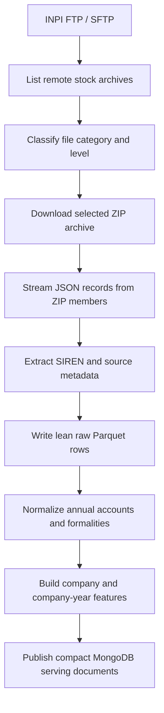

# INPI / RNE Data Pipeline

## Purpose

The INPI / RNE pipeline collects official registry data from the French Registre
National des Entreprises. It transforms large INPI stock archives into structured
datasets that can be joined with BODACC, INSEE, and financial data through the
company identifier `siren`.

INPI is important for this project because it gives a registry-centered view of
companies. Where BODACC provides official legal announcements and INSEE provides
identity information, INPI adds formalities, registry updates, and annual
accounts filing information. These data points help describe the administrative
life of a company and support both frontend company profiles and machine
learning features.

## Data Source

The INPI bulk data is accessed through an FTP/SFTP server. The backend is
configured through environment variables:

```text
INPI_FTP_HOST
INPI_FTP_PORT
INPI_FTP_USER
INPI_FTP_PASSWORD
INPI_FTP_PROTOCOL
INPI_REMOTE_BASE_DIR
INPI_LOCAL_DATA_DIR
```

The FTP directory currently exposes four large stock archives:

| File | Business Meaning | Pipeline Category | Level |
|---|---|---|---|
| `stock_RNE_comptes_annuels_20250926_1000_v2.zip` | Annual accounts stock | `comptes_annuels` | `standard` |
| `stock_RNE_comptes_annuels_NIVEAU1_20260320_1400.zip` | Annual accounts level 1 stock | `comptes_annuels` | `niveau1` |
| `stock_RNE_formalites_20250523_0000.zip` | Registry formalities stock | `formalites` | `standard` |
| `stock_RNE_formalites_NIVEAU1_20260304_1400.zip` | Registry formalities level 1 stock | `formalites` | `niveau1` |

The files are ZIP archives containing many JSON records. Their size makes them
unsuitable for repeated raw processing directly inside the API database.

## INPI Data Families

The INPI feed is separated into two main business families.

| Family | Meaning | Project Use |
|---|---|---|
| `comptes_annuels` | Annual accounts filings deposited by companies | Filing history, closing dates, confidentiality, accounting-line extraction |
| `formalites` | Registry formalities and company updates | Company lifecycle, legal modifications, registry events |

The feed also has two detail levels.

| Level | Meaning | Why It Is Kept Separate |
|---|---|---|
| `standard` | More complete source detail | Useful for detailed reconstruction and traceability |
| `niveau1` | A level 1 INPI product with a different schema | Useful for normalized registry-level processing |

These files should not be merged blindly into one raw collection. They represent
different entities and different grains. A company can have many account filings
and many formalities over time, so `siren` alone is not a valid unique key for
raw INPI records.

## Global Workflow



## Processing Steps

### 1. Remote Listing

The connector lists the INPI FTP/SFTP directory and records the path, remote
size, and remote modification date of each file. File names are normalized to
detect whether the file contains `formalites` or `comptes_annuels`, and whether
it belongs to the `niveau1` product.

The backend also supports an optional include filter:

```text
INPI_REMOTE_INCLUDE_GLOB
```

This can be used to restrict processing to a specific archive during tests.

### 2. Download

Files are downloaded to:

```text
/source-archives/inpi
```

The downloader streams data into a `.part` file and renames it only when the
download is complete. It tracks:

```text
downloaded_bytes
download_total_bytes
download_progress_percent
download_status
```

This makes the ingestion monitorable and avoids treating partial files as valid
archives.

### 3. ZIP And JSON Parsing

The parser opens the ZIP archive and streams its members. It supports several
JSON structures:

```text
JSON arrays
top-level JSON objects
objects containing list fields
JSON lines / NDJSON
gzip-compressed JSON members
```

The parser yields one source record at a time, which avoids loading the whole
archive into memory.

### 4. SIREN And Metadata Extraction

Each record is inspected for a `siren`. The extraction checks several common
paths because INPI records differ by family and level.

For annual accounts, useful top-level fields include:

```text
siren
denomination
dateDepot
dateCloture
typeBilan
confidentiality
updatedAt
deleted
id
```

Some standard annual accounts records also contain detailed accounting lines
inside:

```text
bilanSaisi.bilan.detail.pages[].liasses[]
```

Those accounting lines require a later clean transformation because they are not
simple company-level fields.

### 5. Deduplication Key

Raw INPI records use a deterministic `record_key`. It is computed from the
source record and the target category/level.

This is necessary because one `siren` can appear many times:

```text
one company -> many annual accounts filings
one company -> many formalities
one company -> multiple years and versions
```

Using only `siren` as the raw unique key would overwrite valid historical
records.

## Storage Strategy

The active production path is the data lake. Earlier MongoDB validation
collections may still exist in development databases, but they are not the
planned analytical store and should not be used as the ML source. The current
path is:

```text
INPI ZIP archives
  -> /data-lake/raw/inpi
  -> /data-lake/clean/annual_accounts
  -> /data-lake/clean/formalities
  -> /data-lake/features/company_features
  -> compact MongoDB serving collections
```

This keeps the original ZIP files as the source of truth, stores extracted rows
as compressed Parquet, and publishes only compact summaries to MongoDB.

## Raw Parquet Export

The portable API path for a fresh machine is:

```bash
curl "http://localhost:8000/api/v1/ingestion/inpi/source-files"
curl -X POST "http://localhost:8000/api/v1/ingestion/inpi/source-download/run?categories=formalites&max_files=1"
curl "http://localhost:8000/api/v1/ingestion/inpi/local-files"
curl -X POST "http://localhost:8000/api/v1/ingestion/inpi/parquet-export/run?background=false&force_export=true&max_files=1&max_records_per_file=5000&categories=comptes_annuels&niveaux=standard"
curl "http://localhost:8000/api/v1/ingestion/inpi/parquet-export/status"
```

The INPI Parquet exporter is:

```text
app.tools.inpi_to_parquet
```

Example:

```bash
python -m app.tools.inpi_to_parquet \
  --input /source-archives/inpi/stock_RNE_comptes_annuels_20250926_1000_v2.zip \
  --batch-size 100000
```

By default, it writes to:

```text
/data-lake/raw/inpi/<category>/<niveau>/<zip-name>/
```

The exporter creates chunked Parquet files:

```text
part-00001.parquet
part-00002.parquet
...
_progress.json
_manifest.json
```

The default output is intentionally lean. It stores important source metadata
but does not duplicate the full raw JSON, because the original ZIP is already
kept as the raw source of truth. The option `--include-raw-json` should be used
only for small debug exports.

## Raw Parquet Fields

The first raw Parquet version stores these fields:

| Field | Meaning | Usage |
|---|---|---|
| `record_key` | Deterministic unique key for the source record | Deduplication and traceability |
| `siren` | Company identifier | Main join key |
| `denomination` | Company name when available | Frontend display and search |
| `category` | `comptes_annuels` or `formalites` | Source family filtering |
| `niveau` | `standard` or `niveau1` | Schema/product distinction |
| `source_file` | Source ZIP file name | Traceability |
| `inpi_id` | INPI source-side record identifier when available | Traceability |
| `updated_at_source` | Source update timestamp | Recency and auditing |
| `date_depot` | Filing deposit date when available | Annual accounts timeline |
| `date_cloture` | Account closing date when available | Yearly financial alignment |
| `type_bilan` | Balance sheet/account type | Accounting context |
| `confidentiality` | Public/confidential status | Feature and frontend indicator |
| `deleted` | Source deletion flag | Data quality and lifecycle handling |
| `exported_at` | Technical export timestamp | Operational traceability |

These fields are not the final analytical schema. They are the first raw
extracted layer used to build clean tables.

## Clean Tables

The clean layer should transform raw INPI rows into stable tables with explicit
business grain.

| Clean Table | Grain | Purpose |
|---|---|---|
| `annual_accounts` | One row per annual accounts filing | Deposit date, closing date, account type, confidentiality |
| `annual_account_lines` | One row per accounting line/code when needed | Detailed accounting values extracted from `bilanSaisi` |
| `formalities_events` | One row per registry formality | Registry lifecycle events and modifications |
| `company_registry_snapshot` | One row per company | Latest known registry identity and status |

This separation is important because annual accounts and formalities are not the
same type of information and should not be forced into one table.

## MongoDB Collections

MongoDB should hold operational state and compact serving documents. The active
INPI data source for ML is `/data-lake/raw/inpi`, not raw MongoDB collections.
The old raw validation collections were removed from the development database,
and the public API no longer exposes the Mongo-validation ingestion path.

## Frontend Usage

The frontend should consume compact company documents, not raw INPI records.
Useful INPI-derived frontend fields include:

| Field | Display Purpose |
|---|---|
| `siren` | Main company identifier |
| `denomination` | Company name |
| `latest_account_closing_date` | Most recent known account closing date |
| `latest_account_deposit_date` | Most recent account deposit date |
| `accounts_count` | Number of known annual accounts filings |
| `has_recent_accounts_deposit` | Indicates active financial reporting behavior |
| `has_confidential_accounts` | Indicates whether some filings are confidential |
| `latest_formality_date` | Most recent registry formality date |
| `latest_formality_type` | Most recent registry event type |
| `formalities_count` | Number of known formalities |

Suggested frontend sections:

| Section | INPI Contribution |
|---|---|
| Company profile | Latest registry name/status and account filing activity |
| Annual accounts timeline | Deposits ordered by closing or deposit date |
| Registry history | Formalities and legal updates |
| Risk context | Missing/recent/confidential filings and unusual registry activity |
| Traceability panel | Source ZIP, INPI ID, update timestamp |

## Machine Learning Usage

INPI data should be transformed into company-year features. The recommended ML
grain is:

```text
(siren, year)
```

Potential annual accounts features:

| Feature | Meaning |
|---|---|
| `inpi_accounts_count_year` | Number of annual accounts filings during the year |
| `latest_account_closing_year` | Year of latest known account closing date |
| `days_since_latest_account_deposit` | Recency of latest account filing |
| `has_confidential_accounts_history` | Whether confidential filings appear in the company's history |
| `has_public_accounts_recently` | Whether public annual accounts were deposited recently |
| `account_deposit_regular_years` | Number of years with regular filing behavior |

Potential formalities features:

| Feature | Meaning |
|---|---|
| `formalities_count_year` | Number of formalities during the year |
| `formalities_count_3y` | Number of formalities in the last three years |
| `latest_formality_type_year` | Latest known registry event type during the year |
| `registry_activity_recency_days` | Days since latest registry activity |
| `has_recent_registry_change` | Whether the company had a recent legal/registry change |

These features should be joined with BODACC, INSEE, and financial features using
`siren`.

## Data Leakage Control

INPI records are time-dependent. They must be filtered using a prediction cutoff
date when building ML features.

If the model predicts whether a risk event happens during year `N+1`, then INPI
features for year `N` must only use records known before or at:

```text
prediction_date = 31 December of year N
```

Potential leakage examples:

| Risky Usage | Why It Is A Problem |
|---|---|
| Using a future formality from year `N+1` as an input feature for year `N` | The event would not be known at prediction time |
| Using a future annual accounts deposit to describe past reporting behavior | It gives the model information from after the cutoff |
| Using `deleted` updates from the future without cutoff filtering | It may encode later source corrections |

Safe usage:

```text
features = INPI records with source date <= prediction_date
label = target event during the future prediction window
```

## Relationship With Other Sources

INPI is a complementary source, not a replacement for the other datasets.

| Source | Main Contribution |
|---|---|
| INSEE | Official identity, legal category, activity code, administrative status |
| BODACC | Legal announcements, risk events, radiations, public legal timeline |
| Financial dataset | Financial variables, ratios, and accounting indicators |
| INPI | Registry formalities and annual accounts filing behavior |

The shared key is:

```text
siren
```

## Limitations And Future Improvements

Current limitations:

| Limitation | Future Improvement |
|---|---|
| Raw Parquet currently stores lean filing metadata only | Add clean extraction of accounting `liasses` codes into `annual_account_lines` |
| Formalities fields still require deeper schema analysis | Build a dedicated `formalities_events` normalizer |
| Mongo raw validation collection is large | Keep it as validation only and avoid loading remaining stock archives into Mongo raw |
| Source dates differ by field and product | Define a clear source-date precedence rule for cutoff filtering |

## Report Summary

The INPI / RNE pipeline collects large official registry stock archives from an
FTP/SFTP source. The files contain annual accounts and formalities records in
JSON format. A first MongoDB validation run confirmed the parser and SIREN
extraction on millions of annual accounts records. For the long-term
architecture, INPI records are exported as compressed Parquet files under
`/data-lake/raw/inpi`, then normalized into annual accounts, formalities, and
company registry tables. MongoDB is reserved for operational state and compact
frontend-serving documents. This design preserves source traceability, supports
efficient processing with DuckDB or Polars, and avoids using MongoDB as the main
raw store for very large historical data.
