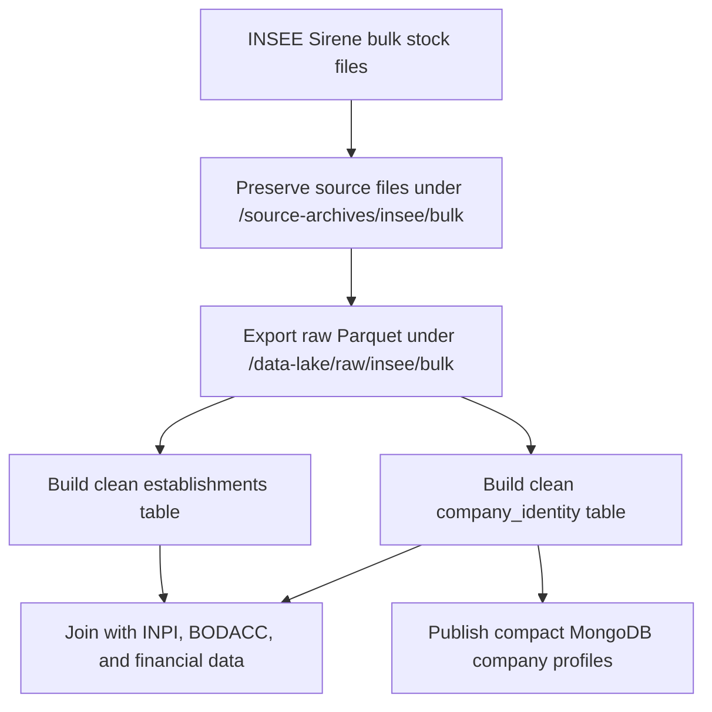

# INSEE Sirene Data Pipeline

## Purpose

The INSEE Sirene pipeline provides the identity backbone of the project. It
collects official company identity and administrative information, then
normalizes it so INPI, BODACC, financial data, the backend, the future
frontend, and the machine-learning dataset can all join around the same company
identifier.

INSEE is important because it answers the basic reference questions:

| Question | INSEE Contribution |
|---|---|
| What is the official company identifier? | `siren` |
| Is the company active or closed? | Administrative status |
| What is the official activity code? | Main activity code |
| What is the legal category? | Legal form/category |
| Where is the company established? | Establishment and head-office information |

The central linking key is:

```text
siren
```

## Data Source

The data comes from official Sirene stock files published through
INSEE/data.gouv.fr. The backend now treats bulk files as the only operational
INSEE ingestion path.

Configured variables:

```text
INSEE_BULK_DATASET_SLUG=base-sirene-des-entreprises-et-de-leurs-etablissements-siren-siret
INSEE_BULK_SOURCE_DIR=/source-archives/insee/bulk
INSEE_BULK_EXPORT_DATASET_SLUG=insee_bulk_export
```

The bulk path should be used for very large full refreshes. The storage target
is the same in both cases: Parquet in the data lake.

## Main INSEE Concepts

| Concept | Meaning | Project Use |
|---|---|---|
| `SIREN` | Nine-digit company identifier | Main join key across all sources |
| `SIRET` | Fourteen-digit establishment identifier | Establishment-level analysis |
| `uniteLegale` | Legal unit, usually one company or legal person | Company identity record |
| `etablissement` | Physical or administrative establishment | Address and local activity |
| `periodesUniteLegale` | Historical periods for a legal unit | Status and activity evolution over time |
| `categorieJuridiqueUniteLegale` | Legal category code | Legal form feature |
| `activitePrincipaleUniteLegale` | Main activity code | Sector and risk grouping |
| `etatAdministratifUniteLegale` | Administrative status | Active/closed company status |

## Global Workflow



## Processing Steps

### 1. Bulk Resource Discovery And Download

The backend lists official data.gouv.fr resources:

```text
GET /api/v1/ingestion/insee/bulk/resources
```

The active resources are the five Parquet stock files:

```text
StockUniteLegale_utf8.parquet
StockEtablissement_utf8.parquet
StockUniteLegaleHistorique_utf8.parquet
StockEtablissementHistorique_utf8.parquet
StockEtablissementLiensSuccession_utf8.parquet
```

Bulk runs preserve files under:

```text
/source-archives/insee/bulk/<dataset-type>/<official-file>
```

### 2. Raw Parquet Export

Preferred full-history exporter:

```text
app.tools.insee_bulk_to_parquet
```

Example:

```bash
python -m app.tools.insee_bulk_to_parquet \
  --input /source-archives/insee/bulk/stock_unite_legale/StockUniteLegale_utf8.parquet \
  --overwrite
```

Default bulk output:

```text
/data-lake/raw/insee/bulk/<dataset-type>/<source-name>/
  part-00001.parquet
  _manifest.json
```

The exporter writes Parquet parts and a manifest for lineage.

### 3. Clean Identity Normalization

The raw rows should be transformed into the clean layer:

```text
/data-lake/clean/company_identity
```

The clean identity table should keep one stable current record per SIREN, with
typed dates and normalized names, activity codes, legal categories, and status.

Future establishment-level data should be normalized into:

```text
/data-lake/clean/establishments
```

## Storage Strategy

INSEE has two roles in the project:

| Storage Role | Location | Purpose |
|---|---|---|
| Raw extracted rows | `/data-lake/raw/insee` | Reproducible source extraction |
| Clean identity | `/data-lake/clean/company_identity` | Stable company identity table |
| Clean establishments | `/data-lake/clean/establishments` | Establishment geography and local activity |
| MongoDB serving | `company_profiles`, `company_search` | Fast frontend company lookup |

The recommended long-term path is:

```text
INSEE Sirene source
  -> /data-lake/raw/insee
  -> /data-lake/clean/company_identity
  -> /data-lake/clean/establishments
  -> compact MongoDB serving collections
```

MongoDB should keep the frontend-ready profile, not every historical raw INSEE
response as the analytical source of truth.

## Raw Parquet Fields

The current raw Parquet exporter stores the most useful company-level fields:

| Field | Description | Usage |
|---|---|---|
| `record_key` | Deterministic key, normally `insee:siren:<siren>` | Deduplication and traceability |
| `siren` | Official nine-digit company identifier | Main join key |
| `denomination` | Company name for legal entities | Frontend display and search |
| `nom`, `prenom1`, `sexe` | Physical-person identity fields when applicable | Frontend display when no denomination exists |
| `categorie_juridique` | INSEE legal category code | Legal form grouping and ML feature |
| `activite_principale` | Main activity code | Sector analysis and ML feature |
| `nic_siege` | Head-office establishment NIC | Link to establishment/head-office data |
| `tranche_effectifs` | Employee-size bracket | Company size feature |
| `annee_effectifs` | Reference year for employee-size bracket | Temporal context |
| `date_creation` | Company creation date | Company age feature |
| `statut_diffusion` | Diffusion status of the record | Source interpretation |
| `caractere_employeur` | Employer indicator | Company profile and feature engineering |
| `economie_sociale_solidaire` | Social and solidarity economy flag | Profile and segmentation |
| `societe_mission` | Mission-driven company flag when available | Profile and segmentation |
| `etat_administratif` | Current administrative status from the active period | Active/closed status |
| `date_debut_periode` | Start date of the selected legal-unit period | Chronological status handling |
| `activite_principale_periode` | Activity code from the selected period | Historical/current activity context |
| `denomination_periode`, `nom_periode` | Name fields from the selected period | Name history context |
| `source_page` | API page number | Operational traceability |
| `source_cursor` | API cursor used for the page | Operational traceability |
| `exported_at` | Export timestamp | Technical lineage |
| `raw_json` | Optional full API record when enabled | Debugging and reprocessing |

Raw Parquet fields are not necessarily the final frontend or ML schema. They
are the reproducible extraction layer from which clean tables are built.

## Clean Company Identity Table

The clean `company_identity` table should contain one row per company:

| Field | Description | Usage |
|---|---|---|
| `siren` | Company identifier | Main join key |
| `company_name` | Best display name from denomination or physical-person name | Frontend display |
| `legal_category_code` | INSEE legal category | Legal form and ML feature |
| `activity_code` | Main activity code | Sector grouping |
| `administrative_status` | Active or closed status | Frontend badge and ML feature |
| `creation_date` | Company creation date | Company age |
| `head_office_siret` | Head-office establishment identifier when available | Establishment join |
| `employee_size_bracket` | Employee-size class | Size feature |
| `employee_size_year` | Year attached to the size bracket | Temporal context |
| `last_insee_period_start` | Start date of the current selected INSEE period | Cutoff and status history |
| `source_updated_at` | Last extraction or source update timestamp | Traceability |

## MongoDB Serving Role

The current Mongo validation collection is:

```text
company_registry
```

It stores a compact company document with:

```text
siren
denomination
insee_raw
insee_updated_at
last_source
```

For the final frontend, INSEE should feed compact serving collections such as:

```text
company_profiles
company_search
```

Example serving identity section:

```json
{
  "siren": "301899522",
  "identity": {
    "name": "Example Company",
    "activity_code": "6420Z",
    "legal_category_code": "5710",
    "administrative_status": "active",
    "creation_date": "1974-01-01"
  }
}
```

## Frontend Usage

INSEE fields should appear in the company identity and search parts of the
frontend.

Recommended fields for display:

| Field | Display Purpose |
|---|---|
| `siren` | Official company identifier |
| `company_name` or `denomination` | Main company title |
| `activity_code` | Activity/sector label after mapping |
| `legal_category_code` | Legal form after mapping |
| `administrative_status` | Active/closed badge |
| `creation_date` | Company age and profile chronology |
| `employee_size_bracket` | Company size indicator |

Recommended search/filter fields:

| Field | Search Or Filter Use |
|---|---|
| `siren` | Exact company lookup |
| `company_name` | Name search/autocomplete |
| `activity_code` | Sector filter |
| `legal_category_code` | Legal-form filter |
| `administrative_status` | Active/closed filter |
| `employee_size_bracket` | Size filter |

Technical fields such as `source_cursor`, `source_page`, and `exported_at`
should remain hidden unless an advanced traceability panel is opened.

## Machine Learning Usage

INSEE provides mostly identity, size, sector, and administrative features. It
does not usually define the main risk label by itself, but it improves the
quality of joins and segmentation.

Recommended INSEE features:

| Feature | Meaning |
|---|---|
| `company_age_years` | Years between creation date and prediction date |
| `activity_code` | Sector category |
| `legal_category_code` | Legal form/category |
| `employee_size_bracket` | Approximate company size |
| `is_active_at_cutoff` | Whether the company was active at prediction date |
| `has_employer_flag` | Whether the company is marked as an employer |
| `is_social_solidarity_company` | Social and solidarity economy indicator |
| `is_mission_company` | Mission-driven company indicator |

The recommended ML grain remains:

```text
(siren, year)
```

INSEE features should be joined with:

| Source | Contribution |
|---|---|
| BODACC | Legal events, radiations, collective procedures |
| INPI | Formalities and accounts filing behavior |
| Financial dataset | Financial values and ratios |

## Data Leakage Control

INSEE looks more static than BODACC or INPI, but it still has temporal fields.
Administrative status, activity, name, and employee-size class can change over
time. The model must only use the INSEE state known at the prediction cutoff.

Rule:

```text
Only use INSEE information whose period/source date is <= prediction_date as input.
Do not use a future closure/status update to predict risk before that update was known.
```

Examples:

| Case | Valid Use |
|---|---|
| Company creation date before cutoff | Safe feature for company age |
| Administrative closure after cutoff | Not valid as an input feature before cutoff |
| Employee-size bracket published after cutoff | Use only if it was available at cutoff |
| Activity code from a future period | Do not use for past prediction years |

If the objective is to predict future failure or collective procedure risk,
future INSEE closure information must not be used as an explanatory variable for
the same prediction window.

## Relationship With Other Sources

INSEE is the reference identity layer. Other sources are joined to it through
`siren`.

| Source | How It Connects To INSEE |
|---|---|
| INPI/RNE | Uses `siren` to attach filings and formalities to official identity |
| BODACC | Uses `siren` to attach legal announcements to official identity |
| Financial data | Uses `siren` to attach accounting indicators to company identity |

When names differ between sources, INSEE should generally be treated as the
identity reference, while BODACC and INPI names remain useful for source
traceability and historical context.

## Limitations And Future Improvements

| Current Limitation | Future Improvement |
|---|---|
| Bulk exporter exists but clean `company_identity` and `establishments` builders are not finalized | Build stable clean tables from unit, establishment, historical, and succession files |
| API exporter covers company-level `unitesLegales` only | Keep API path for smoke tests and targeted refreshes; use bulk stock files for full refreshes |
| Legal category and activity codes are stored as codes | Add mapping tables for readable labels |
| Period history is only lightly flattened in the raw exporter | Build clean period-aware identity snapshots for cutoff-safe ML |
| Final Mongo `company_profiles` builder is still conceptual | Implement publishing from clean identity and feature tables |

## Report Summary

The INSEE Sirene pipeline supplies the official identity layer for the project.
It provides the SIREN join key, company names, activity codes, legal category,
administrative status, creation date, and size indicators. The existing MongoDB
sync remains useful for validation and API experiments, while the long-term
architecture exports INSEE records to Parquet under `/data-lake/raw/insee`,
normalizes them into `/data-lake/clean/company_identity`, and publishes compact
identity sections to MongoDB serving collections. This keeps INSEE aligned with
the same scalable architecture used for INPI, BODACC, and financial data.
