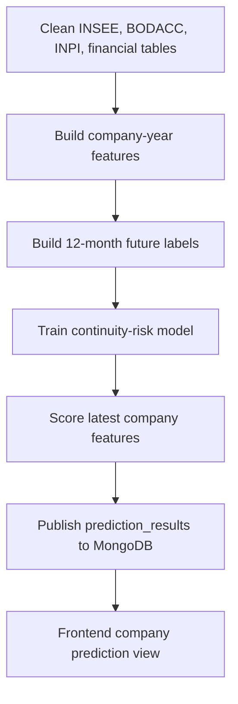

# ML Continuity Risk Pipeline

## Purpose

The first machine-learning objective is company continuity risk:

```text
Will this company still be active/open in the next 12 months?
```

This target is broader and more useful for users than legal distress alone.
Legal distress remains a strong signal, but many companies close, cease
activity, or are radiated without a collective procedure.

## Primary Target

The primary target is:

```text
continuity_risk_12m
```

For a company observed at prediction date `D`, the label is true if one of the
following happens before `D + 12 months`:

| Source | Event |
|---|---|
| INSEE | Company becomes administratively closed or inactive |
| BODACC | Radiation event |
| INPI/RNE | Cessation, closure, or radiation formality |
| BODACC | Liquidation, redressement, sauvegarde, or collective procedure |

## Secondary Targets

The pipeline also builds secondary labels:

| Target | Meaning |
|---|---|
| `legal_distress_risk_12m` | Future liquidation, redressement, sauvegarde, or collective procedure |
| `radiation_risk_12m` | Future radiation or cessation from BODACC/INPI |
| `financial_weakness_risk_12m` | Future weak financial signal when financial fields are available |
| `filing_anomaly_risk_12m` | Missing or abnormal annual-account filing behavior |

These targets can become separate models later. For the first model, they are
kept as labels and explanation signals.

## Data Flow



## Commands

Build features and labels:

```bash
python -m app.tools.build_company_year_features \
  --start-year 2017 \
  --end-year 2025 \
  --overwrite
```

The same step can also be launched through the pipeline API:

```bash
curl -X POST "http://localhost:8000/api/v1/pipeline/features/build/run?background=true&start_year=2017&end_year=2025&overwrite=true"
```

Train the first continuity model:

```bash
python -m app.tools.train_continuity_model \
  --target continuity_risk_12m_label
```

Pipeline API:

```bash
curl -X POST "http://localhost:8000/api/v1/pipeline/model/train/run?background=true&target=continuity_risk_12m_label"
```

Publish prediction results:

```bash
python -m app.tools.publish_prediction_results
```

Pipeline API:

```bash
curl -X POST "http://localhost:8000/api/v1/pipeline/predictions/publish/run?background=true"
```

Smoke-test mode:

```bash
python -m app.tools.build_company_year_features \
  --start-year 2022 \
  --end-year 2024 \
  --max-companies 10000 \
  --overwrite
```

## Output Datasets

| Dataset | Path | Grain |
|---|---|---|
| Company-year features | `/data-lake/features/company_year_features` | One row per `(siren, prediction_year)` |
| Risk labels | `/data-lake/features/risk_labels` | One row per `(siren, prediction_year)` |
| Latest company features | `/data-lake/features/company_features` | One row per company |

Current interim evidence: the 2017-2025 build produced 17,078,580
company-year feature rows, 17,078,580 label rows, and 1,897,620 latest-company
feature rows. This build must be rerun after full INPI, full INSEE, and
historical BODACC coverage are complete.

The implemented builder prefers clean data-lake tables, but can fall back to raw
exports while clean layers are still being built.

| Source View | Preferred Input | Fallback Input |
|---|---|---|
| `company_identity` | `/data-lake/clean/company_identity` | `/data-lake/raw/insee/unites_legales` |
| `legal_events` | `/data-lake/clean/legal_events` | `/data-lake/raw/bodacc` |
| `formalities_events` | `/data-lake/clean/formalities_events` | `/data-lake/raw/inpi/formalites` |
| `annual_accounts` | `/data-lake/clean/annual_accounts` | `/data-lake/raw/inpi/comptes_annuels` |
| `financials` | `/data-lake/clean/financials` | `/data-lake/raw/financials`, then `/data-lake/raw/financial` |

## Implemented Feature Families

The first implemented feature table includes transparent, reportable variables.

| Feature Family | Example Columns | Purpose |
|---|---|---|
| Identity | `company_name`, `activity_code`, `legal_category_code`, `employee_size_bracket`, `administrative_status_at_cutoff`, `company_age_years` | Context and segmentation |
| BODACC legal history | `legal_events_count_all`, `legal_events_count_12m`, `legal_risk_events_count_all`, `legal_distress_events_count_all`, `radiation_events_count_all`, `days_since_last_legal_event` | Historical legal activity and risk context |
| INPI formalities | `formalities_count_all`, `formalities_count_12m`, `cessation_formalities_count_all` | Registry activity and cessation signals |
| INPI accounts | `annual_accounts_count_all`, `annual_accounts_count_24m`, `days_since_last_account_filing`, `latest_account_closing_year` | Filing behavior and reporting recency |
| Financials | `latest_revenue`, `latest_net_result`, `latest_equity`, `latest_debt` | Financial condition when source columns are available |

## Implemented Labels

The label builder writes boolean labels for the 12-month future window.

| Label Column | Definition |
|---|---|
| `continuity_risk_12m_label` | True if future INSEE closure, BODACC legal distress, BODACC radiation, or INPI cessation/radiation signal appears within 12 months |
| `legal_distress_risk_12m_label` | True if a future BODACC liquidation, redressement, sauvegarde, or collective procedure flag appears |
| `radiation_risk_12m_label` | True if a future BODACC radiation or INPI cessation/radiation signal appears |
| `financial_weakness_risk_12m_label` | True if next-year financials show negative net result or negative equity |
| `filing_anomaly_risk_12m_label` | True when a company with recent account filing history has no following filing within the configured future window |

## MongoDB Output

Predictions are published to:

```text
prediction_results
```

Each document stores:

```text
siren
target
horizon_months
model_version
prediction_year
probability
score_percent
risk_bucket
explanation_factors
scored_at
updated_at
```

The frontend can read the latest continuity prediction through:

```text
GET /api/v1/predictions/{siren}
```

The scoring publisher builds explanation factors from readable feature columns:

| Factor Code | Source Column | Direction Logic |
|---|---|---|
| `legal_distress_history` | `legal_distress_events_count_all` | Higher values increase risk |
| `recent_legal_events` | `legal_events_count_12m` | Higher values increase risk |
| `radiation_history` | `radiation_events_count_all` | Higher values increase risk |
| `filing_gap` | `days_since_last_account_filing` | Higher values increase risk |
| `company_age` | `company_age_years` | Higher values are treated as protective |
| `latest_net_result` | `latest_net_result` | Positive values are treated as protective |

## Leakage Control

The feature builder uses information available at or before the prediction
date. Future events are used only to create labels.

Rule:

```text
Features: event/source date <= prediction_date
Labels: prediction_date < event/source date <= prediction_date + 12 months
```

This prevents the model from seeing the closure, radiation, or legal distress
event it is supposed to predict.

## Notes

The first model uses a transparent logistic-regression baseline. This gives a
stable benchmark and readable coefficients before moving to more complex models.
Once the dataset is validated, the same feature/label tables can be used to test
tree-based models and separate secondary targets.

## Limitations And Future Improvements

| Current Limitation | Future Improvement |
|---|---|
| The model is a baseline logistic regression | Compare with calibrated tree-based models after validating the dataset |
| Feature building is implemented as a CLI command and API-triggered job | Schedule feature generation and publishing in the worker after data refreshes |
| Financial clean fields exist, but ratios are not computed yet | Add margins, leverage, liquidity, and trend features |
| Prediction explanations are rule-based from selected columns | Add model-level explanations after the model family is finalized |
| Evaluation depends on available historical labels | Add a model validation report with temporal splits, metrics, and class balance |

## Report Summary

The continuity-risk ML pipeline builds company-year features from INSEE,
BODACC, INPI, and financial Parquet sources. For each company and prediction
year, it keeps only information available up to the prediction date and uses the
following 12 months to create labels. The first model is a transparent
logistic-regression baseline trained from these feature and label tables. Latest
company features are scored and published to MongoDB as `prediction_results`,
which the API exposes through `/api/v1/predictions/{siren}`.
