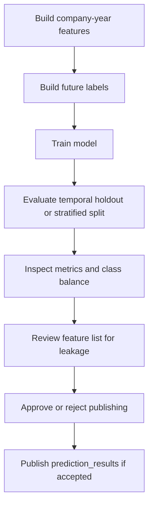

# Model Validation Report

## Purpose

This report defines how the continuity-risk model should be validated before
its results are used in a frontend or final demonstration. It is currently a
validation template because the final training run and metrics depend on the
availability of completed source exports and labels.

## Model Under Review

| Item | Value |
|---|---|
| Primary target | `continuity_risk_12m_label` |
| Horizon | 12 months |
| Training command | `python -m app.tools.train_continuity_model` |
| Feature table | `/data-lake/features/company_year_features` |
| Label table | `/data-lake/features/risk_labels` |
| Model artifact | `ML_ARTIFACTS_DIR / ML_MODEL_FILE` |
| Metadata file | `app/ml/artifacts/model_metadata.json` by default |
| Per-run evidence | `ML_ARTIFACTS_DIR/runs/<descriptive_run_name>/` |

## Validation Workflow



## Required Dataset Checks

| Check | Expected Evidence |
|---|---|
| Row count | Number of training rows is above the chosen `--min-rows` threshold |
| Target balance | Both positive and negative classes exist |
| Year coverage | Multiple prediction years exist when temporal validation is desired |
| SIREN validity | `siren` values are nine-digit identifiers |
| Label window | Labels use only events after the prediction date and within 12 months |
| Feature cutoff | Features use only events and source dates at or before the prediction date |

## Metrics To Report

| Metric | Why It Matters | Current Value |
|---|---|---|
| Accuracy | Basic classification correctness | Pending real training run |
| ROC AUC | Ranking quality across thresholds | Pending real training run |
| Average precision | Useful when the positive class is rare | Pending real training run |
| Class counts | Shows label imbalance | Label-source smoke run: 2,449 negative, 683 positive for `continuity_risk_12m_label` |
| Train/test split strategy | Shows whether validation is temporal or random | Pending real training run |

The training tool writes these fields to `model_metadata.json` after a
successful run. It also writes permanent per-run evidence under a descriptive
folder in `ML_ARTIFACTS_DIR/runs/`, including precision-recall and ROC curves,
threshold analysis, top-K analysis, score distribution, confusion matrix,
yearly class-balance artifacts, coefficient evidence, and a report-ready
`run_summary.md`.

## Current Smoke Validation Status

A BODACC-only label-source smoke run was completed on 2026-05-02:

| Item | Value |
|---|---|
| Feature rows | 3,132 |
| Label rows | 3,132 |
| Prediction year | 2025 |
| Source used | `/data-lake/raw/bodacc` from BILAN, PCL, and RCS-B smoke archives |
| Positive `continuity_risk_12m_label` rows | 683 |
| Negative `continuity_risk_12m_label` rows | 2,449 |
| Positive `legal_distress_risk_12m_label` rows | 190 |
| Positive `radiation_risk_12m_label` rows | 493 |
| Training decision | Do not train yet; source coverage is still too narrow |

The result is useful because it proves that the feature builder can read raw
BODACC Parquet and write feature/label datasets with positive labels. It is not
sufficient for model training because the evidence comes from a very small
current-year sample. The next training-ready dataset must include broader
historical coverage and identity/financial context.

## Current Interim Dataset Status

A larger 2017-2025 feature and label build has completed, but it is not yet the
final training dataset because several source inputs remain partial.

| Item | Value |
|---|---|
| Company-year feature rows | 17,078,580 |
| Risk label rows | 17,078,580 |
| Year range | 2017-2025 |
| Latest company feature rows | 1,897,620 |
| Financial coverage | Full clean financial table available with 6,368,964 rows |
| INPI coverage | Full source download and export still in progress |
| INSEE coverage | Still limited to the 5,000-row API identity smoke export |
| BODACC coverage | Current-year `PCL` and `RCS-B` exist; historical label archives still missing |
| Training decision | Hold training until feature tables are rebuilt after missing source coverage is complete |

This interim dataset is valuable because it proves that the financial clean table
can join into a multi-year company feature build. It should not be used as the
final model evidence because label and lifecycle coverage are still incomplete.

## Leakage Review

Columns excluded from training include:

```text
siren
prediction_date
first_future_legal_event_date
continuity_risk_12m_label
legal_distress_risk_12m_label
radiation_risk_12m_label
financial_weakness_risk_12m_label
filing_anomaly_risk_12m_label
```

The validation review should confirm that no future event text, future status,
or future financial value remains in the feature columns.

## Publishing Gate

Prediction publishing should happen only if these conditions are satisfied:

| Gate | Required Decision |
|---|---|
| Feature and label manifests exist | Required |
| Model has at least two target classes | Required |
| Validation metrics are documented | Required before final report |
| Leakage review passes | Required |
| Model artifact and metadata are saved | Required |

Publishing command:

```bash
python -m app.tools.publish_prediction_results
```

## Limitations And Future Improvements

| Current Limitation | Future Improvement |
|---|---|
| Current larger dataset was built with partial INPI, INSEE, and BODACC coverage | Rebuild features and labels after full INPI export, full INSEE identity, and historical BODACC labels |
| This file has no real final model metrics yet | Populate metrics from `model_metadata.json` and the run artifact folder after a successful temporal validation run |
| The first model is logistic regression | Compare against calibrated tree-based models |
| Explanation factors are manually selected | Add model-level explanations after model choice is stable |
| Validation split falls back to random split when temporal split is not possible | Prefer temporal holdout once enough yearly data exists |

## Report Summary

The model validation report defines the evidence required before publishing
continuity-risk predictions. It checks dataset size, target balance, temporal
cutoff safety, model metrics, and leakage risk. Once a real training run has
been completed, this file should be updated with the metrics from
`model_metadata.json` and used as the approval record before publishing
`prediction_results`.
