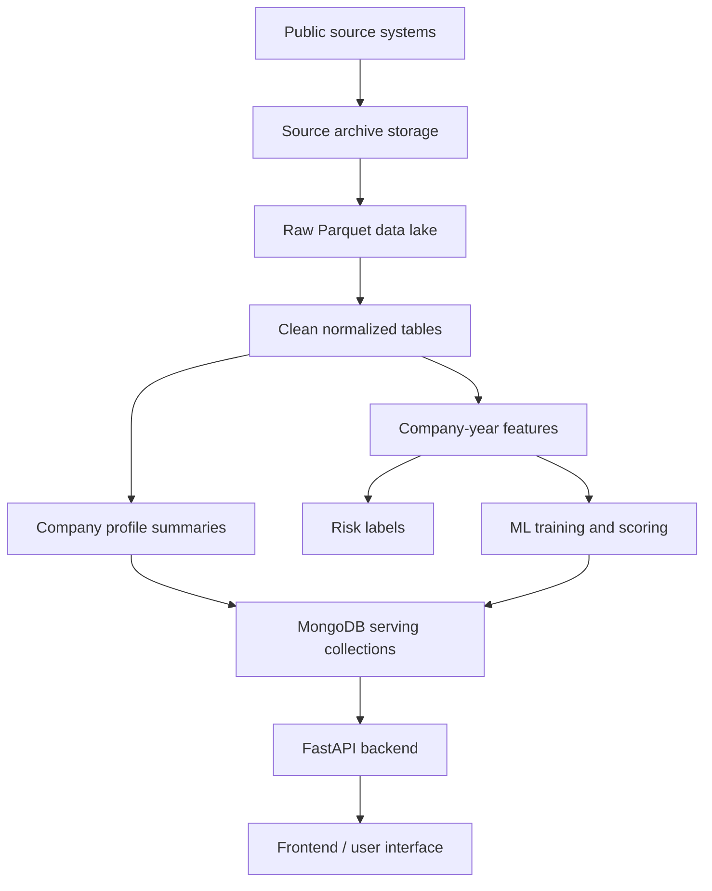
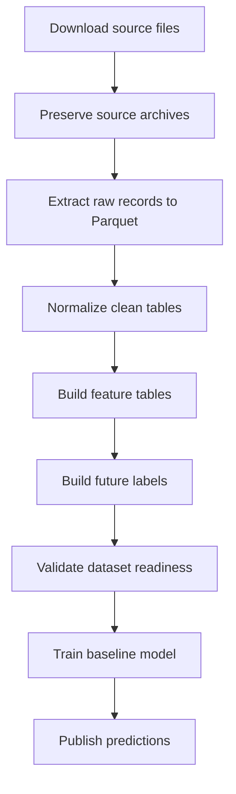

# Project Defense Report: Company Intelligence And Continuity-Risk Platform

## Executive Summary

This project builds a data and machine-learning platform for analyzing French
companies from public administrative, legal, registry, and financial sources.
The goal is to transform fragmented public datasets into a structured company
intelligence system capable of supporting search, company profiles, event
monitoring, feature engineering, and future risk prediction.

The central business question is:

```text
Can we identify companies that may become inactive, close, be radiated, or show
serious continuity risk within the next 12 months?
```

To answer this question responsibly, the project does not begin directly with a
model. It first builds a reproducible data foundation: source archives are
preserved, raw records are extracted to Parquet, clean normalized tables are
prepared, and company-year feature and label datasets are generated with
explicit temporal rules. This architecture makes the later machine-learning
work defensible because the project can explain where each variable comes from,
how it was transformed, and whether it was available at the time of prediction.

## Problem Statement

Public company data in France is rich but fragmented. Useful information is
distributed across multiple systems:

| Source | Information Provided |
|---|---|
| INSEE Sirene | Company identity, administrative status, activity code, legal category, establishments |
| INPI / RNE | Registry formalities and annual accounts filings |
| BODACC | Official legal announcements, collective procedures, radiations, account deposits |
| data.gouv.fr financial data | Financial statement indicators in Parquet format |

These sources are not immediately suitable for application use or machine
learning. They differ in format, size, schema, update rhythm, and business
meaning. Some are ZIP archives containing JSON, some are `.taz` archives
containing XML, and some are large Parquet files.

The project therefore addresses three technical problems:

1. How to collect and preserve large public datasets without losing lineage.
2. How to transform heterogeneous source files into stable analytical tables.
3. How to create a machine-learning dataset without leaking future information
   into the model.

## Difference From Existing Platforms

Existing French company-information platforms such as public registry websites,
company search portals, or commercial intelligence services are useful because
they centralize company facts. Their main value is often descriptive: showing
identity data, legal notices, filings, financial information, or documents.

This project is positioned differently. Its objective is not only to display
company information, but to transform historical public signals into a temporal
risk-analysis dataset.

| Existing Platform Pattern | Project Added Value |
|---|---|
| Displays latest company identity | Builds historical company-year observations |
| Shows legal and registry documents | Converts dated events into cutoff-safe features and labels |
| Provides financial statements | Extracts financial trends, missingness, and weakness indicators |
| Focuses on current profile lookup | Adds future 12-month continuity-risk prediction |
| Usually serves records directly | Separates analytical Parquet processing from compact serving documents |

The contribution is therefore not a replacement for existing company search
sites. It is a reproducible temporal data architecture for transforming
heterogeneous French public company data into company-year risk features and
future continuity labels.

## Project Objectives

The project has both engineering and analytical objectives.

| Objective | Description |
|---|---|
| Data collection | Download or ingest public source files from INSEE, INPI, BODACC, and financial datasets |
| Data preservation | Keep original source archives for reproducibility and future reprocessing |
| Data lake construction | Store extracted and normalized data as Parquet files |
| Backend API | Expose operational health, ingestion controls, prediction lookup, and future company-serving endpoints |
| ML dataset preparation | Build company-year features and 12-month risk labels |
| Model preparation | Provide a baseline training pipeline after data validation |
| Team reproducibility | Allow the pipeline to run locally, in Docker, and in Google Colab with persistent Drive storage |

The current project stage is primarily data engineering and ML dataset
preparation. The model training code exists as a baseline, but final training is
intentionally postponed until the source coverage and quality checks are
complete.

## Architectural Principle

The main architectural choice is to separate:

```text
large analytical data processing
```

from:

```text
frontend/API serving
```

This leads to the following design:

```text
source archives -> Parquet data lake -> clean tables -> feature tables -> compact MongoDB serving collections -> FastAPI/frontend
```

MongoDB is not used as the main raw historical store for all source data. It is
used for operational state, validation collections, and compact serving
documents. This choice is important because the source data can be very large
and analytical joins are more efficient over columnar Parquet files.

## Global System Architecture



This architecture gives the project a clear chain of responsibility:

| Layer | Responsibility |
|---|---|
| Source archives | Preserve the original files exactly as obtained |
| Raw Parquet | Extract source records with minimal transformation |
| Clean Parquet | Normalize fields, identifiers, dates, and business entities |
| Feature Parquet | Aggregate variables for ML and analytical summaries |
| MongoDB | Serve compact documents to the API and frontend |
| FastAPI | Provide health checks, ingestion controls, and prediction endpoints |
| Worker | Run scheduled or long-running jobs outside the request path |

## Data Sources And Rationale

### INSEE Sirene

INSEE is the identity backbone of the system. It provides the `SIREN`
identifier, company names, legal categories, activity codes, administrative
status, creation dates, and establishment-level information.

The main reason for using INSEE is that it provides the most stable reference
for identifying companies. Other sources are joined through `siren`, so INSEE
helps define the company universe and core identity fields.

### INPI / RNE

INPI provides formalities and annual accounts filings. This source is important
because it gives information about registry activity and filing behavior. For
machine learning, annual account filing recency, missing filings, and formalities
related to cessation or radiation can become useful risk signals.

INPI is heavier operationally because it requires FTP or SFTP access and large
ZIP archive processing. For this reason, it is integrated as a source-archive
and Parquet pipeline rather than as direct raw MongoDB ingestion.

### BODACC

BODACC contains official legal announcements. It is the key legal-event source
for collective procedures, radiations, account deposits, and other business
events.

BODACC is essential for the risk objective because events such as
`liquidation judiciaire`, `redressement judiciaire`, `sauvegarde`, and
`radiation` are directly related to business continuity risk.

### Financial Data

The financial dataset from data.gouv.fr provides accounting indicators in
Parquet format. It supports variables such as revenue, net result, equity,
debt, and total assets when available.

Financial data is useful because continuity risk is not only legal or
administrative. A company may show weakness through financial deterioration
before a formal legal event occurs.

## Why Parquet And A Data Lake

The project uses Parquet because it is columnar, compressed, and efficient for
analytical workloads.

| Requirement | Why Parquet Helps |
|---|---|
| Large public datasets | Compression reduces storage cost |
| Repeated transformations | Files can be rescanned without re-downloading sources |
| Feature engineering | DuckDB can query and join Parquet efficiently |
| Reproducibility | Manifests and source paths document lineage |
| Separation from application load | Heavy processing does not overload MongoDB or the API |

This choice also supports future reproducibility. If parsing rules improve, the
project can regenerate clean and feature tables from the preserved source
archives.

## Why MongoDB Is Still Used

MongoDB remains important, but for a different role. It is used as the serving
and operational database, not as the only analytical store.

| MongoDB Role | Example |
|---|---|
| Operational state | Ingestion jobs, status, cancellation flags |
| Validation collections | Temporary parser validation outputs |
| Serving collections | Company profiles, event summaries, prediction results |
| API lookup | Latest prediction for a company |

This approach gives the frontend fast access to compact documents while keeping
large historical data in a more appropriate analytical format.

## Backend And Runtime Design

The backend is built with FastAPI and runs alongside a separate worker process.

| Component | Role |
|---|---|
| FastAPI API | Handles HTTP requests and exposes `/api/v1` endpoints |
| Worker | Runs scheduled jobs and long-running operations |
| APScheduler | Registers recurring background jobs |
| MongoDB | Stores operational state and serving documents |
| CLI tools | Execute data-lake exports, clean builds, feature builds, training, and publishing |

The separation between API and worker is intentional. Large ingestion jobs can
run for a long time and should not block user-facing requests.

## Data Pipeline

The complete project pipeline can be summarized as follows:



The currently implemented Colab and backend scripts cover the pipeline from
download to feature generation. Training exists as a baseline step but is not
the current priority until data readiness is confirmed.

## Raw, Clean, And Feature Layers

The project uses three explicit data-lake layers.

| Layer | Meaning | Example |
|---|---|---|
| `raw` | Extracted source records with minimal transformation | BODACC event rows, INPI filing rows |
| `clean` | Normalized business tables with stable columns | `company_identity`, `legal_events`, `financials` |
| `features` | Aggregated ML-ready variables | `company_year_features`, `risk_labels` |

This structure is important for academic defense because it separates evidence
from interpretation. Raw data keeps the source close to its original form; clean
data standardizes it; feature data expresses the analytical hypothesis.

## Machine-Learning Objective

The first ML objective is company continuity risk:

```text
Will a company become inactive, close, be radiated, or enter serious legal
distress within the next 12 months?
```

The primary target is:

```text
continuity_risk_12m_label
```

The project also prepares secondary labels:

| Label | Meaning |
|---|---|
| `legal_distress_risk_12m_label` | Future liquidation, redressement, sauvegarde, or collective procedure |
| `radiation_risk_12m_label` | Future radiation or cessation signal |
| `financial_weakness_risk_12m_label` | Future negative financial signal |
| `filing_anomaly_risk_12m_label` | Filing behavior anomaly |

These labels can support either one global continuity-risk model or several
specialized models in later work.

The main target must always be described precisely. In this project,
`continuity_risk_12m_label` means:

```text
legal distress OR radiation OR administrative closure/cessation within the next 12 months
```

It is not a pure bankruptcy target. This is why secondary labels are kept. They
allow the system to say whether the global risk is mainly legal, administrative,
financial, or filing-related.

## Feature Design

The ML dataset is company-year based:

```text
one row = one company observed at one prediction year
```

For example:

```text
(siren = 123456789, prediction_year = 2023)
```

represents the information known at the end of 2023. The label then asks
whether a target event occurs during the following 12 months.

Feature families include:

| Feature Family | Source | Example Variables |
|---|---|---|
| Identity | INSEE | Activity code, legal category, company age, administrative status |
| Legal history | BODACC | Legal event counts, risk event counts, radiation history |
| Registry behavior | INPI | Formalities count, annual account filing recency |
| Financial condition | Financial Parquet | Revenue, net result, equity, debt, growth indicators |

This feature design is interpretable and aligned with the business problem.

## Logic Behind Data Selection

The data sources were not selected only because they are available. They were
selected because each one represents a different dimension of company
continuity.

| Dimension | Source | Why It Matters For Risk |
|---|---|---|
| Legal existence and identity | INSEE Sirene | A company must be correctly identified before joining events, accounts, and predictions |
| Administrative lifecycle | INSEE Sirene | Status changes, creation dates, and activity categories describe the company's official situation |
| Registry behavior | INPI / RNE | Formalities and account filings indicate whether a company is active, compliant, changing, or approaching cessation |
| Official legal events | BODACC | Collective procedures, radiations, and legal announcements are direct signals of distress or closure |
| Financial condition | data.gouv.fr financial data | Revenue, result, debt, equity, and trends describe economic health before legal events occur |

The model objective is not to predict an abstract risk score. It is to estimate
the probability of a concrete future continuity event. For that reason, the
dataset must combine several types of evidence:

1. What the company is.
2. What the company has done.
3. What has officially happened to it.
4. How its financial situation is evolving.
5. Whether similar signals historically preceded closure, radiation, or legal
   distress.

Using only one source would make the model weaker. For example, using only
financial data would miss companies with administrative or legal problems but
limited financial disclosure. Using only BODACC would detect obvious legal
distress but may miss early warning signs. Using INSEE alone would describe
identity and status, but not enough behavior. The value of the project comes
from combining these sources into a coherent temporal dataset.

## Logic Behind Feature Selection

The first feature set is intentionally built from interpretable variables. This
is important because the project is still in the validation stage. Before using
more complex models or automatically generated features, the team needs features
whose meaning can be defended in a report and inspected when results look
wrong.

The selected features follow four principles.

| Principle | Meaning |
|---|---|
| Business relevance | The feature must have a plausible relationship with company continuity |
| Temporal validity | The feature must be known before or at the prediction date |
| Cross-source joinability | The feature must be joinable by `siren` and, when needed, year |
| Interpretability | The feature should be explainable to a supervisor, user, or future maintainer |

### Identity And Structural Features

Identity features describe the company's stable context.

| Feature Type | Example | Why It Is Useful |
|---|---|---|
| Activity sector | `activity_code` | Some sectors have higher closure or distress rates than others |
| Legal category | `legal_category_code` | Legal form can influence filing behavior, obligations, and risk profile |
| Company age | `company_age_years` | Very young and very old companies may have different continuity patterns |
| Employee size bracket | `employee_size_bracket` | Size can approximate economic scale when full financials are missing |
| Administrative status at cutoff | `administrative_status_at_cutoff` | Gives the official status known at prediction time |

These features are not sufficient alone, but they provide segmentation. A legal
event count has a different meaning for a newly created small company than for a
large mature company.

### Legal Event Features

BODACC legal events are used because they capture official, public signals of
business difficulty or lifecycle change.

| Feature Type | Example | Why It Is Useful |
|---|---|---|
| Total legal events | `legal_events_count_all` | Measures historical legal activity |
| Recent legal events | `legal_events_count_12m` | Recent events are often more predictive than old events |
| Risk event history | `legal_risk_events_count_all` | Captures whether the company has previous risk-related announcements |
| Legal distress history | `legal_distress_events_count_all` | Flags past collective procedures or serious difficulties |
| Radiation history | `radiation_events_count_all` | Indicates prior closure/radiation-related events |
| Recency | `days_since_last_legal_event` | Recent legal activity may indicate instability or important change |

Counts and recency are preferred over raw text in the first version because they
are more stable, easier to validate, and less likely to overfit to source
formatting details.

### Registry And Filing Features

INPI features represent registry behavior and accounting disclosure behavior.

| Feature Type | Example | Why It Is Useful |
|---|---|---|
| Formality count | `formalities_count_all` | Measures registry activity over time |
| Recent formalities | `formalities_count_12m` | Recent changes may indicate restructuring or closure preparation |
| Cessation formalities | `cessation_formalities_count_all` | Directly related to continuity risk |
| Account filing count | `annual_accounts_count_all` | Indicates reporting history |
| Recent account filings | `annual_accounts_count_24m` | Captures whether the company is still filing recently |
| Days since filing | `days_since_last_account_filing` | Long delays may indicate missing compliance or reduced activity |

Filing behavior is important because the absence or delay of expected filings
can be informative, especially when financial values are missing or confidential.

### Financial Features

Financial features describe the economic health of the company.

| Feature Type | Example | Why It Is Useful |
|---|---|---|
| Scale | `latest_revenue`, `latest_total_assets` | Larger and smaller companies have different risk patterns |
| Profitability | `latest_net_result`, `latest_net_margin` | Losses may precede distress or closure |
| Solvency | `latest_equity`, `latest_debt`, `latest_debt_to_assets` | High debt or negative equity can indicate fragility |
| Trend | `revenue_growth_1y`, `net_result_change_1y` | Deterioration can matter more than the absolute value |
| History flags | `has_negative_result_history`, `has_negative_equity_history` | Repeated weakness may be more predictive than one isolated year |

The model should not rely only on financial features because many companies may
have incomplete, confidential, or delayed financial statements. However,
financial features are valuable when available because they can reveal risk
before administrative closure or legal distress is officially announced.

Missing financial values are not treated as automatically negative. The feature
set includes availability and recency variables so the model can distinguish
between a company with weak financials and a company whose financial data is not
available or is confidential.

| Missingness Feature | Purpose |
|---|---|
| `has_financial_data` | Indicates whether any financial record exists before the cutoff |
| `financial_years_available` | Measures how much financial history is available |
| `latest_financial_year` | Records the most recent financial year observed before the cutoff |
| `years_since_last_financial_statement` | Captures reporting recency without assuming missing values are bad |
| `has_confidential_financials` | Separates confidential publication behavior from financial weakness |

## Why We Avoid Raw High-Cardinality Fields First

The first feature version avoids feeding raw names, long event texts, archive
paths, source URLs, and unprocessed identifiers directly into the model.

| Excluded Field Type | Reason |
|---|---|
| Company name | High cardinality and weak generalization |
| Raw event text | Requires NLP validation and may encode source-specific artifacts |
| Archive filenames | Lineage information, not business signal |
| Source URLs | Useful for traceability, not prediction |
| Future event dates | Would create leakage if used as features |
| `siren` as a model feature | Identifier would encourage memorization instead of learning patterns |

These fields are still useful for traceability, audit, and frontend display.
They are simply not appropriate as first-pass predictive variables.

## Data Leakage Control

Data leakage is a major risk in time-dependent prediction. The project follows
the rule:

```text
Features use information available at or before the prediction date.
Labels use future events after the prediction date.
```

Example:

```text
Prediction date: 2023-12-31
Features: events and financial information known up to 2023-12-31
Label: continuity event between 2024-01-01 and 2024-12-31
```

This prevents the model from learning from information that would not have been
available in a real prediction scenario.

The expected validation checks are:

```text
max(feature_event_date) <= prediction_date
min(label_event_date) > prediction_date
duplicate count for (siren, prediction_year) = 0
for each label year: positive and negative class counts are reported
for each feature table: SIREN validity is measured
```

These checks are not cosmetic. They are the difference between a model that
predicts the future and a model that accidentally reads it.

## Target And Label Construction

The project uses a 12-month prediction horizon because it is short enough to be
operationally useful and long enough to capture meaningful business events.

For each company-year row:

```text
prediction_date = December 31 of prediction_year
```

The input features are calculated using only events and source information known
at or before this date. The label then checks whether a continuity-risk event
appears in the following 12 months.

```text
prediction_date < future event date <= prediction_date + 12 months
```

The main label is positive when one or more of the following occurs:

| Event Family | Source | Why It Defines Continuity Risk |
|---|---|---|
| Administrative closure or inactive status | INSEE | Official lifecycle signal |
| Radiation | BODACC / INPI | Company is removed or cessation is registered |
| Liquidation, redressement, sauvegarde, collective procedure | BODACC | Serious legal distress |
| Cessation or closure formality | INPI | Registry-level lifecycle signal |

This target is broader than bankruptcy alone. That choice is deliberate:
business users usually care whether a company will continue operating, not only
whether it will enter one specific legal procedure.

## Why Company-Year Modeling Is Preferred

A simpler approach would be to keep one row per company and train on the latest
available data. The project does not start with that approach because it wastes
historical information and makes temporal validation harder.

The company-year approach has several advantages:

| Advantage | Explanation |
|---|---|
| More training examples | Each company can contribute several historical observation years |
| Clear prediction cutoff | Every row has a defined date at which information stops |
| Better label construction | Future 12-month events can be attached to each prediction year |
| Temporal validation | The latest year can be reserved as a realistic holdout |
| Rebuildable features | Features can be recalculated consistently when sources improve |

This design is especially appropriate because the target is time-dependent.
Continuity risk is not a fixed property of a company. It changes as new filings,
events, and financial statements appear.

## Data Splitting Strategy

The preferred validation split is temporal rather than purely random.

In a real use case, the model is trained on the past and used on the future.
Therefore, the best validation design is:

```text
Train: older prediction years
Test: latest available prediction year
```

For example:

```text
Train: 2017-2024 company-year rows
Test: 2025 company-year rows
```

This better simulates deployment than randomly mixing all years. A random split
can place very similar company histories from adjacent years in both train and
test sets, which may make performance look better than it would be in real use.

The baseline training script implements this logic when the data allows it:

| Split Type | When It Is Used | Why |
|---|---|---|
| Temporal latest-year split | Enough rows and both classes exist in train and test periods | Best approximation of future deployment |
| Stratified random split | Temporal split is not statistically possible | Fallback to preserve both classes in train/test |

The fallback exists because early or partial datasets may not contain enough
positive labels in every year. It is useful for smoke validation, but final
model reporting should prefer a temporal split.

## Why We Start With 2017-2025

The first recommended range is:

```text
2017-2025
```

This range is not a claim that older data is useless. It is an engineering and
quality-control choice.

| Reason | Explanation |
|---|---|
| Manageable first run | Company-year data grows with companies multiplied by years |
| Recent source quality | Recent financial, registry, and legal records are more likely to be complete |
| Faster debugging | A smaller period helps validate the pipeline before expanding |
| Relevant behavior | Recent years better reflect current economic and administrative conditions |
| Label feasibility | The end year should allow future labels to exist or be consciously interpreted |

After the pipeline is validated, the range can be extended to 2010-2025 or older
if source coverage supports it. The decision should be based on measured data
quality, not only on the existence of older records.

## Handling Missing Data

Missing data is expected in this project because not all companies publish the
same information, and not all sources cover all companies equally.

The first modeling pipeline handles missing values with standard preprocessing:

| Data Type | Handling Strategy |
|---|---|
| Numeric features | Median imputation, then scaling |
| Categorical features | Most-frequent imputation, then one-hot encoding |
| Boolean values | Converted to numeric-compatible form |

This is appropriate for the baseline model because it allows training to proceed
without deleting large numbers of rows. Later models can improve this by adding
missingness indicators or source-coverage features.

Missingness itself may be informative. For example, a missing recent account
filing can be a signal. For that reason, the feature builder includes behavioral
features such as `days_since_last_account_filing` and account filing counts
instead of relying only on raw financial values.

## Class Imbalance And Metric Choice

Continuity-risk events are expected to be less frequent than normal active
company-years. This creates class imbalance.

For that reason, model evaluation should not rely on accuracy alone. A model can
appear accurate by predicting the majority class too often.

Recommended metrics are:

| Metric | Why It Matters |
|---|---|
| ROC AUC | Measures ranking quality across thresholds |
| Average precision | More informative when the positive class is rare |
| Class counts | Shows whether the split has enough positive examples |
| Accuracy | Useful but insufficient alone |
| Confusion matrix | Helps choose an operational risk threshold |
| Precision, recall, F1 | Show whether risky companies are actually detected |
| PR-AUC | More useful than accuracy when risky companies are rare |
| Top-K capture | Measures whether the highest-risk slice contains many true future events |
| Brier score / calibration curve | Checks whether probabilities are reliable |

The baseline logistic-regression model uses class weighting to reduce the impact
of class imbalance during training. Later model comparisons should include
threshold analysis because the business cost of false negatives and false
positives may not be equal.

The operational threshold should not be chosen only because it maximizes a
generic metric. It should reflect the cost trade-off:

| Error Type | Business Meaning |
|---|---|
| False negative | A risky company is missed |
| False positive | A healthy company is flagged and may require unnecessary review |

For a risk-monitoring platform, a useful evaluation is also:

```text
Among the top 5% or top 10% highest-risk companies, how many future events were captured?
```

This top-K view is often more actionable than a single classification threshold.

Probability calibration is also required before presenting a score as a
probability. If the model says `80%`, the system should test whether companies
with similar scores actually experience events at approximately that rate.

## Why The Baseline Model Is A Good First Step

The first model is not meant to be the final best model. It is meant to validate
that the data pipeline can produce learnable signals.

Logistic regression is useful at this stage because:

| Benefit | Explanation |
|---|---|
| Transparent | Coefficients and feature effects are easier to inspect |
| Fast | Training is quick enough for repeated pipeline validation |
| Stable | Less sensitive to small implementation changes than some complex models |
| Defensible | Supervisors can understand the baseline before advanced models are introduced |

After the baseline is validated, the project can compare it with tree-based
models such as random forests, gradient boosting, or calibrated boosting models.
Those models may capture nonlinear interactions, but they should be introduced
only after the dataset itself is trusted.

## Baseline Model Strategy

The repository contains a baseline training script:

```text
app/tools/train_continuity_model.py
```

It trains a logistic-regression model and writes:

```text
model.joblib
model_metadata.json
```

The choice of logistic regression as a first model is deliberate:

| Reason | Explanation |
|---|---|
| Interpretability | Easier to defend and inspect than a complex black-box model |
| Baseline value | Provides a reference point before advanced models |
| Faster iteration | Suitable for validating the feature pipeline |
| Lower complexity | Helps separate data-quality problems from model-complexity problems |

However, final training is deferred until the dataset is complete. Training too
early would produce a technically valid artifact but a scientifically weak
result.

After the baseline, the project can compare calibrated tree-based models such as
random forests, gradient boosting, LightGBM, XGBoost, or CatBoost. More complex
models should be introduced only after the dataset passes coverage, leakage, and
temporal validation checks.

## Source Freshness And Profile Confidence

The sources do not update at the same rhythm. A company profile may contain a
recent BODACC event, older financial statements, and an INSEE identity snapshot
from another date. For this reason, each serving profile should expose source
freshness.

Recommended freshness fields:

```json
{
  "last_insee_update": "2026-03-01",
  "last_inpi_update": "2026-03-10",
  "last_bodacc_update": "2026-03-15",
  "last_financial_update": "2025-12-31",
  "last_pipeline_run": "2026-05-09",
  "data_completeness_score": 0.84
}
```

This prevents the frontend from presenting a profile as equally complete for all
sources when some inputs may be stale or missing.

## MongoDB Serving Design

MongoDB should contain compact documents designed for API/frontend use. It
should not become the historical analytical database.

Recommended serving collections:

| Collection | Role |
|---|---|
| `company_profiles` | Latest identity, status, summary facts, and source freshness |
| `company_events_summary` | Compact BODACC/INPI event counts and recent events |
| `company_predictions` or `prediction_results` | Latest model score, model version, and explanation factors |
| `company_search` | Search/autocomplete document |
| `ingestion_jobs` / `pipeline_runs` | Operational monitoring and freshness state |

Example serving document:

```json
{
  "siren": "123456789",
  "identity": {
    "company_name": "Example SAS",
    "activity_code": "6201Z",
    "administrative_status": "active"
  },
  "latest_prediction": {
    "continuity_risk_score": 0.72,
    "risk_level": "High",
    "prediction_date": "2025-12-31",
    "model_version": "v1"
  },
  "data_freshness": {
    "insee": "2026-03-01",
    "bodacc": "2026-03-15",
    "inpi": "2026-03-10",
    "financials": "2025-12-31"
  }
}
```

This gives the frontend a stable contract while keeping raw history in Parquet.

## Explainability Strategy

A risk score alone is not enough. The platform should explain why a company was
flagged, but explanations must be grounded in model features and source
evidence.

The explanation format should include:

1. model score;
2. risk level;
3. top contributing feature groups;
4. source evidence supporting each factor;
5. cautious recommended action;
6. model version and prediction date.

Example:

```text
Risk score: 78%

Main factors:
- two legal-risk BODACC events in the last 12 months
- no recent account filing
- negative equity in the latest available financial statement

Recommended action:
Review legal announcements and request updated financial documents before engagement.
```

An LLM may help phrase the explanation later, but it must not invent reasons.
The evidence must come from features and source records.

## Google Colab Role

Google Colab was added as an execution environment for heavy data preparation.
The local backend remains the main application environment, while Colab helps
with downloading and preparing large datasets.

Colab uses:

```text
collabs/requirements-colab.txt
```

instead of backend `requirements.txt`, because Colab already includes many
packages and installing backend API dependencies created conflicts with
preinstalled packages.

The Colab storage strategy is:

```text
/content/pfein = temporary code checkout
/content/drive/.../pfe_data = persistent data storage
```

This allows the runtime to be reset without losing downloaded archives or
generated data.

## Team Collaboration Strategy

The team data folder is:

```text
PFE ML Data / pfe_data
```

The goal is to avoid every team member downloading the same large datasets.
Shared Google Drive or a true Google Shared Drive can be used so that all team
members point their Colab commands to the same `--drive-root`.

This choice supports reproducibility and reduces storage duplication.

## Current Implementation Status

The project already includes:

| Area | Current Status |
|---|---|
| Backend API | FastAPI routes for health, predictions, ingestion controls, and pipeline operations |
| Worker process | Separate worker and scheduler structure |
| Data lake | Raw, clean, and feature folder strategy implemented |
| Financial pipeline | Full financial clean evidence exists locally |
| INSEE pipeline | Bulk exporter exists; full clean identity snapshots still need finalization |
| INPI pipeline | Download/export tools exist; full source coverage is still in progress |
| BODACC pipeline | Parser/export tooling exists; historical coverage remains needed |
| Feature builder | Company-year features and risk labels are implemented |
| Baseline training | Logistic-regression training script exists |
| Dataset readiness | Readiness checker exists to block premature training |
| Documentation | Source, architecture, quality, validation, and operations reports exist |

## Current Data Readiness Position

The current position is intentionally cautious. The pipeline can generate large
feature tables, but that does not automatically mean the dataset is final.

Current evidence from local reports shows:

| Area | Status |
|---|---|
| Financials | Complete clean evidence exists |
| INPI | In progress |
| INSEE | Still limited by smoke or incomplete clean coverage |
| BODACC | Current-year evidence exists; historical coverage is still needed |
| Features | Interim outputs exist and must be rebuilt after source completion |
| Model training | Should wait until readiness checks pass |

This is not a weakness in the project. It is a deliberate quality gate. The
project distinguishes between pipeline mechanics and training-ready evidence.

## Main Choices And Defense Rationale

| Choice | Why We Made It | What It Enables |
|---|---|---|
| Use a data lake | Source data is large and analytical | Efficient joins, reproducibility, feature engineering |
| Use Parquet | Columnar, compressed, widely supported | Faster scans and smaller storage |
| Keep source archives | Results must be reproducible | Reprocessing after parser changes |
| Use MongoDB for serving | Frontend needs compact, fast documents | API-friendly company profiles and predictions |
| Separate API and worker | Long jobs should not block requests | Stable backend operations |
| Build company-year features | ML target is temporal | Cutoff-safe prediction design |
| Defer model training | Sources are not fully validated yet | More defensible final metrics |
| Use Colab for heavy runs | Local machine may be limited | Shared compute and persistent Drive storage |
| Use a baseline model first | Need interpretable reference | Easier validation before advanced models |

## What We Expect To Obtain

The expected final outputs are:

| Output | Purpose |
|---|---|
| Source archive library | Reproducible copy of original source files |
| Raw Parquet datasets | Efficient extracted records for each source |
| Clean normalized tables | Stable business entities and event tables |
| Company-year feature table | Main ML input matrix |
| Risk label table | Future 12-month outcomes |
| Latest company feature table | Company-level snapshot for serving or scoring |
| Baseline model artifact | First continuity-risk prediction model |
| Prediction results | Company-level risk scores for frontend/API |
| Company profiles | Compact serving documents for user-facing views |

## What We Still Want To Do

The next work is organized by priority.

| Priority | Work |
|---|---|
| 1 | Finish public-data pipeline run in Colab with shared Drive storage |
| 2 | Validate generated feature and label outputs |
| 3 | Complete full INSEE bulk clean identity processing |
| 4 | Complete INPI archive download and Parquet export |
| 5 | Add historical BODACC `PCL` and `RCS-B` coverage |
| 6 | Rebuild features after all sources are complete |
| 7 | Run dataset readiness and quality checks |
| 8 | Train baseline model and record metrics |
| 9 | Compare improved models after the baseline |
| 10 | Build final MongoDB serving collections for frontend use |

## Risks And Mitigation

| Risk | Mitigation |
|---|---|
| Very large source files | Use resumable downloads, source archives, and Parquet parts |
| Dependency conflicts in Colab | Use `collabs/requirements-colab.txt` only |
| Training on incomplete data | Use dataset readiness checks and defer `--train` |
| Data leakage | Enforce prediction-date cutoffs in feature and label builders |
| Slow frontend queries | Serve compact MongoDB documents, not raw source records |
| Inconsistent team data | Use shared Drive path for persistent data |

## Academic Contribution

The contribution of the project is not only a prediction model. The main
contribution is the construction of a complete, traceable pipeline that turns
large public company datasets into a usable analytical and predictive system.

More precisely:

```text
The contribution is a reproducible temporal data architecture for transforming
heterogeneous French public company data into company-year risk features and
future 12-month continuity labels, while separating analytical processing from
operational serving.
```

The project demonstrates:

| Contribution | Explanation |
|---|---|
| Multi-source integration | INSEE, INPI, BODACC, and financial data are aligned through `siren` |
| Scalable storage design | Parquet data lake separates analytics from serving |
| Temporal ML framing | Company-year features and future labels avoid leakage |
| Operational architecture | API and worker separation supports long-running data tasks |
| Reproducibility | Source archives, manifests, and explicit commands document the pipeline |
| Defensible modeling process | Training is delayed until data readiness is proven |

## Conclusion

This project is designed as a full data-to-ML platform rather than a simple
notebook model. The work so far establishes the architecture, source ingestion
strategy, data-lake structure, backend operations, Colab execution path, feature
generation logic, and model-readiness gates. The most important decision is the
separation between raw historical processing and compact application serving.

The current phase focuses on preparing and validating data. This is the correct
foundation for a defensible machine-learning project, because model performance
is only meaningful if the training dataset is complete, traceable, and free from
future-information leakage. Once full source coverage is available, the project
can move from interim feature generation to validated baseline training, model
comparison, prediction publishing, and frontend integration.
