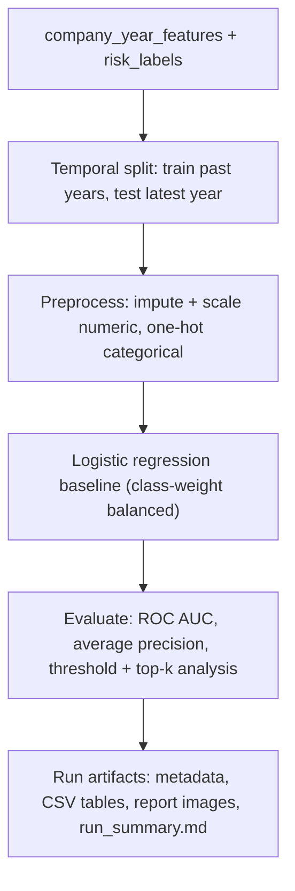

# Machine Learning Section — Academic Report

## Purpose

This document is the academic report for the machine-learning part of the
project. It explains the prediction problem, the modelling logic, the evaluation
methodology, and it keeps a **chronological log of every training run** with the
real artifacts each run produced.

It is written to be copied into the end-of-studies report and to be defended in
front of a supervisor. It is updated after each training run: a new run adds a
new dated entry to the run log, it never overwrites a previous one.

## Problem Definition

The machine-learning objective is **company continuity risk**:

```text
For a company observed at a prediction date D,
will the company stop being active/open within the next 12 months?
```

The primary target column is `continuity_risk_12m_label`. It is a broad label:
it is true if, within twelve months after `D`, any of the following appears.

| Source | Event that makes the label true |
|---|---|
| INSEE / Sirene | Company becomes administratively closed or inactive |
| BODACC | `radiation` event |
| BODACC | `liquidation judiciaire`, `redressement judiciaire`, `sauvegarde`, or other collective procedure |
| INPI / RNE | Cessation, closure, or radiation formality |

Secondary labels (`legal_distress_risk_12m_label`, `radiation_risk_12m_label`,
`financial_weakness_risk_12m_label`, `filing_anomaly_risk_12m_label`) are built
in the same dataset but are not modelled yet. They are kept as explanation
signals and as candidate targets for later models.

This is a **rare-event ranking problem**: the positive rate is close to 1.4%, so
accuracy is not a meaningful headline metric. The useful question is operational:
*among the companies the model ranks as most at risk, how many real events are
captured?*

## Data Foundation

The model is trained from two Parquet tables in the data lake, joined on
`(siren, prediction_year)`.

| Table | Grain | Role |
|---|---|---|
| `data-lake/features/company_year_features` | One row per `(siren, prediction_year)` | Model input features |
| `data-lake/features/risk_labels` | One row per `(siren, prediction_year)` | Future 12-month labels |

Features are aggregated from four sources — INSEE (identity, administrative
status, activity, legal category, age), BODACC (legal-event and distress
history), INPI/RNE (formalities and annual-account filing behaviour), and the
data.gouv.fr financial Parquet (revenue, net result, equity, debt, ratios). The
exact feature inventory and each feature's historical-safety classification are
maintained in [feature_safety_audit.md](ouputs/feature_safety_audit.md).

## Modelling Approach And Rationale



### The Role Of scikit-learn

scikit-learn (`sklearn`) is the standard Python library for classical machine
learning. In this project it is used for **two distinct jobs**, and the
distinction matters for understanding which parts of the pipeline are fixed and
which are a real modelling choice.

**Job 1 — orchestration (fixed).** This is the pipeline machinery, and it stays
the same regardless of which model is used.

| Component | Role in this project |
|---|---|
| `ColumnTransformer` | Applies different preprocessing to numeric and categorical columns |
| `SimpleImputer` | Fills missing values — median for numeric, most-frequent for categorical |
| `StandardScaler` | Rescales numeric features so large-magnitude fields do not dominate small ratios |
| `OneHotEncoder` | Converts categorical codes such as `activity_code` into numeric columns |
| `Pipeline` | Binds preprocessing and model into one object, so test data is treated exactly like training data |
| Metrics (`roc_auc_score`, `average_precision_score`, ...) | Score the model |
| `CalibratedClassifierCV` | Probability calibration (planned, see limitations) |

**Job 2 — the classifier (the actual choice).** Only one line of the pipeline is
a genuine modelling decision: the estimator. The current estimator is
`LogisticRegression(class_weight="balanced")`. Because gradient-boosting
libraries (LightGBM, XGBoost, CatBoost) expose scikit-learn-compatible
estimators, this single component can be replaced without changing the
orchestration around it. The project therefore does not choose "scikit-learn or
LightGBM"; it chooses "scikit-learn orchestration plus one swappable classifier".

### Model Family Choices

| Model | Description | Strengths | Weaknesses | Role here |
|---|---|---|---|---|
| **Logistic Regression** (scikit-learn) | Linear model — weighted sum of features mapped to a probability | Transparent readable coefficients, fast, resistant to overfitting, easy to audit for leakage | Cannot capture non-linear patterns or feature interactions on its own; needs manual encoding and scaling | **Current baseline** — a defensible reference point that also exposes data problems |
| **Random Forest** (scikit-learn) | Many decision trees averaged together | Captures non-linearity, little tuning needed | Generally weaker than boosting on this type of data | Not planned as the final model |
| **Gradient-Boosted Trees** — LightGBM, XGBoost, CatBoost | Decision trees built sequentially, each correcting the previous errors | Strong accuracy on tabular data; handle missing values natively; LightGBM and CatBoost handle categorical codes without one-hot expansion | Less transparent, require tuning, can overfit if careless | **Planned next step** after the data foundation is validated |
| **Neural networks** (PyTorch, TensorFlow) | Deep learning models | Dominate image, text, and audio tasks | Need very large data; typically underperform tree models on plain tabular data | Not appropriate for this project |

### Rationale

**Why a logistic-regression baseline first.** It is transparent: each feature
produces a readable coefficient, which makes the model defensible in a report
and easy to audit for leakage. It is fast, it gives a stable benchmark, and it
exposes data problems — a coefficient that is far too large is usually a data
problem, not a modelling win. Run 1 demonstrated exactly this: the oversized
categorical coefficients revealed an encoding issue that a black-box model would
have hidden.

**Why the model family will change later.** The baseline is intentionally
temporary. Once the data foundation is proven (labels, leakage, feature
historical validity), the same feature and label tables will be used to train
and compare gradient-boosted trees. Trees are expected to help because the data
is tabular, has strong non-linear interactions, contains many missing values,
and has high-cardinality categorical codes. This change is deliberately *not*
done before the data is validated, because a stronger model on unvalidated data
only produces confident wrong answers.

## Evaluation Methodology

| Choice | Reason |
|---|---|
| **Temporal split** — train on earlier prediction years, test on the latest year | A company-health model must be tested on a future it has not seen. A random split would let the model learn the test period's companies. |
| **Average precision (PR-AUC)** as the primary score | With a ~1.4% positive rate, ROC AUC stays high even for weak models. Average precision reflects the precision actually available on the rare positives. |
| **Threshold analysis** | The default 0.5 threshold is not assumed to be the operating point. The trainer sweeps thresholds from 0.001 to 0.5 and reports precision, recall, and flagged rate at each. |
| **Top-k capture** | The business question is "how many real events are in the top 1% / 5% / 10% riskiest companies?". This is reported with precision, recall, and lift over the base rate. |
| **Class balance by year** | Recorded for every run to detect label-construction problems (for example a year with zero or near-zero positives). |

### Data Leakage Control

The rule enforced across the feature and label builders:

```text
Features: event/source date <= prediction_date
Labels:   prediction_date < event/source date <= prediction_date + 12 months
```

Leakage is not only declared, it is checked. The automated leakage audit
([leakage_audit (1).md](<ouputs/leakage_audit (1).md>)) verifies that target
columns, `first_future_legal_event_date`, and `siren` never reach the model
inputs, that future legal-label dates fall inside the 12-month window, and that
financial feature years never exceed the prediction year.

## Run Log

Each entry below corresponds to one training run. Runs are trained on Google
Colab (High-RAM CPU) using [collabs/archive/training_only.ipynb](../collabs/archive/training_only.ipynb),
which calls `app.tools.train_continuity_model`. The artifacts referenced are
copied into `docs/ouputs/ml-artifacts/`.

---

### Run 1 — 2026-05-15 — `20260515-003859_continuity-risk-12m_logreg_time-test-2024_cap-2m_rows-2m`

**Configuration**

| Item | Value |
|---|---|
| Model version | `continuity-risk-20260515-003859` |
| Model family | Logistic regression, `class_weight="balanced"` |
| Target | `continuity_risk_12m_label`, 12-month horizon |
| Eligible rows before cap | 191,592,143 |
| Training rows (capped) | 2,000,000 (deterministic hash sample) |
| Split | Temporal — train 2017–2023, test 2024 |
| Train / test rows | 1,708,530 / 291,470 |
| Feature count | 38 (34 numeric, 4 categorical) |
| Categorical encoding | One-hot, `handle_unknown="ignore"`, no minimum-frequency floor |

**Dataset health**

The label-construction problem reported in earlier work (years 2021–2025 with
zero positives) is resolved: every year from 2017 to 2024 has a positive rate
between 1.18% and 1.71%. The overall positive rate is 1.41%. The leakage audit
returns PASS on all seven checks.

**Results (test year 2024)**

| Metric | Value | Reading |
|---|---|---|
| ROC AUC | 0.869 | Good ranking ability |
| Average precision | 0.134 | About 8× the 1.7% test base rate, but low in absolute terms |
| Precision @ 0.5 | 0.063 | At the default threshold, ~94% of flags are false alarms |
| Recall @ 0.5 | 0.805 | Catches most true positives, but at an unusable precision |
| Accuracy | 0.793 | Not meaningful for this imbalanced target |

Confusion matrix at threshold 0.5: TN 227,233 — FP 59,313 — FN 960 — TP 3,964.

Top-k capture is the most useful result:

| Segment | Precision | Recall | Lift |
|---|---|---|---|
| Top 1% | 0.247 | 0.146 | 14.6× |
| Top 5% | 0.137 | 0.404 | 8.1× |
| Top 10% | 0.103 | 0.607 | 6.1× |

**Interpretation**

The model is usable as a **risk-ranking tool** (a watchlist of the top few
percent), not as a binary classifier at 0.5. The score distribution confirms
heavy class overlap in the 0.2–0.6 probability range.

The main weakness is in the coefficients: every one of the top ~50 logistic
coefficients is an `activity_code` or `legal_category_code` one-hot dummy, with
magnitudes around ±5–6. This is a sign of overfitting on rare categories — with
no minimum-frequency floor, the high-cardinality activity code expands into
hundreds of sparse columns, each estimated from very few positive rows
(`activity_code_None` itself receives a −3.8 coefficient). The financial and
legal-event features the pipeline was designed around are crowded out.

A second concern is that these same four INSEE columns are flagged
`needs_verification` in the feature-safety audit: their historical validity
(value at `prediction_date`, not a current snapshot) is not yet proven.

**Decision taken after Run 1**

The categorical encoder in `app.tools.train_continuity_model` was changed to use
`min_frequency=0.001` and `handle_unknown="infrequent_if_exist"`. At full scale
this folds any activity/legal-category value appearing in fewer than ~2,000 rows
into a single "infrequent" bin per column, instead of giving each rare code its
own one-hot dimension. This is a correctness fix for the cardinality explosion,
not a hyperparameter tuning choice.

---

### Run 2 — 2026-05-15 — `20260515-012825_continuity-risk-12m_logreg_time-test-2024_cap-2m_rows-2m`

**Configuration**

| Item | Value |
|---|---|
| Model version | `continuity-risk-20260515-012825` |
| Model family | Logistic regression, `class_weight="balanced"` |
| Change under test | One-hot encoder set to `min_frequency=0.001` and `handle_unknown="infrequent_if_exist"` |
| Dataset, cap, split | Identical to Run 1 — 2,000,000 rows, same deterministic hash sample, temporal split train 2017–2023 / test 2024 |

The configuration is identical to Run 1 except for the one encoder change, so the
two runs are directly comparable.

**Results (test year 2024)**

| Metric | Run 1 | Run 2 | Change |
|---|---|---|---|
| ROC AUC | 0.869 | 0.859 | −0.010 |
| Average precision | 0.134 | 0.121 | −0.012 |
| Precision @ 0.5 | 0.063 | 0.060 | −0.003 |
| Recall @ 0.5 | 0.805 | 0.789 | −0.016 |
| Top 1% precision | 0.247 | 0.224 | −0.024 |
| Top 1% lift | 14.6× | 13.2× | −1.4× |
| Top 5% recall | 0.404 | 0.385 | −0.019 |
| Top 10% recall | 0.607 | 0.589 | −0.018 |

Confusion matrix at threshold 0.5: TN 225,581 — FP 60,965 — FN 1,038 — TP 3,886.

**Interpretation**

The encoder change produced a small but **uniform regression** across every
metric, measured on the same temporal holdout. This is informative. The Run 1
hypothesis was that the large categorical coefficients were pure overfitting;
if that were true, removing the rare dummies would have improved test metrics.
It did the opposite. The conclusion is that the rare `activity_code` and
`legal_category_code` values **carry genuine predictive signal**, and a
0.001 minimum-frequency floor (a ~2,000-row threshold at this scale) is too
aggressive — it collapses real, useful categories into the infrequent bin.

However, this result is **not yet conclusive**, because the same four INSEE
categorical columns are still `needs_verification` for historical validity.
There are two competing explanations for Run 1's advantage:

| Explanation | Implication |
|---|---|
| The INSEE categoricals are historically valid (value at `prediction_date`) | Run 1 is genuinely better; `min_frequency=0.001` is simply too aggressive and should be relaxed or reverted |
| The INSEE categoricals come from a current snapshot (leakage) | Run 1's advantage is partly inflated by leakage, and Run 2's lower score is partly a *less leaky* score |

These cannot be separated by further encoder tuning. They can only be separated
by verifying how the four INSEE features are built.

**Decision taken after Run 2**

Pause encoder tuning. The next action is the INSEE feature-validity
investigation (see below). Its outcome determines whether the encoder change is
reverted to Run 1 settings or kept and relaxed.

---

### Feature-Validity Investigation — 2026-05-15

The four INSEE categorical columns flagged `needs_verification` were traced
through the two builders that produce them.

**Finding — the clean identity table is a snapshot.** `build_clean_core_sources.py`
builds `clean/company_identity` with a `row_number() OVER (PARTITION BY siren
ORDER BY source_updated_at DESC ...) = 1` deduplication. Its manifest grain is
stated as "one row per SIREN". INSEE period history
(`activite_principale_periode`, `date_debut_periode`) is collapsed away — only
the most recent state of each company survives.

**Finding — the feature builder applies that snapshot to every past year.** In
`build_company_year_features.py`, the `identity_features` step reads
`activity_code`, `legal_category_code`, and `employee_size_bracket` with
`any_value(...)` joined on `siren` only, with **no date filter**. For a company
observed at prediction date 2017-12-31, these columns therefore hold the
company's value as of the latest INSEE export (effectively "today"), not its
value in 2017.

**Verdict.**

| Feature | Verdict | Reason |
|---|---|---|
| `activity_code` | **Temporal leakage** | Present-day value applied to every past prediction year; no date filter |
| `legal_category_code` | **Temporal leakage** | Same — and legal-form changes often accompany distress |
| `employee_size_bracket` | **Temporal leakage** | Same — a company shrinking before closure leaks its outcome |
| `administrative_status_at_cutoff` | **Partial leakage** | Has a `status_period_start <= prediction_date` guard, but with one row per SIREN it mostly resolves to the latest status, and the `status_period_start IS NULL` fallback uses the snapshot unconditionally |

**Why this explains Run 1 vs Run 2.** Run 1's coefficients were dominated by
`activity_code` and `legal_category_code` dummies — that is, by leaky features.
Run 2's minimum-frequency floor collapsed the rare categories and reduced the
model's ability to exploit that leak, which is why every metric dropped slightly.
Of the two explanations recorded after Run 2, the second is confirmed: Run 1's
advantage was partly leakage, and Run 2 was incidentally a *less leaky* model.

**Decision.** All four INSEE identity columns are added to `EXCLUDE_COLUMNS` in
`train_continuity_model.py`. They remain in the feature table for display and
audit, but no longer reach the model. With all four removed there are no
categorical columns left, so the categorical preprocessing branch is now added
conditionally. The proper long-term fix — preserving INSEE periods in the clean
layer and selecting the period covering `prediction_date` — is recorded in the
limitations table.

---

### Run 3 — 2026-05-15 — `20260515-020342_continuity-risk-12m_logreg_time-test-2024_cap-2m_rows-2m`

**Configuration**

| Item | Value |
|---|---|
| Model version | `continuity-risk-20260515-020342` |
| Model family | Logistic regression, `class_weight="balanced"` |
| Change under test | The four INSEE identity columns excluded from model inputs (feature count 38 → 34, excluded columns 4 → 8) |
| Dataset, cap, split | 2,000,000 rows, same deterministic hash sample and temporal split as Runs 1 and 2 — same test set (291,470 rows, 4,924 positives), so directly comparable |

This is the **first leakage-free run**. The only difference from Run 2 is the
removal of the four leaky INSEE identity features.

**Results (test year 2024)**

| Metric | Run 2 (with leakage) | Run 3 (leakage-free) | Change |
|---|---|---|---|
| ROC AUC | 0.859 | 0.764 | −0.095 |
| Average precision | 0.121 | 0.061 | −0.060 |
| Precision @ 0.5 | 0.060 | 0.051 | −0.009 |
| Recall @ 0.5 | 0.789 | 0.583 | −0.206 |
| Top 1% precision / lift | 0.224 / 13.2× | 0.115 / 6.8× | roughly halved |
| Top 5% recall | 0.385 | 0.229 | −0.156 |
| Top 10% recall | 0.589 | 0.393 | −0.196 |

Confusion matrix at threshold 0.5: TN 232,844 — FP 53,702 — FN 2,052 — TP 2,872.

**Interpretation**

The drop is large and it is the **honest cost of removing leakage**. Roughly
half of the apparent performance of Runs 1 and 2 came from the four INSEE
snapshot features peeking at each company's present-day identity. Average
precision falls to 0.061 — only about 3.6× the test base rate of 0.017 — and
top-5% lift falls from ~8× to ~4.6×. Run 3 is a genuinely weak model, but it is
a *true* one. It is the reference point for every later modelling decision.

**Good news — the model is now interpretable and sensible.** With the
high-cardinality dummies gone, the coefficients are small (largest ≈ 1.1, versus
±5–6 in Run 1) and they point the right way: `revenue_growth_1y` decreases risk,
`company_age_years` decreases risk, `legal_events_count_all` and
`legal_events_count_12m` increase risk, `years_since_last_financial_statement`
increases risk. This is a defensible model — just not yet a strong one.

**Problem found — three features are dead weight.** `formalities_count_all`,
`formalities_count_12m`, and `cessation_formalities_count_all` all received a
coefficient of exactly 0.0. These INPI formality features carry no signal,
consistent with the label audit showing INPI events appearing only in 2023–2024
and in very small counts. The INPI formalities source is currently too sparse to
be useful.

**Decision taken after Run 3** — proceed to the row-count scaling check
(Run 4), then address feature quality rather than model family.

---

### Run 4 — 2026-05-15 — Row-count scaling check (5M and 10M)

**Configuration.** Identical to Run 3 (leakage-free, 34 features, same temporal
split) except for `--max-rows`. Three runs were produced:
`20260515-020012` (5M), `20260515-020602` (5M, an exact re-run — byte-identical
to the first), and `20260515-020913` (10M).

**Results.**

| Rows | ROC AUC | Average precision | Precision @ 0.5 | Recall @ 0.5 |
|---|---|---|---|---|
| 2M (Run 3) | 0.7638 | 0.0606 | 0.0508 | 0.5833 |
| 5M | 0.7649 | 0.0624 | 0.0511 | 0.5764 |
| 10M | 0.7644 | 0.0623 | 0.0511 | 0.5763 |

**Interpretation.** The metrics are flat. Going from 2M to 10M training rows —
a 5× increase — moves ROC AUC by 0.001 and average precision by less than 0.002.
This **empirically confirms that 2M rows is statistically sufficient** for the
logistic-regression baseline: the deterministic hash sample is uniform, and the
model has long since saturated on sample size. The conclusion is not that the
model is good, but that *more data is not the lever* — the ceiling is set by
feature quality, not row count. Later runs return to the 2M cap to keep training
cheap and comparable.

---

### Pending — Proper INSEE Period Fix

Run 3 removed the four INSEE identity columns because they were applied as a
present-day snapshot. Those features carried real predictive signal — sector,
legal form, employee bracket, administrative status genuinely are predictive of
continuity risk — so removing them entirely is conservative but lossy. The
proper fix restores them as **temporally valid** features.

**What changed in the code.** Three files updated, no notebook change.

| File | Change |
|---|---|
| `app/tools/build_clean_core_sources.py` (`_build_company_identity`) | Reads `raw/insee/bulk/stock_unite_legale_historique` (already downloaded by the pipeline) and writes one row per *(SIREN, period)* with `period_start` / `period_end`. SIREN-level attributes (`creation_date`, `employee_size_bracket`, `employee_size_year`) come from the current stock file and are broadcast to every period row. A `closure_date` is derived as the first period start with administrative status in the closure set. A degraded fallback uses the current stock file when the historique file is absent. Grain is recorded as `one row per SIREN historical period`, schema version 2. |
| `app/tools/build_company_year_features.py` (`_create_company_identity_view`, `base_rows`, `identity_features`, `future_insee`) | The view now exposes `period_start`, `period_end`, `employee_size_year`. `base_rows` carries `creation_date` forward. The `identity_features` CTE joins only periods with `period_start <= prediction_date` and selects the period in effect at the cutoff via `arg_max(field, period_start)`. The final SELECT gates `employee_size_bracket` by `employee_size_year <= prediction_year`. The `future_insee` label CTE now reads `period_start` instead of `status_period_start`. |
| `app/tools/train_continuity_model.py` (`EXCLUDE_COLUMNS`) | The four INSEE identity columns are removed from the exclusion set — they are temporally valid now and reach the model. The categorical preprocessing branch (with `min_frequency=0.001` from Run 2) reactivates automatically. |

**Pipeline required.** Unlike Runs 2–4, this fix touches the *data lake*, not
only the trainer. Re-running the training notebook is not enough. The required
sequence is:

1. Confirm `data-lake/raw/insee/bulk/stock_unite_legale_historique/` exists
   (it should — the file is in `INSEE_RESOURCES`). If missing, run
   `collabs/export_raw_sources.py --insee` once.
2. Rebuild the clean layer: `python -m app.tools.build_clean_core_sources --overwrite`.
3. Rebuild the company-year features and labels:
   `python -m app.tools.build_company_year_features --start-year 2017 --end-year 2024 --overwrite`.
   Recommended: start with `--max-companies 50000` for a smoke test, verify the
   clean manifest reports `"grain": "one row per SIREN historical period"`, then
   run without the cap.
4. Re-run training, keeping `--max-rows 2000000` for direct comparability with
   Run 3.

**Expected outcome.** Some of the gap between Run 3 (ROC AUC 0.764,
AP 0.061) and Runs 1–2 (ROC AUC ~0.86) should be recovered, this time
legitimately. The recovery will not necessarily be complete: part of Runs 1–2's
score was *pure* leakage (for example employee_size shrinking right before
closure leaking the outcome), which the temporal gate now blocks. The fair
expectation is "meaningfully better than Run 3, somewhat below Runs 1–2."

## Cross-Run Comparison

| Run | Date | Rows | Configuration | ROC AUC | Avg precision | Precision @0.5 | Recall @0.5 | Top 5% recall |
|---|---|---|---|---|---|---|---|---|
| 1 | 2026-05-15 | 2M | INSEE identity features included; one-hot, no min-frequency | 0.869 | 0.134 | 0.063 | 0.805 | 0.404 |
| 2 | 2026-05-15 | 2M | INSEE identity features included; one-hot, `min_frequency=0.001` | 0.859 | 0.121 | 0.060 | 0.789 | 0.385 |
| 3 | 2026-05-15 | 2M | **Leakage-free** — four INSEE identity features excluded | 0.764 | 0.061 | 0.051 | 0.583 | 0.229 |
| 4 | 2026-05-15 | 5M | Leakage-free, row-count scaling check | 0.765 | 0.062 | 0.051 | 0.576 | — |
| 4 | 2026-05-15 | 10M | Leakage-free, row-count scaling check | 0.764 | 0.062 | 0.051 | 0.576 | — |
| 5 | pending | 2M | INSEE identity features restored from period-dated source | — | — | — | — | — |

Runs 1 and 2 both included the four INSEE identity features later confirmed as
temporal leakage, so their metrics are leakage-inflated and are kept only as a
record, not as a baseline. **Run 3 is the honest reference point** — the true
baseline against which all later work is measured. Run 4 confirms that adding
training rows beyond 2M does not move the metrics, so the path forward is better
features, not more data or (yet) a different model family.

## Limitations And Future Improvements

| Current Limitation | Future Improvement |
|---|---|
| The leakage-free baseline (Run 3) is weak — average precision 0.061, only ~3.6× the base rate, top-5% lift ~4.6× | The ceiling is feature quality, not model or row count (Run 4 proved more data does not help). Improve features before changing model family. |
| The four INSEE identity features were confirmed as temporal leakage and are excluded — but they carried real predictive signal | **Highest-value next step.** Rebuild `clean/company_identity` to preserve INSEE periods (one row per period, not per SIREN), then have the feature builder select the period covering `prediction_date`. This restores activity/legal-category/employee-size *legitimately*. |
| The clean identity layer keeps only one row per SIREN, discarding INSEE period history | Change the deduplication in `build_clean_core_sources.py` to keep period rows; this is the prerequisite for the row above. |
| Three INPI formality features (`formalities_count_all`, `formalities_count_12m`, `cessation_formalities_count_all`) received zero coefficients — the INPI source is too sparse | Improve INPI formalities coverage in the data lake, or drop these features until coverage is broad enough to carry signal. |
| Financial features are point-in-time values and a single 1-year change; no multi-year trends or richer ratios | Add multi-year trend and volatility features, and the richer financial-weakness definition described in the improvement-plan document. |
| No probability calibration is produced | Add Brier score, a reliability table, and a calibration curve; evaluate `CalibratedClassifierCV`. |
| No operating threshold is stored in the run metadata | Select a threshold from the threshold analysis on a business criterion and record it for the serving layer. |
| Model family is a baseline only | The data foundation is now leakage-free, so comparing logistic regression with LightGBM, XGBoost, and CatBoost (including calibrated variants) is now legitimate — but feature quality should be addressed first. |

## Report Summary

The machine-learning section predicts company continuity risk over a 12-month
horizon from INSEE, BODACC, INPI, and financial features, using a temporal
train/test split and a transparent logistic-regression baseline orchestrated
with scikit-learn. Runs 1 and 2 (ROC AUC ~0.86) were later found to depend on
four INSEE identity features that the feature builder applied as a present-day
snapshot to every past prediction year — a temporal leak. Run 3, with those
features removed, is the honest baseline: ROC AUC 0.764, average precision 0.061,
top-5% lift ~4.6×. It is a weak but genuine and interpretable model. Run 4
confirmed that increasing training rows from 2M to 10M does not change the
metrics, so the limiting factor is feature quality, not data volume or model
family. The next priorities, in order, are: rebuild the clean identity layer to
restore the INSEE features as temporally valid period data, improve the sparse
INPI and point-in-time financial features, add probability calibration, store an
operating threshold, and then compare gradient-boosted tree models.
