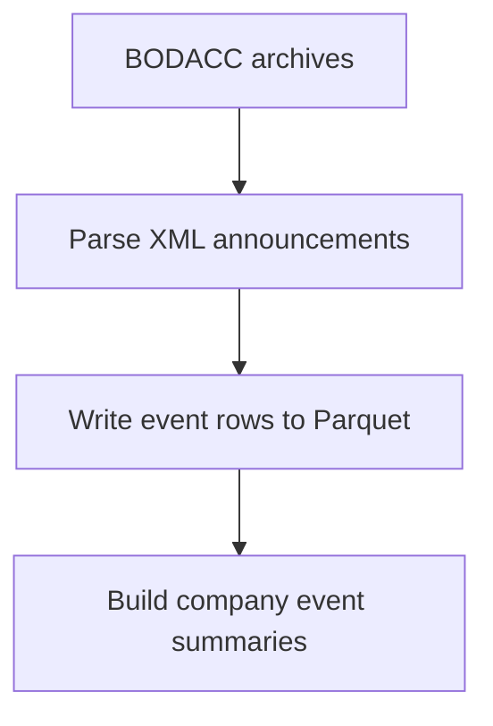

# Report Markdown Generation Rules

## Purpose

This file defines the rules to follow when generating or updating Markdown
documentation intended for the end-of-studies report, supervisor presentations,
and technical project handover.

The goal is to keep documentation:

| Requirement | Meaning |
|---|---|
| Academic | Clear enough for a report or defense |
| Technical | Accurate enough for implementation decisions |
| Reusable | Sections can be copied into the final report |
| Consistent | All data-source sections follow the same structure |
| Traceable | Source, storage, and processing choices are explicit |

## General Style

- Use clear academic language.
- Explain technical terms when they first appear.
- Prefer meaningful section headings.
- Keep paragraphs short and focused.
- Use tables for fields, roles, limitations, and comparisons.
- Use Mermaid diagrams for workflows and conceptual models.
- Keep French legal terms when they are official domain terms, for example `SIREN`, `BODACC`, `RCS`, `redressement judiciaire`, and `liquidation judiciaire`.
- Avoid implementation noise unless it helps explain architecture or reproducibility.
- Avoid vague claims such as "the system is optimized" unless the document explains why.
- When describing a design choice, include the reason and the trade-off.

## Document Types

The project uses several documentation types. Choose the structure based on the
document purpose.

| Document Type | Example | Purpose |
|---|---|---|
| Source pipeline section | `inpi_report_section.md`, `bodacc_report_section.md` | Explain one source, its data, processing, fields, frontend, and ML usage |
| Architecture overview | `system_data_architecture.md` | Explain how all sources and storage layers fit together |
| Operational reference | `data_lake_pipeline.md` | Explain paths, commands, monitoring, and processing conventions |
| Backend operations section | `backend_api_operations_report.md` | Explain API endpoints, worker jobs, state collections, and operational controls |
| Documentation inventory | `report_index.md` | Track report coverage, status, and remaining gaps |
| Model validation section | `model_validation_report.md` | Record model metrics, split strategy, leakage review, and publishing decision |
| Data-quality section | `data_quality_report.md` | Record row counts, manifests, schema checks, duplicate checks, and lineage evidence |
| Rules/template | `report_markdown_rules.md` | Define how future documentation should be written |

## Required Structure For Source Pipeline Sections

Each source-specific report section should include these parts when applicable:

1. Purpose
2. Data source
3. Input formats and access method
4. Source families or subtypes
5. Global workflow diagram
6. Processing steps
7. Storage strategy
8. Raw or stored fields
9. Clean layer targets
10. MongoDB validation or serving collections
11. Frontend usage
12. Machine-learning usage
13. Data leakage control
14. Relationship with other sources
15. Limitations and future improvements
16. Short report-ready summary

If a section becomes long, keep it organized with subsections rather than
compressing important explanations.

## Required Structure For Architecture Sections

Architecture documents should include:

1. Purpose
2. Source systems table
3. Why the architecture is needed
4. Global architecture diagram
5. Storage responsibilities
6. Tooling choices and rationale
7. Source-specific roles
8. Serving model
9. Machine-learning dataset strategy
10. Data leakage control
11. Operational strategy
12. Advantages
13. Limitations and future improvements
14. Report summary

Architecture sections must explain not only what the system does, but why this
design is preferable for the project volume and goals.

## Required Structure For Operational References

Operational documents such as data-lake references should include:

1. Purpose
2. Storage paths and mounts
3. Configuration variables
4. Folder layout
5. Processing commands
6. Output file structure
7. Progress and manifest files
8. Validation checks
9. Operational notes
10. Report summary

## Diagram Rules

- Prefer Mermaid diagrams because they can be versioned inside Markdown.
- Use `flowchart TD` for vertical processing workflows.
- Use `flowchart LR` for compact left-to-right data movement.
- Use `classDiagram` for conceptual domain models.
- Keep diagrams readable and not too large.
- Use business labels rather than function names.

Good:



Avoid:

```text
_process_archive_sync -> _insert_annonces_idempotent -> bulk_write
```

## Storage Rules

Always distinguish between storage roles.

| Storage | Meaning |
|---|---|
| Source archive | Original ZIP, TAZ, XML, JSON, or Parquet file kept for traceability |
| Raw Parquet | Extracted rows under `/data-lake/raw` |
| Clean Parquet | Normalized tables under `/data-lake/clean` |
| Feature Parquet | Aggregated ML/frontend features under `/data-lake/features` |
| MongoDB validation collection | Temporary or development collection used to validate parsing |
| MongoDB serving collection | Compact documents exposed to API/frontend |

Do not describe MongoDB as the final raw storage for very large historical
datasets such as INPI or BODACC. MongoDB should be documented as the serving
database unless the section is explicitly describing a validation/prototype
ingestion.

When mentioning MongoDB, specify the role:

| Role | Example |
|---|---|
| Operational state | `ingestion_jobs`, source-file tracking collections |
| Validation raw collection | `inpi_annual_accounts_raw`, `bodacc_annonces` during parser validation |
| Serving collection | `company_profiles`, `company_features`, `company_events_summary` |

## Data Lake Rules

When documenting the data lake, use these terms consistently:

| Layer | Meaning |
|---|---|
| `raw` | Extracted source records with minimal transformation |
| `clean` | Normalized tables with stable schemas, dates, and identifiers |
| `features` | Aggregated company or company-year features for ML/frontend summaries |

Always mention:

- Default container path: `/data-lake`
- Default host path: `D:/PFE_volumes/data-lake`
- Whether a command writes to raw, clean, or features
- Whether the output writes `_progress.json` and `_manifest.json`
- Whether full raw JSON is duplicated or source archives remain the source of truth

## Field Documentation Rules

For important fields, include a table with:

| Column | Meaning |
|---|---|
| Field | Exact field name |
| Description | What the field represents |
| Usage | Frontend, ML, risk analysis, traceability, or internal only |

When a field is internal only, state that clearly.

Example:

```text
`rcsCode` is kept for source traceability but should not be shown by default in the frontend.
```

For raw Parquet fields, explain that raw fields are not necessarily the final
frontend or ML schema.

## Data Source Rules

When documenting a source, always mention:

- Organization/provider name
- Access method
- File or response format
- Update or ingestion strategy when known
- Whether the pipeline is resumable
- How duplicates are avoided
- Main join key, usually `siren`
- Source-specific identifiers, such as `nojo`, `record_key`, INSEE API cursor, archive member, or source URL

## Processing Rules

Describe processing at the system level first. Mention implementation details
only when they clarify the architecture.

Good:

```text
The parser classifies announcements into normalized event categories such as `procedure_collective` and `radiation`.
```

Avoid:

```text
The function `_event_category_for` checks `family == "PCL"`.
```

When processing is large-scale, explain:

- Streaming or chunking strategy
- Deduplication key
- Progress tracking
- Why batch/Parquet processing is preferred over raw database inserts

## Frontend-Oriented Rules

When a section will support the frontend, include:

- Which fields should be displayed to users.
- Which fields should remain internal.
- Which fields support search or filters.
- Which fields support charts, timelines, badges, or summaries.
- Which collection or serving document the frontend should read.

Examples:

```text
`eventCategory` can be used as a timeline filter.
`isRiskEvent` can be displayed as a risk badge.
`sourceUrl` can be shown in an advanced traceability panel.
```

The frontend should normally consume compact serving documents, not raw source
records.

## Machine Learning Rules

When a source can support ML, include:

- Recommended grain, usually `(siren, year)`.
- Feature examples.
- Which fields should not be used directly.
- Whether fields can be labels, historical features, or both.
- Relationship with prediction cutoff date.

Recommended framing:

```text
Features = information available up to the end of year N
Label = whether a target event occurs during year N+1 or the next K months
```

## Data Leakage Rules

All ML-related documentation must include leakage control when time-dependent
events are involved.

State the rule clearly:

```text
Only use data whose event/source date is <= prediction_date as input.
Use data after prediction_date only to define labels.
```

Examples of leakage:

| Leakage Example | Why It Is Invalid |
|---|---|
| Using a liquidation announcement from year `N+1` to predict liquidation in year `N+1` | The model sees the future target event |
| Using a future INPI formality as a feature for year `N` | The event was not known at prediction time |
| Using a future financial statement as a feature | It gives information unavailable at cutoff |

## Limitations And Future Improvements

Every major report section should include a limitations table.

Recommended columns:

| Current Limitation | Future Improvement |
|---|---|
| What is incomplete or risky today | How the project should address it next |

This makes the report honest and gives a clear development roadmap.

## Supervisor Presentation Rules

For supervisor-facing content:

- Emphasize why each source is useful.
- Explain how data quality is improved.
- Show traceability from source to storage.
- Explain why storage choices were made.
- Mention scalability concerns when data is large.
- Mention limitations and planned improvements.
- Avoid claiming final production readiness unless the section documents evidence.

## Update Rules

When updating a report Markdown file:

- Keep useful existing sections unless they are outdated.
- Update diagrams when workflow changes.
- Update field tables when schema changes.
- Add a note if a field is deprecated or no longer shown in the frontend.
- Prefer additive changes for mature sections.
- Rewrite thin or misleading sections when they no longer match the architecture.
- Check that source-specific docs link back to architecture docs when relevant.

## Current Project Vocabulary

Use these terms consistently:

| Term | Meaning |
|---|---|
| BODACC | Official French civil and commercial announcements bulletin |
| DILA | Provider of BODACC open data files |
| SIREN | Unique French company identifier and central join key |
| RCS | Registre du Commerce et des Societes |
| PCL | BODACC collective procedure family |
| BILAN | BODACC annual accounts deposit family |
| RCS_A | BODACC registrations family |
| RCS_B | BODACC modifications and radiations family |
| INPI / RNE | Registry source for formalities and annual accounts filings |
| INSEE / Sirene | Identity and establishment reference source |
| Financial Parquet | data.gouv.fr financial source used for accounting indicators |
| Data lake | File-based Parquet storage used for large historical data |
| Raw layer | Extracted source records with minimal transformation |
| Clean layer | Normalized stable tables |
| Feature layer | Aggregated company or company-year features |
| MongoDB | Serving database and operational state store, not final raw store for large historical datasets |
| DuckDB | SQL engine used to query and join Parquet files |
| Polars | Python dataframe engine used for fast batch transformations |
| FastAPI | Backend API layer |
| Worker | Separate backend process that owns scheduled jobs |
| APScheduler | Python scheduler used by the worker |
| Serving collection | Compact MongoDB collection read by API/frontend |
| Validation collection | MongoDB collection used to test parser/raw ingestion behavior |
| `prediction_results` | MongoDB serving collection for published model scores |
| `record_key` | Deterministic raw-record key, especially for INPI |
| `nojo` | Official BODACC announcement identifier |
| `uniteLegale` | INSEE company-level legal unit |
| `etablissement` | INSEE establishment-level record |

## Quality Checklist

Before considering a report Markdown section complete, check:

- It explains why the data source matters.
- It identifies the provider and input format.
- It includes a workflow diagram.
- It explains raw, clean, feature, and serving storage roles when relevant.
- It documents important fields with usage.
- It explains frontend use.
- It explains ML use if applicable.
- It includes data leakage control for temporal data.
- It includes limitations and future improvements.
- It ends with a short report-ready summary.
